Statistical Methods for Finance
================
Filippo De Boni
2026-04-24

## Statistical Methods for Finance - Returns and Volatility Analysis

Prices, returns and volatility analysis for NVIDIA-daily, NVIDIA-monthly
and Amplifon-daily.

``` r
rm(list=ls())
library(readxl)
library(quantmod)
library(astsa)
library(tidyverse)
library(fImport)
library(fBasics)
library(fUnitRoots)
library(timeSeries)
library(forecast)
library(tseries)
library(rugarch)
library(roll)
library(distr)
library(FinTS)
library(sandwich)
source("dm_test.R")
```

## NVIDIA - daily

### Prices, log-prices

Refinitiv data from the 4th of January 2010 to the 29th of December
2023.

``` r
data=read_excel("nvidia giornalieri.xlsx",skip = 27)
```

Prices and log-prices. Exploration of the series characteristics.
Looking at quartiles from BasicStats’ output looks like the log
transformation reduces skewness and peaks.

``` r
P=data$Close
P=P[length(P):1]#Reversing series
p=log(P)
BS=basicStats(cbind(P,p))
BS
```

    ##                        P           p
    ## nobs         3522.000000 3522.000000
    ## NAs             0.000000    0.000000
    ## Minimum         0.222000   -1.505078
    ## Maximum        50.409000    3.920170
    ## 1. Quartile     0.424562   -0.856696
    ## 3. Quartile     9.529187    2.254359
    ## Mean            7.295186    0.777625
    ## Median          2.471750    0.904926
    ## Sum         25693.645375 2738.795850
    ## SE Mean         0.183457    0.028066
    ## LCL Mean        6.935493    0.722597
    ## UCL Mean        7.654879    0.832653
    ## Variance      118.538307    2.774347
    ## Stdev          10.887530    1.665637
    ## Skewness        2.084796    0.258604
    ## Kurtosis        4.049036   -1.415726

``` r
par(mfrow=c(1,2))
tsplot(P,xlab="Time",ylab="Prices",main="NVIDIA - PRICES")
tsplot(p,xlab="Time",ylab="Log-Prices",main="NVIDIA - LOG-PRICES")
```

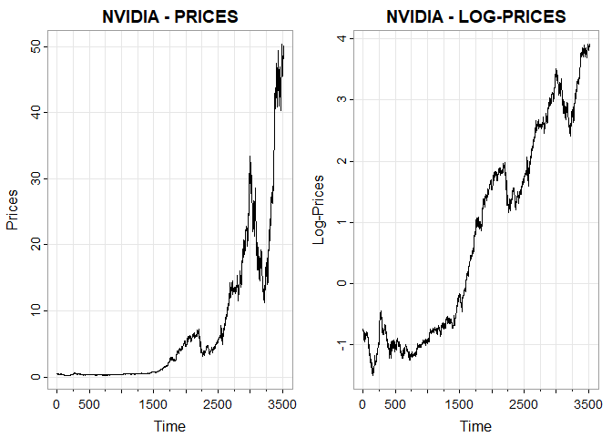<!-- -->

ACF/PACF analysis. The plots evidently suggest the presence of a RW
stochastic process for both Prices and Log-prices series. ACF show
values close to 1 consistently at least until 21 lags; PACF show values
close to 1 at the first lag and non-significant values for the remaining
ones.

``` r
par(mfrow=c(2,2))
acf.P=acf(P,lag.max = 21)
pacf.P=pacf(P,lag.max=21)
acf.p=acf(p,lag.max=21)
pacf.p=pacf(p,lag.max=21)
```

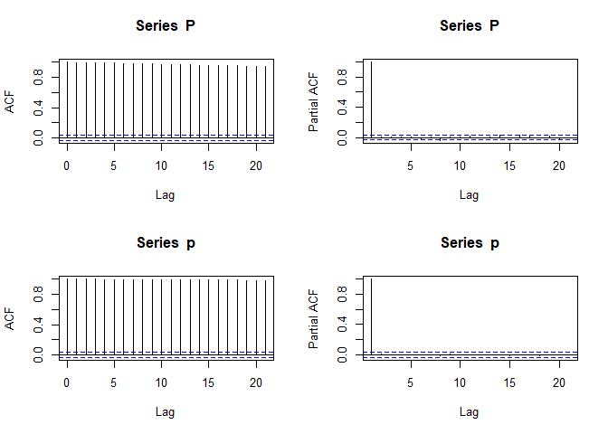<!-- -->

``` r
acf.P[21]
```

    ## 
    ## Autocorrelations of series 'P', by lag
    ## 
    ##    21 
    ## 0.943

``` r
pacf.P[1]
```

    ## 
    ## Partial autocorrelations of series 'P', by lag
    ## 
    ##     1 
    ## 0.997

``` r
acf.p[21]
```

    ## 
    ## Autocorrelations of series 'p', by lag
    ## 
    ##    21 
    ## 0.984

``` r
pacf.p[1]
```

    ## 
    ## Partial autocorrelations of series 'p', by lag
    ## 
    ##     1 
    ## 0.999

Augmented Dickey-Fuller tests for unit roots and Ljung-Box on residuals.
Log-prices show unit roots, differenced log-prices don’t; residuals
however are correlated: RW is not confirmed. Let’s keep this in mind.

``` r
adf1=adfTest(p,lags=21,type="ct")
summary(adf1@test$lm)
```

    ## 
    ## Call:
    ## lm(formula = y.diff ~ y.lag.1 + 1 + tt + y.diff.lag)
    ## 
    ## Residuals:
    ##       Min        1Q    Median        3Q       Max 
    ## -0.203633 -0.013655 -0.000053  0.013495  0.255395 
    ## 
    ## Coefficients:
    ##                Estimate Std. Error t value Pr(>|t|)   
    ## (Intercept)  -5.246e-03  2.284e-03  -2.297  0.02169 * 
    ## y.lag.1      -2.647e-03  1.028e-03  -2.575  0.01006 * 
    ## tt            4.861e-06  1.691e-06   2.876  0.00406 **
    ## y.diff.lag1  -4.151e-02  1.694e-02  -2.450  0.01435 * 
    ## y.diff.lag2   1.846e-02  1.695e-02   1.089  0.27620   
    ## y.diff.lag3  -1.450e-02  1.694e-02  -0.856  0.39205   
    ## y.diff.lag4   5.306e-03  1.694e-02   0.313  0.75407   
    ## y.diff.lag5   9.135e-03  1.693e-02   0.540  0.58957   
    ## y.diff.lag6  -1.590e-02  1.693e-02  -0.939  0.34771   
    ## y.diff.lag7   4.319e-02  1.693e-02   2.551  0.01079 * 
    ## y.diff.lag8  -5.207e-02  1.695e-02  -3.073  0.00214 **
    ## y.diff.lag9   2.719e-02  1.696e-02   1.603  0.10904   
    ## y.diff.lag10  1.280e-02  1.697e-02   0.755  0.45056   
    ## y.diff.lag11 -5.273e-03  1.697e-02  -0.311  0.75597   
    ## y.diff.lag12  7.270e-03  1.697e-02   0.429  0.66829   
    ## y.diff.lag13 -2.293e-02  1.696e-02  -1.352  0.17641   
    ## y.diff.lag14  1.230e-02  1.694e-02   0.726  0.46789   
    ## y.diff.lag15 -5.546e-03  1.693e-02  -0.328  0.74319   
    ## y.diff.lag16  1.972e-02  1.692e-02   1.166  0.24389   
    ## y.diff.lag17  2.069e-03  1.692e-02   0.122  0.90272   
    ## y.diff.lag18  1.325e-02  1.692e-02   0.783  0.43372   
    ## y.diff.lag19  3.606e-03  1.693e-02   0.213  0.83129   
    ## y.diff.lag20  1.950e-02  1.692e-02   1.152  0.24941   
    ## y.diff.lag21  2.416e-02  1.691e-02   1.428  0.15332   
    ## ---
    ## Signif. codes:  0 '***' 0.001 '**' 0.01 '*' 0.05 '.' 0.1 ' ' 1
    ## 
    ## Residual standard error: 0.02797 on 3476 degrees of freedom
    ## Multiple R-squared:  0.01495,    Adjusted R-squared:  0.008434 
    ## F-statistic: 2.294 on 23 and 3476 DF,  p-value: 0.000425

``` r
adf1=adfTest(p,lags=9,type="ct")
summary(adf1@test$lm)
```

    ## 
    ## Call:
    ## lm(formula = y.diff ~ y.lag.1 + 1 + tt + y.diff.lag)
    ## 
    ## Residuals:
    ##      Min       1Q   Median       3Q      Max 
    ## -0.20785 -0.01393 -0.00004  0.01348  0.25590 
    ## 
    ## Coefficients:
    ##               Estimate Std. Error t value Pr(>|t|)   
    ## (Intercept) -5.050e-03  2.246e-03  -2.249  0.02457 * 
    ## y.lag.1     -2.558e-03  1.016e-03  -2.518  0.01186 * 
    ## tt           4.774e-06  1.668e-06   2.863  0.00422 **
    ## y.diff.lag1 -4.267e-02  1.688e-02  -2.528  0.01153 * 
    ## y.diff.lag2  1.797e-02  1.687e-02   1.065  0.28683   
    ## y.diff.lag3 -1.346e-02  1.686e-02  -0.799  0.42455   
    ## y.diff.lag4  3.941e-03  1.685e-02   0.234  0.81507   
    ## y.diff.lag5  1.197e-02  1.685e-02   0.710  0.47758   
    ## y.diff.lag6 -1.787e-02  1.685e-02  -1.061  0.28885   
    ## y.diff.lag7  4.416e-02  1.685e-02   2.621  0.00882 **
    ## y.diff.lag8 -5.444e-02  1.687e-02  -3.227  0.00126 **
    ## y.diff.lag9  2.944e-02  1.688e-02   1.744  0.08121 . 
    ## ---
    ## Signif. codes:  0 '***' 0.001 '**' 0.01 '*' 0.05 '.' 0.1 ' ' 1
    ## 
    ## Residual standard error: 0.02797 on 3500 degrees of freedom
    ## Multiple R-squared:  0.01253,    Adjusted R-squared:  0.009431 
    ## F-statistic: 4.039 on 11 and 3500 DF,  p-value: 6.691e-06

``` r
#Keeping lags until the ninth: for this particular lag, significance is dubious considering 21 lags, but considering 9 lags significance is confirmed. Significant trend and intercept.

adf1
```

    ## 
    ## Title:
    ##  Augmented Dickey-Fuller Test
    ## 
    ## Test Results:
    ##   PARAMETER:
    ##     Lag Order: 9
    ##   STATISTIC:
    ##     Dickey-Fuller: -2.5177
    ##   P VALUE:
    ##     0.3592 
    ## 
    ## Description:
    ##  Sun Apr 26 23:45:50 2026 by user: Utente

``` r
#Fail to reject H0: log-prices do have at least one unit root. Repeating the procedure on differenced series to verify the presence of other unit roots.

dp=diff(p)
adf2=adfTest(dp,lags=21,type="ct")
```

    ## Warning in adfTest(dp, lags = 21, type = "ct"): p-value smaller than printed
    ## p-value

``` r
summary(adf2@test$lm)#It's safe to keep 21 lags but not to keep trend.
```

    ## 
    ## Call:
    ## lm(formula = y.diff ~ y.lag.1 + 1 + tt + y.diff.lag)
    ## 
    ## Residuals:
    ##       Min        1Q    Median        3Q       Max 
    ## -0.204586 -0.013732  0.000147  0.013784  0.256141 
    ## 
    ## Coefficients:
    ##                Estimate Std. Error t value Pr(>|t|)    
    ## (Intercept)   1.618e-04  9.545e-04   0.169   0.8654    
    ## y.lag.1      -9.872e-01  8.072e-02 -12.230   <2e-16 ***
    ## tt            6.784e-07  4.718e-07   1.438   0.1506    
    ## y.diff.lag1  -5.424e-02  7.909e-02  -0.686   0.4928    
    ## y.diff.lag2  -3.559e-02  7.734e-02  -0.460   0.6454    
    ## y.diff.lag3  -4.934e-02  7.548e-02  -0.654   0.5134    
    ## y.diff.lag4  -4.525e-02  7.355e-02  -0.615   0.5384    
    ## y.diff.lag5  -3.757e-02  7.152e-02  -0.525   0.5994    
    ## y.diff.lag6  -5.316e-02  6.944e-02  -0.766   0.4439    
    ## y.diff.lag7  -1.148e-02  6.720e-02  -0.171   0.8644    
    ## y.diff.lag8  -6.381e-02  6.492e-02  -0.983   0.3257    
    ## y.diff.lag9  -3.870e-02  6.251e-02  -0.619   0.5358    
    ## y.diff.lag10 -2.686e-02  6.012e-02  -0.447   0.6550    
    ## y.diff.lag11 -3.305e-02  5.759e-02  -0.574   0.5661    
    ## y.diff.lag12 -2.582e-02  5.499e-02  -0.470   0.6387    
    ## y.diff.lag13 -4.926e-02  5.218e-02  -0.944   0.3453    
    ## y.diff.lag14 -3.950e-02  4.906e-02  -0.805   0.4208    
    ## y.diff.lag15 -4.423e-02  4.606e-02  -0.960   0.3370    
    ## y.diff.lag16 -2.628e-02  4.257e-02  -0.617   0.5371    
    ## y.diff.lag17 -2.496e-02  3.889e-02  -0.642   0.5211    
    ## y.diff.lag18 -1.218e-02  3.474e-02  -0.351   0.7258    
    ## y.diff.lag19 -1.011e-02  2.996e-02  -0.337   0.7359    
    ## y.diff.lag20  9.385e-03  2.444e-02   0.384   0.7009    
    ## y.diff.lag21  3.178e-02  1.692e-02   1.879   0.0604 .  
    ## ---
    ## Signif. codes:  0 '***' 0.001 '**' 0.01 '*' 0.05 '.' 0.1 ' ' 1
    ## 
    ## Residual standard error: 0.02797 on 3475 degrees of freedom
    ## Multiple R-squared:   0.53,  Adjusted R-squared:  0.5269 
    ## F-statistic: 170.4 on 23 and 3475 DF,  p-value: < 2.2e-16

``` r
adf2=adfTest(dp,lags=21,type="c")
```

    ## Warning in adfTest(dp, lags = 21, type = "c"): p-value smaller than printed
    ## p-value

``` r
summary(adf2@test$lm)
```

    ## 
    ## Call:
    ## lm(formula = y.diff ~ y.lag.1 + 1 + y.diff.lag)
    ## 
    ## Residuals:
    ##       Min        1Q    Median        3Q       Max 
    ## -0.204119 -0.013663  0.000214  0.013658  0.256113 
    ## 
    ## Coefficients:
    ##                Estimate Std. Error t value Pr(>|t|)    
    ## (Intercept)   0.0013438  0.0004851   2.770  0.00563 ** 
    ## y.lag.1      -0.9727290  0.0801028 -12.144  < 2e-16 ***
    ## y.diff.lag1  -0.0681205  0.0785072  -0.868  0.38562    
    ## y.diff.lag2  -0.0488316  0.0768047  -0.636  0.52496    
    ## y.diff.lag3  -0.0619497  0.0749819  -0.826  0.40875    
    ## y.diff.lag4  -0.0572534  0.0730862  -0.783  0.43346    
    ## y.diff.lag5  -0.0489399  0.0710955  -0.688  0.49127    
    ## y.diff.lag6  -0.0638911  0.0690449  -0.925  0.35484    
    ## y.diff.lag7  -0.0215380  0.0668499  -0.322  0.74733    
    ## y.diff.lag8  -0.0732128  0.0645957  -1.133  0.25712    
    ## y.diff.lag9  -0.0474330  0.0622225  -0.762  0.44593    
    ## y.diff.lag10 -0.0349396  0.0598651  -0.584  0.55950    
    ## y.diff.lag11 -0.0404657  0.0573702  -0.705  0.48064    
    ## y.diff.lag12 -0.0325794  0.0547937  -0.595  0.55216    
    ## y.diff.lag13 -0.0553660  0.0520176  -1.064  0.28724    
    ## y.diff.lag14 -0.0449125  0.0489241  -0.918  0.35868    
    ## y.diff.lag15 -0.0489870  0.0459498  -1.066  0.28645    
    ## y.diff.lag16 -0.0303600  0.0424862  -0.715  0.47491    
    ## y.diff.lag17 -0.0283576  0.0388214  -0.730  0.46516    
    ## y.diff.lag18 -0.0149037  0.0346907  -0.430  0.66750    
    ## y.diff.lag19 -0.0121402  0.0299346  -0.406  0.68509    
    ## y.diff.lag20  0.0080389  0.0244218   0.329  0.74205    
    ## y.diff.lag21  0.0311297  0.0169123   1.841  0.06576 .  
    ## ---
    ## Signif. codes:  0 '***' 0.001 '**' 0.01 '*' 0.05 '.' 0.1 ' ' 1
    ## 
    ## Residual standard error: 0.02798 on 3476 degrees of freedom
    ## Multiple R-squared:  0.5298, Adjusted R-squared:  0.5268 
    ## F-statistic:   178 on 22 and 3476 DF,  p-value: < 2.2e-16

``` r
adf2
```

    ## 
    ## Title:
    ##  Augmented Dickey-Fuller Test
    ## 
    ## Test Results:
    ##   PARAMETER:
    ##     Lag Order: 21
    ##   STATISTIC:
    ##     Dickey-Fuller: -12.1435
    ##   P VALUE:
    ##     0.01 
    ## 
    ## Description:
    ##  Sun Apr 26 23:45:50 2026 by user: Utente

``` r
#Reject H0: RW confirmed if residuals show compatibility with WN.

par(mfrow=c(1,2))
acf(dp,lag.max=21)
pacf(dp,lag.max=21)
```

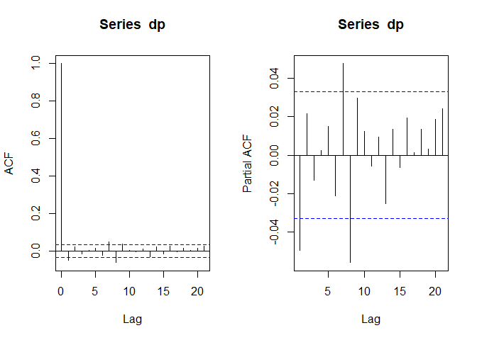<!-- -->

``` r
Box.test(dp,lag=21,type="Ljung-Box")
```

    ## 
    ##  Box-Ljung test
    ## 
    ## data:  dp
    ## X-squared = 54.161, df = 21, p-value = 9.358e-05

``` r
#ACF and PACF plots are compatible with WN; however Ljung-Box rejects H0. RW is not confirmed, the analysis continues keeping this in mind.
```

### Log-returns

Exploratory analysis. BasicStats shows slight skewness to the left
(unusual case with positive returns more frequent than negative ones)
and high kurtosis (leptokurtosis). Evident volatility clustering and
stationarity around 0 (as expected). QQ plot doesn’t suggest normality,
as does the density plot, especially in the tails, accordingly to the
test.

``` r
r=dp
BS.2=as.matrix(basicStats(r))
BS.2
```

    ##                       r
    ## nobs        3521.000000
    ## NAs            0.000000
    ## Minimum       -0.207712
    ## Maximum        0.260876
    ## 1. Quartile   -0.012270
    ## 3. Quartile    0.015312
    ## Mean           0.001327
    ## Median         0.001502
    ## Sum            4.674066
    ## SE Mean        0.000473
    ## LCL Mean       0.000399
    ## UCL Mean       0.002256
    ## Variance       0.000789
    ## Stdev          0.028089
    ## Skewness       0.235224
    ## Kurtosis       7.256378

``` r
par(mfrow=c(1,3))
tsplot(r,xlab="Time",ylab="Log-returns", main="NVIDIA - LOG-RETURNS")
x=seq(min(r),max(r),length=50)
y=dnorm(x,mean=mean(r),sd=sd(r))
hist(r,breaks=100,freq=F,main="NVIDIA's returns")
lines(x,y,col=2,lwd=2)
qqnorm(r,main="Normal Q-Q Plot",xlab="Theoretical",ylab="Empirical")
qqline(r,col="steelblue", lwd=2)
```

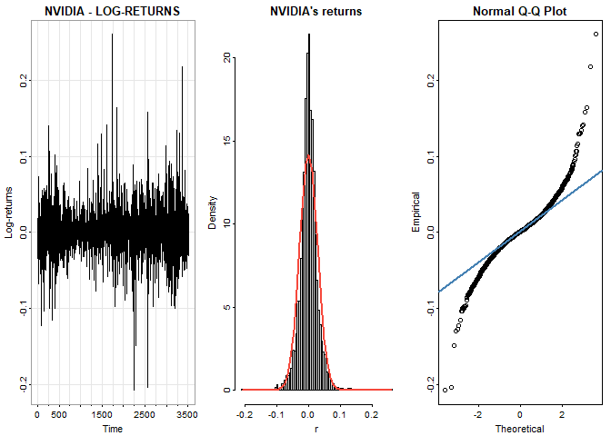<!-- -->

``` r
jarqueberaTest(r)
```

    ## 
    ## Title:
    ##  Jarque-Bera Normality Test
    ## 
    ## Test Results:
    ##   STATISTIC:
    ##     X-squared: 7769.8412
    ##   P VALUE:
    ##     Asymptotic p Value: < 2.2e-16

Plots show ACF and PACF of the log-returns, their squared values and
their absolute values, and suggest the presence of some form of
non-linear serial dependence. No clear stochastic processes are
evidently suggested by the plots, therefore some ARMA processes are
estimated and then evaluated.

``` r
par(mfrow=c(2,3))
r2=r^2
r.abs=abs(r)
acf(r,lag.max=21)
acf(r2,lag.max = 21)
acf(r.abs,lag.max=21)
pacf(r,lag.max=21)
pacf(r2,lag.max=21)
pacf(r.abs,lag.max=21)
```

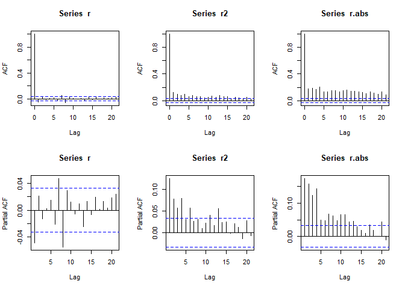<!-- -->

ACF plots look the same, so the choice is based on significance of the
coefficients and AIC. AR(1) is selected and compared in the following
analysis with the null model.

``` r
ar.int=arma(r,order=c(1,0))
ar=arma(r,order=c(1,0),include.intercept = F)
```

    ## Warning in optim(coef, err, gr = NULL, hessian = TRUE, ...): l'ottimizzazione ad una dimensione di Nelder-Mead non è affidabile:
    ## utilizzare "Brent" o direttamente optimize()

``` r
ma.int=arma(r,order=c(0,1))
ma=arma(r,order=c(0,1),include.intercept = F)
```

    ## Warning in optim(coef, err, gr = NULL, hessian = TRUE, ...): l'ottimizzazione ad una dimensione di Nelder-Mead non è affidabile:
    ## utilizzare "Brent" o direttamente optimize()

``` r
arma.int=arma(r,order=c(1,1))
arma=arma(r,order=c(1,1),include.intercept = F)
par(mfrow=c(2,3))
acf(na.omit(ar.int$residuals), lag.max=21)
acf(na.omit(ar$residuals), lag.max=21)
acf(na.omit(ma.int$residuals), lag.max=21)
acf(na.omit(ma$residuals), lag.max=21)
acf(na.omit(arma.int$residuals), lag.max=21)
acf(na.omit(arma$residuals), lag.max=21)
```

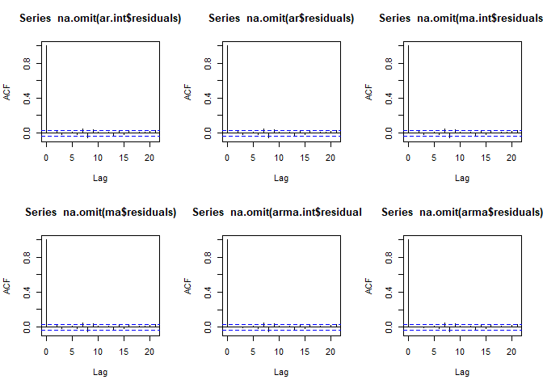<!-- -->

``` r
summary(ar.int)
```

    ## 
    ## Call:
    ## arma(x = r, order = c(1, 0))
    ## 
    ## Model:
    ## ARMA(1,0)
    ## 
    ## Residuals:
    ##        Min         1Q     Median         3Q        Max 
    ## -0.2078116 -0.0137111  0.0002288  0.0139293  0.2579144 
    ## 
    ## Coefficient(s):
    ##             Estimate  Std. Error  t value Pr(>|t|)   
    ## ar1       -0.0494842   0.0168315   -2.940  0.00328 **
    ## intercept  0.0013880   0.0004733    2.933  0.00336 **
    ## ---
    ## Signif. codes:  0 '***' 0.001 '**' 0.01 '*' 0.05 '.' 0.1 ' ' 1
    ## 
    ## Fit:
    ## sigma^2 estimated as 0.0007872,  Conditional Sum-of-Squares = 2.77,  AIC = -15168.35

``` r
summary(ar)
```

    ## 
    ## Call:
    ## arma(x = r, order = c(1, 0), include.intercept = F)
    ## 
    ## Model:
    ## ARMA(1,0)
    ## 
    ## Residuals:
    ##       Min        1Q    Median        3Q       Max 
    ## -0.206483 -0.012352  0.001631  0.015298  0.259375 
    ## 
    ## Coefficient(s):
    ##      Estimate  Std. Error  t value Pr(>|t|)   
    ## ar1  -0.04720     0.01683   -2.804  0.00505 **
    ## ---
    ## Signif. codes:  0 '***' 0.001 '**' 0.01 '*' 0.05 '.' 0.1 ' ' 1
    ## 
    ## Fit:
    ## sigma^2 estimated as 0.0007872,  Conditional Sum-of-Squares = 2.78,  AIC = -15170.33

``` r
summary(ma.int)
```

    ## 
    ## Call:
    ## arma(x = r, order = c(0, 1))
    ## 
    ## Model:
    ## ARMA(0,1)
    ## 
    ## Residuals:
    ##        Min         1Q     Median         3Q        Max 
    ## -0.2078845 -0.0136926  0.0002113  0.0138508  0.2579409 
    ## 
    ## Coefficient(s):
    ##             Estimate  Std. Error  t value Pr(>|t|)   
    ## ma1       -0.0474362   0.0164737   -2.880  0.00398 **
    ## intercept  0.0013227   0.0004504    2.937  0.00332 **
    ## ---
    ## Signif. codes:  0 '***' 0.001 '**' 0.01 '*' 0.05 '.' 0.1 ' ' 1
    ## 
    ## Fit:
    ## sigma^2 estimated as 0.0007873,  Conditional Sum-of-Squares = 2.77,  AIC = -15167.99

``` r
summary(ma)
```

    ## 
    ## Call:
    ## arma(x = r, order = c(0, 1), include.intercept = F)
    ## 
    ## Model:
    ## ARMA(0,1)
    ## 
    ## Residuals:
    ##       Min        1Q    Median        3Q       Max 
    ## -0.206557 -0.012309  0.001591  0.015276  0.259410 
    ## 
    ## Coefficient(s):
    ##      Estimate  Std. Error  t value Pr(>|t|)   
    ## ma1  -0.04501     0.01643   -2.739  0.00617 **
    ## ---
    ## Signif. codes:  0 '***' 0.001 '**' 0.01 '*' 0.05 '.' 0.1 ' ' 1
    ## 
    ## Fit:
    ## sigma^2 estimated as 0.0007873,  Conditional Sum-of-Squares = 2.78,  AIC = -15169.97

``` r
summary(arma.int)
```

    ## 
    ## Call:
    ## arma(x = r, order = c(1, 1))
    ## 
    ## Model:
    ## ARMA(1,1)
    ## 
    ## Residuals:
    ##        Min         1Q     Median         3Q        Max 
    ## -0.2071132 -0.0137353  0.0001667  0.0140648  0.2580786 
    ## 
    ## Coefficient(s):
    ##             Estimate  Std. Error  t value Pr(>|t|)   
    ## ar1       -0.3973155   0.1935810   -2.052  0.04013 * 
    ## ma1        0.3471793   0.1971147    1.761  0.07819 . 
    ## intercept  0.0018555   0.0006878    2.698  0.00699 **
    ## ---
    ## Signif. codes:  0 '***' 0.001 '**' 0.01 '*' 0.05 '.' 0.1 ' ' 1
    ## 
    ## Fit:
    ## sigma^2 estimated as 0.0007869,  Conditional Sum-of-Squares = 2.77,  AIC = -15168.05

``` r
summary(arma)
```

    ## 
    ## Call:
    ## arma(x = r, order = c(1, 1), include.intercept = F)
    ## 
    ## Model:
    ## ARMA(1,1)
    ## 
    ## Residuals:
    ##       Min        1Q    Median        3Q       Max 
    ## -0.205759 -0.012367  0.001552  0.015430  0.259499 
    ## 
    ## Coefficient(s):
    ##      Estimate  Std. Error  t value Pr(>|t|)  
    ## ar1   -0.4062      0.1896   -2.142   0.0322 *
    ## ma1    0.3576      0.1929    1.854   0.0638 .
    ## ---
    ## Signif. codes:  0 '***' 0.001 '**' 0.01 '*' 0.05 '.' 0.1 ' ' 1
    ## 
    ## Fit:
    ## sigma^2 estimated as 0.0007869,  Conditional Sum-of-Squares = 2.78,  AIC = -15170.02

``` r
mod.arma=ar
mod.mean=arma(r,order=c(0,0))
```

    ## Warning in optim(coef, err, gr = NULL, hessian = TRUE, ...): l'ottimizzazione ad una dimensione di Nelder-Mead non è affidabile:
    ## utilizzare "Brent" o direttamente optimize()

``` r
summary(mod.mean)
```

    ## 
    ## Call:
    ## arma(x = r, order = c(0, 0))
    ## 
    ## Model:
    ## ARMA(0,0)
    ## 
    ## Residuals:
    ##        Min         1Q     Median         3Q        Max 
    ## -0.2090360 -0.0135946  0.0001778  0.0139871  0.2595518 
    ## 
    ## Coefficient(s):
    ##            Estimate  Std. Error  t value Pr(>|t|)   
    ## intercept 0.0013245   0.0004733    2.798  0.00514 **
    ## ---
    ## Signif. codes:  0 '***' 0.001 '**' 0.01 '*' 0.05 '.' 0.1 ' ' 1
    ## 
    ## Fit:
    ## sigma^2 estimated as 0.000789,  Conditional Sum-of-Squares = 2.78,  AIC = -15162.51

``` r
par(mfrow=c(1,2))
acf(mod.mean$residuals,lag.max=21)
pacf(mod.mean$residuals,lag.max=21)
```

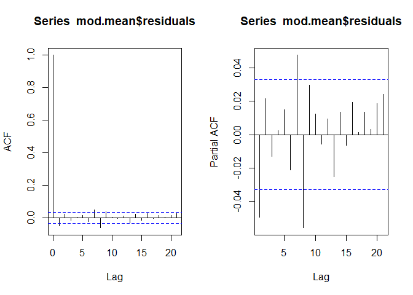<!-- -->

Static and dynamic forecast.

``` r
test.size=250
train.size=length(r)-250
test=tail(r,test.size)
train=head(r,train.size)
for (i in 1:test.size){
  if (i==1){
    new.train=train
    p.mean=p.ar=c(rep(NA,250))
    mod.mean=Arima(train,order=c(0,0,0),include.mean = T)
    mod.arma=Arima(train,order=c(1,0,0),include.mean = F)
  }
  else{
    new.train=c(new.train, test[i-1])
  }
  mod.mean.stat=Arima(new.train,model=mod.mean)
  mod.arma.stat=Arima(new.train,model=mod.arma)
  p.mean[i]=forecast(mod.mean.stat,h=1)$mean
  p.ar[i]=forecast(mod.arma.stat,h=1)$mean
}

test.size=250
train.size=length(r)-250
test=tail(r,test.size)
train=head(r,train.size)
for (i in 1:test.size){
  if (i==1){
    new.train=train
    p.ar.2=c(rep(NA,250))
    mod.arma=Arima(train,order=c(1,0,0),include.mean = F)
  }
  else{
    new.train=as.vector(new.train)
    new.train=c(new.train, p.ar.2[i-1])
  }
  mod.arma.din=Arima(new.train,model=mod.arma)
  p.ar.2[i]=forecast(mod.arma.din,h=1)$mean
}
```

As expected (by model metrics and usual characteristics of returns time
series) the model doesn’t perform well in forecasting, errors look
similar to the ones of the intercept model. Diebold-Mariano shows that
the intercept model gives the best predictions.

``` r
par(mfrow=c(1,1)) 
ts.plot(ts(test),ts(p.mean),ts(p.ar),ts(p.ar.2),col=1:3,main="Forecasts comparison") 
legend("topleft",legend=c("Actual returns","Forecasts mean model","Forecasts AR(1) (static)","Forecasts AR(1) (dynamic)"),col=1:4,lty = 1,  cex=0.70) 
```

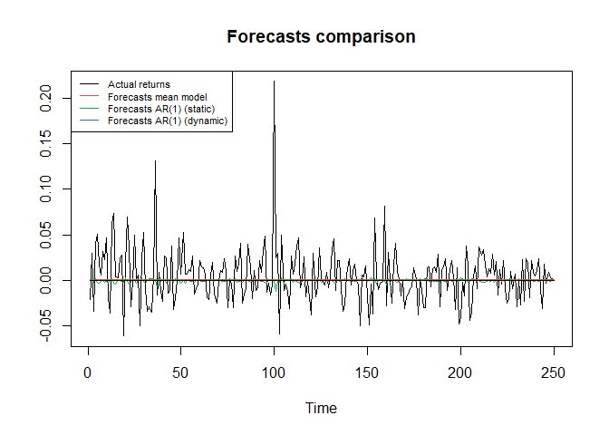<!-- -->

``` r
err.mean=test-p.mean 
err.ar=test-p.ar 
err.ar.2=test-p.ar.2
MSE.mean=mean(err.mean^2) 
MSE.ar=mean(err.ar^2) 
MSE.ar.2=mean(err.ar.2^2) 
MSE.mean 
```

    ## [1] 0.0008792716

``` r
MSE.ar 
```

    ## [1] 0.0008955027

``` r
MSE.ar.2 
```

    ## [1] 0.000888458

``` r
p1=dm_test(err.ar,err.mean,alternative = "greater",h=1)$p.value
p2=dm_test(err.ar,err.ar.2,alternative = "greater",h=1)$p.value
p3=dm_test(err.ar.2,err.mean,alternative = "greater",h=1)$p.value
p.adjust(c(p1,p2,p3),"holm")
```

    ##        DM        DM        DM 
    ## 0.0305604 0.1114390 0.0305604

### Volatility

Returns’ series doesn’t appear homoscedastic: peaks and effects on
variance are visible in the following plots. Possible serial dependence
on absolute returns’ plot.

``` r
par(mfrow=c(3,1))
tsplot(r,main="NVIDIA's daily returns")
tsplot(abs(r),main="Absolute returns")
tsplot(r^2, main="Squared returns")#Proxy of variance, since mean(r)~0
```

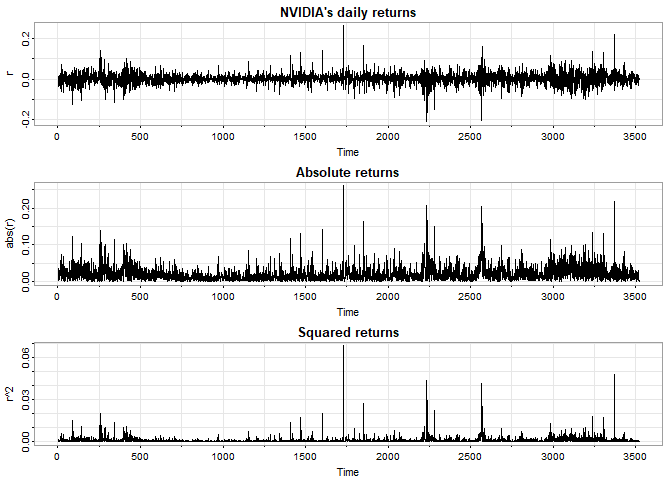<!-- -->

``` r
var62=roll_var(r,width=62,center=T)
var126=roll_var(r,width=126,center=T)
par(mfrow=c(2,1))
tsplot(var62,main="Rolling variance with 62 obs window")
tsplot(var126,main="Rolling variance with 126 obs window")
```

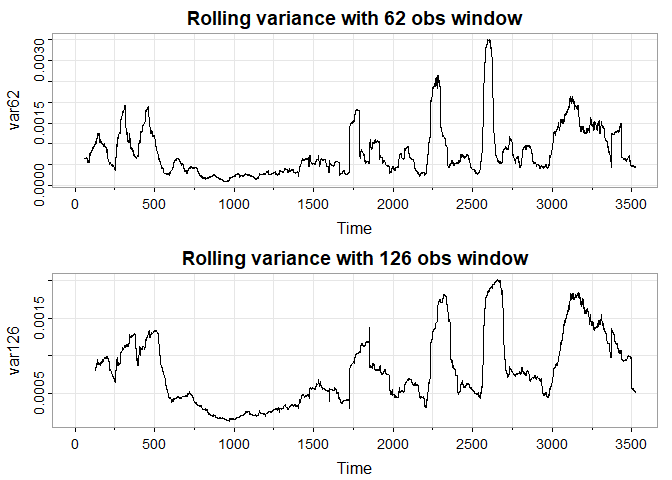<!-- -->

H0 is rejected for both LM and Ljung-Box. ARCH effects are confirmed.

``` r
ArchTest(r,lags=1)
```

    ## 
    ##  ARCH LM-test; Null hypothesis: no ARCH effects
    ## 
    ## data:  r
    ## Chi-squared = 54.425, df = 1, p-value = 1.615e-13

``` r
ArchTest(r,lags=5)
```

    ## 
    ##  ARCH LM-test; Null hypothesis: no ARCH effects
    ## 
    ## data:  r
    ## Chi-squared = 111.6, df = 5, p-value < 2.2e-16

``` r
ArchTest(r,lags=10)
```

    ## 
    ##  ARCH LM-test; Null hypothesis: no ARCH effects
    ## 
    ## data:  r
    ## Chi-squared = 130.06, df = 10, p-value < 2.2e-16

``` r
Box.test(as.numeric(r^2),lag=5,type ="Ljung-Box")
```

    ## 
    ##  Box-Ljung test
    ## 
    ## data:  as.numeric(r^2)
    ## X-squared = 152.69, df = 5, p-value < 2.2e-16

``` r
Box.test(as.numeric(r^2),lag=10,type="Ljung-Box")
```

    ## 
    ##  Box-Ljung test
    ## 
    ## data:  as.numeric(r^2)
    ## X-squared = 214.18, df = 10, p-value < 2.2e-16

Fitting a GARCH(1,1) as starting model, with both normal and skewed
t-Student distribution of innovations.

Normal model:

Optimal coefficients entirely significant and variance’s intercept non
significant for robust estimates of coefficients’ standard deviation in
the normal model. Absence of ARCH effects among residuals. Stability
over time for the model’s coefficients. Symmetry rejected. Low goodness
of fit for normal distribution on innovations.

Sstd model:

Non-significant variance intercept. Absence of ARCH effects among
residuals. Coefficients are unstable. Asymmetry is correctly addressed
by sstd, showing a good fit.

``` r
r1=r[1:3270]
r2=r[3271:3521]
spec1=ugarchspec(variance.model=list(model="sGARCH",garchOrder=c(1,1)),mean.model = list(armaOrder=c(0,0),include.mean=T),distribution.model = "norm")
spec2=ugarchspec(variance.model=list(model="sGARCH",garchOrder=c(1,1)),mean.model = list(armaOrder=c(0,0),include.mean=T),distribution.model = "sstd")
garch11.norm=ugarchfit(spec1,r1)
garch11.sstd=ugarchfit(spec2,r1)
show(garch11.norm)
```

    ## 
    ## *---------------------------------*
    ## *          GARCH Model Fit        *
    ## *---------------------------------*
    ## 
    ## Conditional Variance Dynamics    
    ## -----------------------------------
    ## GARCH Model  : sGARCH(1,1)
    ## Mean Model   : ARFIMA(0,0,0)
    ## Distribution : norm 
    ## 
    ## Optimal Parameters
    ## ------------------------------------
    ##         Estimate  Std. Error  t value Pr(>|t|)
    ## mu      0.001660    0.000414   4.0149  5.9e-05
    ## omega   0.000029    0.000006   4.8386  1.0e-06
    ## alpha1  0.094965    0.014473   6.5616  0.0e+00
    ## beta1   0.871346    0.019083  45.6600  0.0e+00
    ## 
    ## Robust Standard Errors:
    ##         Estimate  Std. Error  t value Pr(>|t|)
    ## mu      0.001660    0.000482   3.4472 0.000566
    ## omega   0.000029    0.000017   1.7680 0.077069
    ## alpha1  0.094965    0.041537   2.2863 0.022238
    ## beta1   0.871346    0.053285  16.3525 0.000000
    ## 
    ## LogLikelihood : 7315.649 
    ## 
    ## Information Criteria
    ## ------------------------------------
    ##                     
    ## Akaike       -4.4720
    ## Bayes        -4.4645
    ## Shibata      -4.4720
    ## Hannan-Quinn -4.4693
    ## 
    ## Weighted Ljung-Box Test on Standardized Residuals
    ## ------------------------------------
    ##                         statistic p-value
    ## Lag[1]                      1.884  0.1699
    ## Lag[2*(p+q)+(p+q)-1][2]     2.169  0.2362
    ## Lag[4*(p+q)+(p+q)-1][5]     2.657  0.4734
    ## d.o.f=0
    ## H0 : No serial correlation
    ## 
    ## Weighted Ljung-Box Test on Standardized Squared Residuals
    ## ------------------------------------
    ##                         statistic p-value
    ## Lag[1]                    0.01254  0.9109
    ## Lag[2*(p+q)+(p+q)-1][5]   1.38231  0.7688
    ## Lag[4*(p+q)+(p+q)-1][9]   2.69107  0.8087
    ## d.o.f=2
    ## 
    ## Weighted ARCH LM Tests
    ## ------------------------------------
    ##             Statistic Shape Scale P-Value
    ## ARCH Lag[3]    0.4476 0.500 2.000  0.5035
    ## ARCH Lag[5]    1.9890 1.440 1.667  0.4737
    ## ARCH Lag[7]    2.6565 2.315 1.543  0.5806
    ## 
    ## Nyblom stability test
    ## ------------------------------------
    ## Joint Statistic:  1.2248
    ## Individual Statistics:             
    ## mu     0.5589
    ## omega  0.4176
    ## alpha1 0.2854
    ## beta1  0.3455
    ## 
    ## Asymptotic Critical Values (10% 5% 1%)
    ## Joint Statistic:          1.07 1.24 1.6
    ## Individual Statistic:     0.35 0.47 0.75
    ## 
    ## Sign Bias Test
    ## ------------------------------------
    ##                    t-value    prob sig
    ## Sign Bias           1.8801 0.06019   *
    ## Negative Sign Bias  0.2980 0.76573    
    ## Positive Sign Bias  0.2891 0.77250    
    ## Joint Effect        7.0622 0.06994   *
    ## 
    ## 
    ## Adjusted Pearson Goodness-of-Fit Test:
    ## ------------------------------------
    ##   group statistic p-value(g-1)
    ## 1    20     169.7    3.316e-26
    ## 2    30     186.7    5.834e-25
    ## 3    40     191.1    6.087e-22
    ## 4    50     203.5    9.928e-21
    ## 
    ## 
    ## Elapsed time : 0.2813389

``` r
show(garch11.sstd)
```

    ## 
    ## *---------------------------------*
    ## *          GARCH Model Fit        *
    ## *---------------------------------*
    ## 
    ## Conditional Variance Dynamics    
    ## -----------------------------------
    ## GARCH Model  : sGARCH(1,1)
    ## Mean Model   : ARFIMA(0,0,0)
    ## Distribution : sstd 
    ## 
    ## Optimal Parameters
    ## ------------------------------------
    ##         Estimate  Std. Error  t value Pr(>|t|)
    ## mu      0.001132    0.000387   2.9246 0.003449
    ## omega   0.000005    0.000004   1.3578 0.174522
    ## alpha1  0.060933    0.012622   4.8275 0.000001
    ## beta1   0.936909    0.013397  69.9345 0.000000
    ## skew    0.988428    0.023451  42.1487 0.000000
    ## shape   4.329864    0.328481  13.1815 0.000000
    ## 
    ## Robust Standard Errors:
    ##         Estimate  Std. Error  t value Pr(>|t|)
    ## mu      0.001132    0.000391  2.89846 0.003750
    ## omega   0.000005    0.000010  0.51262 0.608221
    ## alpha1  0.060933    0.031804  1.91590 0.055378
    ## beta1   0.936909    0.035554 26.35205 0.000000
    ## skew    0.988428    0.024088 41.03486 0.000000
    ## shape   4.329864    0.363963 11.89643 0.000000
    ## 
    ## LogLikelihood : 7562.633 
    ## 
    ## Information Criteria
    ## ------------------------------------
    ##                     
    ## Akaike       -4.6218
    ## Bayes        -4.6106
    ## Shibata      -4.6218
    ## Hannan-Quinn -4.6178
    ## 
    ## Weighted Ljung-Box Test on Standardized Residuals
    ## ------------------------------------
    ##                         statistic p-value
    ## Lag[1]                      2.168  0.1409
    ## Lag[2*(p+q)+(p+q)-1][2]     2.764  0.1626
    ## Lag[4*(p+q)+(p+q)-1][5]     3.490  0.3248
    ## d.o.f=0
    ## H0 : No serial correlation
    ## 
    ## Weighted Ljung-Box Test on Standardized Squared Residuals
    ## ------------------------------------
    ##                         statistic p-value
    ## Lag[1]                     0.1344  0.7139
    ## Lag[2*(p+q)+(p+q)-1][5]    1.3241  0.7830
    ## Lag[4*(p+q)+(p+q)-1][9]    2.4827  0.8403
    ## d.o.f=2
    ## 
    ## Weighted ARCH LM Tests
    ## ------------------------------------
    ##             Statistic Shape Scale P-Value
    ## ARCH Lag[3]   0.05343 0.500 2.000  0.8172
    ## ARCH Lag[5]   1.98944 1.440 1.667  0.4736
    ## ARCH Lag[7]   2.52978 2.315 1.543  0.6063
    ## 
    ## Nyblom stability test
    ## ------------------------------------
    ## Joint Statistic:  5.3309
    ## Individual Statistics:             
    ## mu     0.6540
    ## omega  1.3206
    ## alpha1 1.1299
    ## beta1  0.7063
    ## skew   0.6554
    ## shape  1.5156
    ## 
    ## Asymptotic Critical Values (10% 5% 1%)
    ## Joint Statistic:          1.49 1.68 2.12
    ## Individual Statistic:     0.35 0.47 0.75
    ## 
    ## Sign Bias Test
    ## ------------------------------------
    ##                    t-value   prob sig
    ## Sign Bias           1.2204 0.2224    
    ## Negative Sign Bias  0.7692 0.4418    
    ## Positive Sign Bias  0.1039 0.9172    
    ## Joint Effect        5.9092 0.1161    
    ## 
    ## 
    ## Adjusted Pearson Goodness-of-Fit Test:
    ## ------------------------------------
    ##   group statistic p-value(g-1)
    ## 1    20     21.93       0.2879
    ## 2    30     28.53       0.4896
    ## 3    40     42.42       0.3260
    ## 4    50     41.99       0.7508
    ## 
    ## 
    ## Elapsed time : 0.5998759

Standardized residuals’ analysis. Similar results, sstd fits the data
better than normal distribution.

``` r
resst.garch11.norm=residuals(garch11.norm,standardize=T)
resst.garch11.sstd=residuals(garch11.sstd,standardize=T)
par(mfrow=c(2,1))
plot(resst.garch11.norm,main="Standardized residuals' analysis - Normal model")
plot(resst.garch11.sstd,main="Standardized residuals' analysis - Sstd model")
```

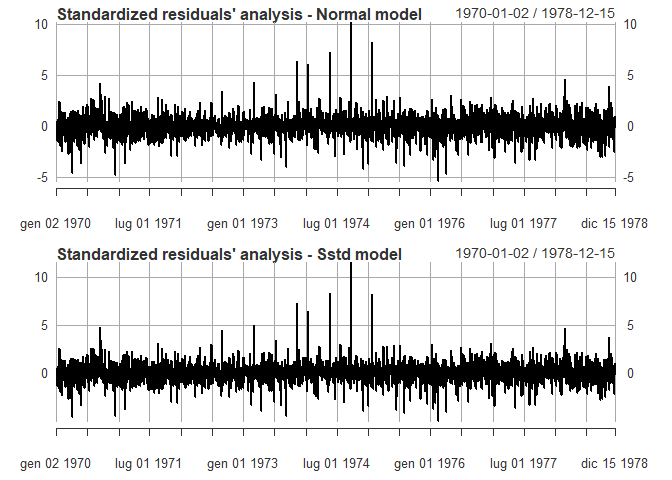<!-- -->

``` r
par(mfrow=c(2,1))
plot(garch11.norm,which=8)
plot(garch11.norm,which=9)
```

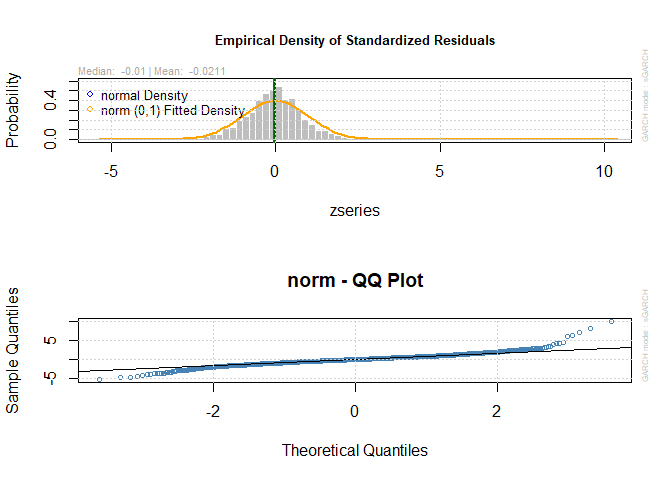<!-- -->

``` r
par(mfrow=c(2,1))
plot(garch11.sstd,which=8)
plot(garch11.sstd,which=9)
```

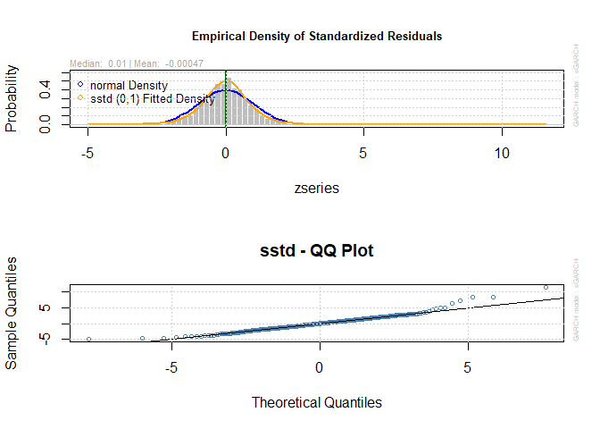<!-- -->

``` r
par(mfrow=c(2,2))
plot(garch11.norm,which=10)
plot(garch11.norm,which=11)
plot(garch11.sstd,which=10)
plot(garch11.sstd,which=11)
```

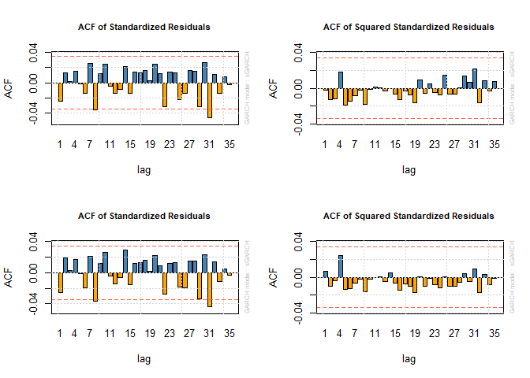<!-- -->

Fitting the GJR-GARCH and E-GARCH models to capture returns’
asymmetrical response to shocks.

GJR-GARCH:

Dubious significance for variance’s intercept. Fail to reject absence of
ARCH effects among residuals. Unstable coefficients. Absence of residual
asymmetry. Satisfying goodness of fit for sstd.

E-GARCH:

Significant coefficients. No residual ARCH effects. Unstable
coefficients. Dubious goodness of fit for sstd.

``` r
spec3=ugarchspec(variance.model=list(model="gjrGARCH",garchOrder=c(1,1)),mean.model = list(armaOrder=c(0,0),include.mean=T),distribution.model = "sstd")
spec4=ugarchspec(variance.model=list(model="eGARCH",garchOrder=c(1,1)),mean.model = list(armaOrder=c(0,0),include.mean=T),distribution.model = "sstd")
#mu is not significant
gjrgarch11.sstd=ugarchfit(spec3,r1)
egarch11.sstd=ugarchfit(spec4,r1)
show(gjrgarch11.sstd)
```

    ## 
    ## *---------------------------------*
    ## *          GARCH Model Fit        *
    ## *---------------------------------*
    ## 
    ## Conditional Variance Dynamics    
    ## -----------------------------------
    ## GARCH Model  : gjrGARCH(1,1)
    ## Mean Model   : ARFIMA(0,0,0)
    ## Distribution : sstd 
    ## 
    ## Optimal Parameters
    ## ------------------------------------
    ##         Estimate  Std. Error  t value Pr(>|t|)
    ## mu      0.000934    0.000385   2.4276 0.015201
    ## omega   0.000006    0.000004   1.7935 0.072891
    ## alpha1  0.030474    0.007571   4.0250 0.000057
    ## beta1   0.932133    0.010612  87.8359 0.000000
    ## gamma1  0.071834    0.016720   4.2963 0.000017
    ## skew    0.984507    0.023562  41.7843 0.000000
    ## shape   4.346800    0.328879  13.2170 0.000000
    ## 
    ## Robust Standard Errors:
    ##         Estimate  Std. Error  t value Pr(>|t|)
    ## mu      0.000934    0.000379  2.46170 0.013828
    ## omega   0.000006    0.000007  0.91725 0.359012
    ## alpha1  0.030474    0.010574  2.88211 0.003950
    ## beta1   0.932133    0.019141 48.69889 0.000000
    ## gamma1  0.071834    0.025007  2.87256 0.004072
    ## skew    0.984507    0.024618 39.99071 0.000000
    ## shape   4.346800    0.364625 11.92128 0.000000
    ## 
    ## LogLikelihood : 7576.95 
    ## 
    ## Information Criteria
    ## ------------------------------------
    ##                     
    ## Akaike       -4.6299
    ## Bayes        -4.6169
    ## Shibata      -4.6299
    ## Hannan-Quinn -4.6253
    ## 
    ## Weighted Ljung-Box Test on Standardized Residuals
    ## ------------------------------------
    ##                         statistic p-value
    ## Lag[1]                      1.367  0.2424
    ## Lag[2*(p+q)+(p+q)-1][2]     2.050  0.2545
    ## Lag[4*(p+q)+(p+q)-1][5]     2.957  0.4150
    ## d.o.f=0
    ## H0 : No serial correlation
    ## 
    ## Weighted Ljung-Box Test on Standardized Squared Residuals
    ## ------------------------------------
    ##                         statistic p-value
    ## Lag[1]                      0.696  0.4041
    ## Lag[2*(p+q)+(p+q)-1][5]     2.590  0.4870
    ## Lag[4*(p+q)+(p+q)-1][9]     4.204  0.5546
    ## d.o.f=2
    ## 
    ## Weighted ARCH LM Tests
    ## ------------------------------------
    ##             Statistic Shape Scale P-Value
    ## ARCH Lag[3]   0.01715 0.500 2.000  0.8958
    ## ARCH Lag[5]   3.50190 1.440 1.667  0.2248
    ## ARCH Lag[7]   4.14935 2.315 1.543  0.3255
    ## 
    ## Nyblom stability test
    ## ------------------------------------
    ## Joint Statistic:  3.9796
    ## Individual Statistics:             
    ## mu     0.8906
    ## omega  0.7490
    ## alpha1 1.1065
    ## beta1  0.6818
    ## gamma1 0.9432
    ## skew   0.6713
    ## shape  1.3532
    ## 
    ## Asymptotic Critical Values (10% 5% 1%)
    ## Joint Statistic:          1.69 1.9 2.35
    ## Individual Statistic:     0.35 0.47 0.75
    ## 
    ## Sign Bias Test
    ## ------------------------------------
    ##                    t-value   prob sig
    ## Sign Bias           1.4980 0.1342    
    ## Negative Sign Bias  0.1152 0.9083    
    ## Positive Sign Bias  0.3632 0.7165    
    ## Joint Effect        3.8352 0.2798    
    ## 
    ## 
    ## Adjusted Pearson Goodness-of-Fit Test:
    ## ------------------------------------
    ##   group statistic p-value(g-1)
    ## 1    20     28.03      0.08284
    ## 2    30     34.64      0.21653
    ## 3    40     50.44      0.10372
    ## 4    50     57.00      0.20194
    ## 
    ## 
    ## Elapsed time : 1.264262

``` r
show(egarch11.sstd)
```

    ## 
    ## *---------------------------------*
    ## *          GARCH Model Fit        *
    ## *---------------------------------*
    ## 
    ## Conditional Variance Dynamics    
    ## -----------------------------------
    ## GARCH Model  : eGARCH(1,1)
    ## Mean Model   : ARFIMA(0,0,0)
    ## Distribution : sstd 
    ## 
    ## Optimal Parameters
    ## ------------------------------------
    ##         Estimate  Std. Error  t value Pr(>|t|)
    ## mu      0.000914    0.000380   2.4071 0.016078
    ## omega  -0.104276    0.010608  -9.8300 0.000000
    ## alpha1 -0.052318    0.011543  -4.5324 0.000006
    ## beta1   0.985746    0.001439 685.2109 0.000000
    ## gamma1  0.157638    0.017936   8.7891 0.000000
    ## skew    0.986806    0.023770  41.5140 0.000000
    ## shape   4.455566    0.345875  12.8820 0.000000
    ## 
    ## Robust Standard Errors:
    ##         Estimate  Std. Error   t value Pr(>|t|)
    ## mu      0.000914    0.000380    2.4070 0.016083
    ## omega  -0.104276    0.005407  -19.2844 0.000000
    ## alpha1 -0.052318    0.012802   -4.0868 0.000044
    ## beta1   0.985746    0.000830 1187.2758 0.000000
    ## gamma1  0.157638    0.023442    6.7245 0.000000
    ## skew    0.986806    0.024831   39.7408 0.000000
    ## shape   4.455566    0.384050   11.6015 0.000000
    ## 
    ## LogLikelihood : 7589.649 
    ## 
    ## Information Criteria
    ## ------------------------------------
    ##                     
    ## Akaike       -4.6377
    ## Bayes        -4.6247
    ## Shibata      -4.6377
    ## Hannan-Quinn -4.6330
    ## 
    ## Weighted Ljung-Box Test on Standardized Residuals
    ## ------------------------------------
    ##                         statistic p-value
    ## Lag[1]                      1.424  0.2327
    ## Lag[2*(p+q)+(p+q)-1][2]     2.185  0.2338
    ## Lag[4*(p+q)+(p+q)-1][5]     3.177  0.3757
    ## d.o.f=0
    ## H0 : No serial correlation
    ## 
    ## Weighted Ljung-Box Test on Standardized Squared Residuals
    ## ------------------------------------
    ##                         statistic p-value
    ## Lag[1]                      1.210  0.2713
    ## Lag[2*(p+q)+(p+q)-1][5]     3.170  0.3769
    ## Lag[4*(p+q)+(p+q)-1][9]     4.775  0.4632
    ## d.o.f=2
    ## 
    ## Weighted ARCH LM Tests
    ## ------------------------------------
    ##             Statistic Shape Scale P-Value
    ## ARCH Lag[3]  0.001073 0.500 2.000  0.9739
    ## ARCH Lag[5]  3.444662 1.440 1.667  0.2315
    ## ARCH Lag[7]  4.095131 2.315 1.543  0.3331
    ## 
    ## Nyblom stability test
    ## ------------------------------------
    ## Joint Statistic:  3.645
    ## Individual Statistics:             
    ## mu     0.9598
    ## omega  0.8216
    ## alpha1 0.2486
    ## beta1  0.8376
    ## gamma1 0.3131
    ## skew   0.6479
    ## shape  0.9526
    ## 
    ## Asymptotic Critical Values (10% 5% 1%)
    ## Joint Statistic:          1.69 1.9 2.35
    ## Individual Statistic:     0.35 0.47 0.75
    ## 
    ## Sign Bias Test
    ## ------------------------------------
    ##                    t-value   prob sig
    ## Sign Bias           1.3071 0.1913    
    ## Negative Sign Bias  0.0693 0.9448    
    ## Positive Sign Bias  0.3335 0.7388    
    ## Joint Effect        2.8151 0.4210    
    ## 
    ## 
    ## Adjusted Pearson Goodness-of-Fit Test:
    ## ------------------------------------
    ##   group statistic p-value(g-1)
    ## 1    20     26.38      0.11997
    ## 2    30     46.37      0.02157
    ## 3    40     57.80      0.02665
    ## 4    50     62.78      0.08921
    ## 
    ## 
    ## Elapsed time : 0.815856

Standardized residuals’ analysis. Similar results.

``` r
resst.gjrgarch11.sstd=residuals(gjrgarch11.sstd,standardize=T)
resst.egarch11.sstd=residuals(egarch11.sstd,standardize=T)
par(mfrow=c(2,1))
plot(resst.gjrgarch11.sstd,main="Standardized residuals' analysis - Normal model")
plot(resst.egarch11.sstd,main="Standardized residuals' analysis - Sstd model")
```

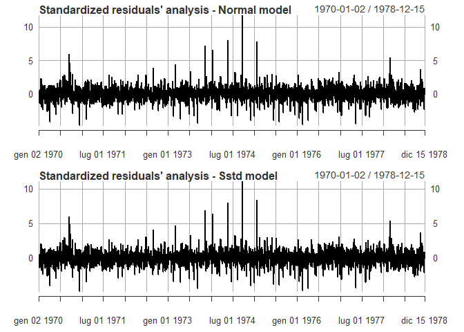<!-- -->

``` r
par(mfrow=c(2,1))
plot(gjrgarch11.sstd,which=8)
plot(gjrgarch11.sstd,which=9)
```

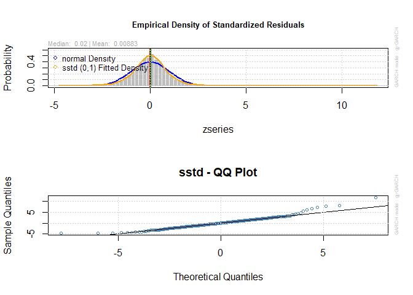<!-- -->

``` r
par(mfrow=c(2,1))
plot(egarch11.sstd,which=8)
plot(egarch11.sstd,which=9)
```

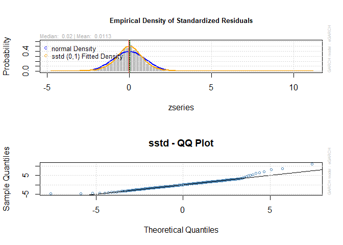<!-- -->

``` r
par(mfrow=c(2,2))
plot(gjrgarch11.sstd,which=10)
plot(gjrgarch11.sstd,which=11)
plot(egarch11.sstd,which=10)
plot(egarch11.sstd,which=11)
```

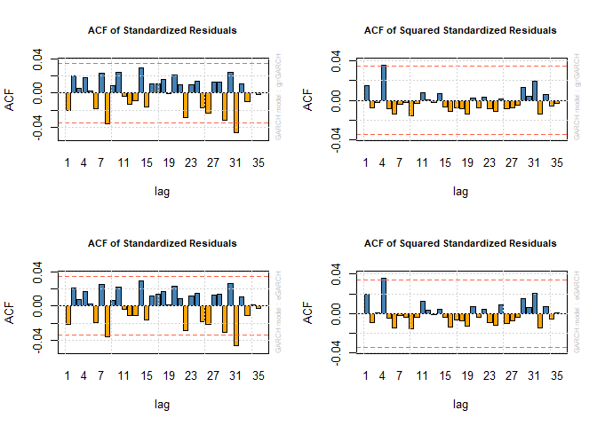<!-- -->

Similar fitted values for sigma, the bigger differences between plots
sits in the “sharpness” and height of peaks. Volatility clustering is
correctly recognized.

``` r
sigma1=sigma(garch11.norm)
sigma2=sigma(garch11.sstd)
sigma3=sigma(egarch11.sstd)
sigma4=sigma(gjrgarch11.sstd)
par(mfrow=c(2,2))
plot(sigma1,main="GARCH(1,1) norm")
plot(sigma2,main="GARCH(1,1) sstd")
plot(sigma3,main="EGARCH(1,1) sstd")
plot(sigma4,main="GJR-GARCH(1,1) sstd")
```

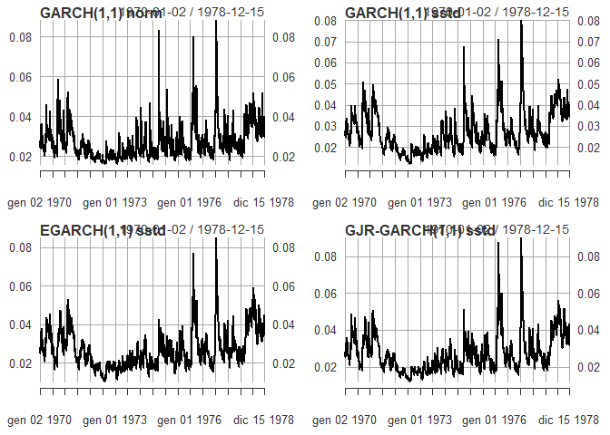<!-- -->

Information Criteria. The first model shows the poorest results in
information criteria, whereas the third one shows the best ones.

``` r
AIC=c(infocriteria(garch11.norm)[1],infocriteria(garch11.sstd)[1],infocriteria(egarch11.sstd)[1],infocriteria(gjrgarch11.sstd)[1])
BIC=c(infocriteria(garch11.norm)[2],infocriteria(garch11.sstd)[2],infocriteria(egarch11.sstd)[2],infocriteria(gjrgarch11.sstd)[2])
SHI=c(infocriteria(garch11.norm)[3],infocriteria(garch11.sstd)[3],infocriteria(egarch11.sstd)[3],infocriteria(gjrgarch11.sstd)[3])
HQC=c(infocriteria(garch11.norm)[4],infocriteria(garch11.sstd)[4],infocriteria(egarch11.sstd)[4],infocriteria(gjrgarch11.sstd)[4])

par(mfrow=c(2,2))
plot(AIC)
plot(BIC)
plot(SHI)
plot(HQC)
```

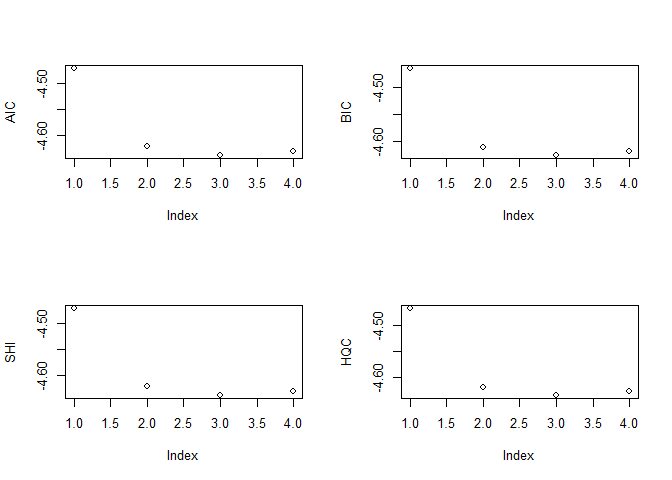<!-- -->

Log-likelihood evaluation. Results compatible with previous analysis.

``` r
loglik=c(garch11.norm@fit$LLH,garch11.sstd@fit$LLH,egarch11.sstd@fit$LLH,gjrgarch11.sstd@fit$LLH)
par(mfrow=c(1,1))
plot(loglik)
```

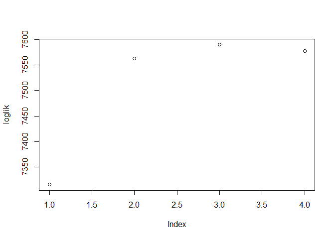<!-- -->

Static and dynamic forecasts.

``` r
for1=ugarchroll(spec1,data=r1,forecast.length = length(r2),refit.every = 5)
for2=ugarchroll(spec2,data=r1,forecast.length = length(r2),refit.every = 5)
for3=ugarchroll(spec3,data=r1,forecast.length = length(r2),refit.every = 5)
for4=ugarchroll(spec4,data=r1,forecast.length = length(r2),refit.every = 5)
forec=cbind("GARCH(1,1) norm"=as.data.frame(for1)$Sigma,"GARCH(1,1) sstd"=as.data.frame(for2)$Sigma,"E-GARCH(1,1) sstd"=as.data.frame(for3)$Sigma,"GJR-GARCH(1,1) sstd"=as.data.frame(for4)$Sigma)
plot(ts(forec),main="Static Forecasts")
```

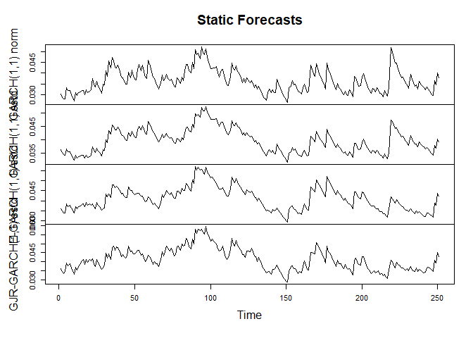<!-- -->

``` r
for5=ugarchforecast(garch11.norm,data=r1,n.ahead = length(r2))
for6=ugarchforecast(garch11.sstd,data=r1,n.ahead = length(r2))
for7=ugarchforecast(egarch11.sstd,data=r1,n.ahead = length(r2))
for8=ugarchforecast(gjrgarch11.sstd,data=r1,n.ahead = length(r2))
forec2=cbind("GARCH(1,1) norm"=for5@forecast$sigmaFor,"GARCH(1,1) sstd"=for6@forecast$sigmaFor,"E-GARCH(1,1) sstd"=for7@forecast$sigmaFor,"GJR-GARCH(1,1) sstd"=for8@forecast$sigmaFor)
plot(ts(forec2),main="Dynamic Forecasts")
```

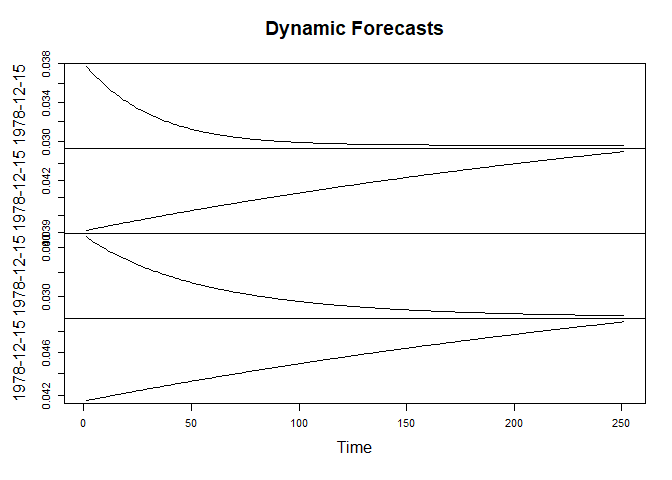<!-- -->

Visualization.

``` r
par(mfrow=c(2,2))
plot(for1,which=1)
plot(for2,which=1)
plot(for3,which=1)
plot(for4,which=1)
```

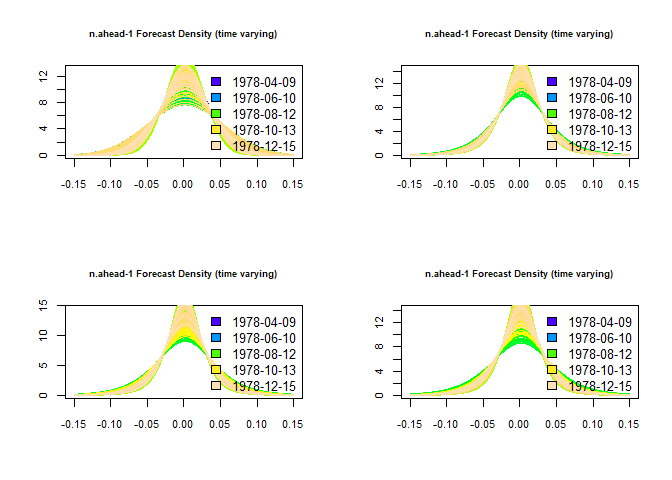<!-- -->

``` r
par(mfrow=c(2,2))
plot(for1,which=2)
plot(for2,which=2)
plot(for3,which=2)
plot(for4,which=2)
```

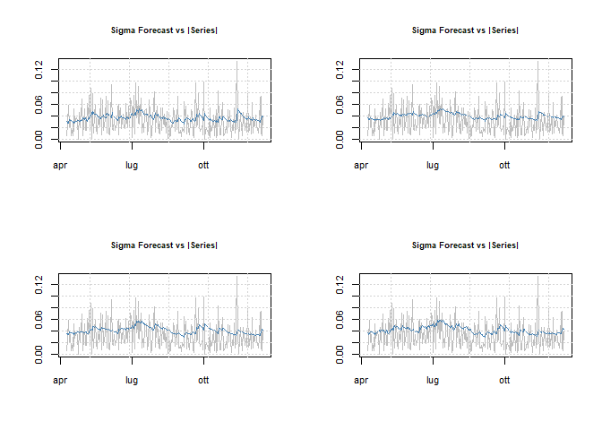<!-- -->

``` r
par(mfrow=c(2,2))
plot(for1,which=3)
plot(for2,which=3)
plot(for3,which=3)
plot(for4,which=3)
```

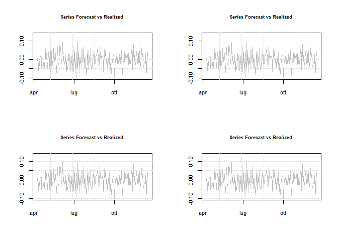<!-- -->

``` r
plot(for1,which=5)
```

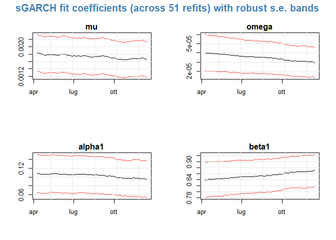<!-- -->

``` r
plot(for2,which=5)
```

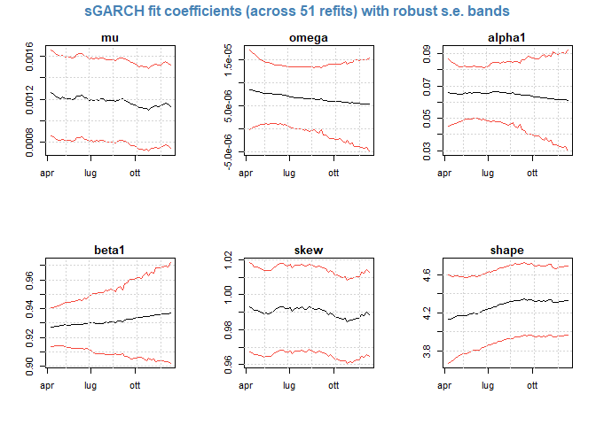<!-- -->

``` r
plot(for3,which=5)
plot(for4,which=5)
```

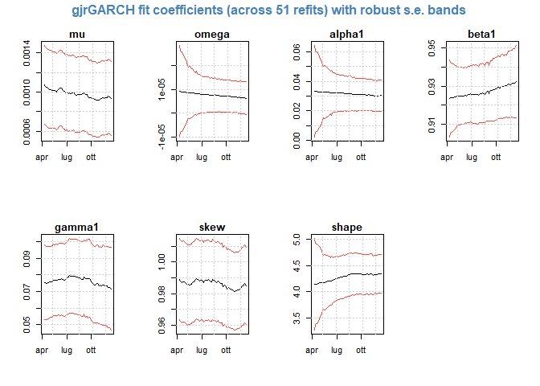<!-- -->

``` r
plot(for5,which=1)
```

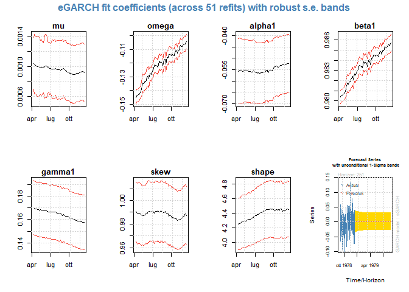<!-- -->

``` r
plot(for6,which=1)
plot(for7,which=1)
plot(for8,which=1)
plot(for5,which=3)
plot(for6,which=3)
plot(for7,which=3)
plot(for8,which=3)
```

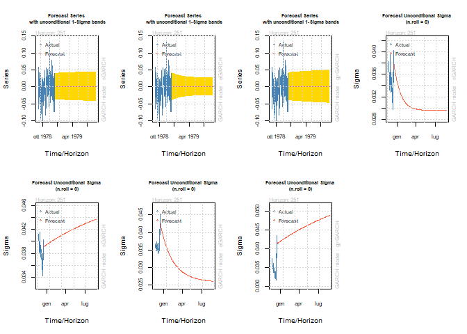<!-- -->

Forecast errors analysis. GARCH norm shows best results for static
forecasts.

``` r
err1=as.data.frame(for1)$Sigma^2-r2^2
err2=as.data.frame(for2)$Sigma^2-r2^2
err3=as.data.frame(for3)$Sigma^2-r2^2
err4=as.data.frame(for4)$Sigma^2-r2^2
ERR=cbind("GARCH(1,1) norm"=err1,"GARCH(1,1) sstd"=err2,"E-GARCH(1,1) sstd"=err3,"GJR-GARCH(1,1) sstd"=err4)
plot(ts(ERR),main="Forcecast's errors")
```

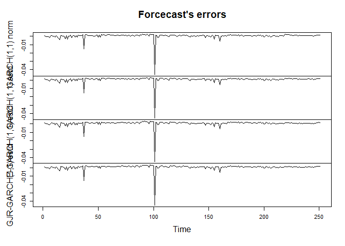<!-- -->

``` r
err.ind=matrix(nrow=3,ncol=4)
colnames(err.ind)=c("GARCH norm","GARCH sstd", "E-GARCH sstd", "GJR-GARCH sstd")
row.names(err.ind)=c("MSE","RMSE","MAE")
err.ind[,1]=c(mean(err1^2),sqrt(mean(err1^2)),mean(abs(err1)))
err.ind[,2]=c(mean(err2^2),sqrt(mean(err2^2)),mean(abs(err2)))
err.ind[,3]=c(mean(err3^2),sqrt(mean(err3^2)),mean(abs(err3)))
err.ind[,4]=c(mean(err4^2),sqrt(mean(err4^2)),mean(abs(err4)))
err.ind
```

    ##        GARCH norm   GARCH sstd E-GARCH sstd GJR-GARCH sstd
    ## MSE  1.091165e-05 1.109242e-05 1.124846e-05   1.130318e-05
    ## RMSE 3.303279e-03 3.330528e-03 3.353873e-03   3.362020e-03
    ## MAE  1.297975e-03 1.468523e-03 1.567255e-03   1.589659e-03

``` r
err5=for5@forecast$sigmaFor^2-r2^2
err6=for6@forecast$sigmaFor^2-r2^2
err7=for7@forecast$sigmaFor^2-r2^2
err8=for8@forecast$sigmaFor^2-r2^2
ERR2=cbind("GARCH(1,1) norm"=err5,"GARCH(1,1) sstd"=err6,"E-GARCH(1,1) sstd"=err7,"GJR-GARCH(1,1) sstd"=err8)
plot(ts(ERR2),main="Forcecast's errors")
```

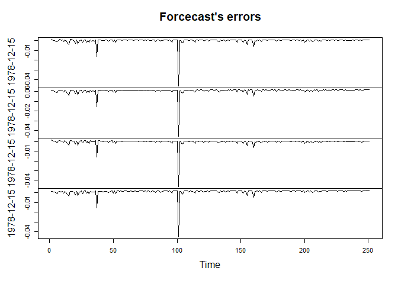<!-- -->

``` r
err.ind2=matrix(nrow=3,ncol=4)
colnames(err.ind2)=c("GARCH norm","GARCH sstd", "E-GARCH sstd", "GJR-GARCH sstd")
row.names(err.ind2)=c("MSE","RMSE","MAE")
err.ind2[,1]=c(mean(err5^2),sqrt(mean(err5^2)),mean(abs(err5)))
err.ind2[,2]=c(mean(err6^2),sqrt(mean(err6^2)),mean(abs(err6)))
err.ind2[,3]=c(mean(err7^2),sqrt(mean(err7^2)),mean(abs(err7)))
err.ind2[,4]=c(mean(err8^2),sqrt(mean(err8^2)),mean(abs(err8)))
err.ind2
```

    ##        GARCH norm   GARCH sstd E-GARCH sstd GJR-GARCH sstd
    ## MSE  1.065792e-05 1.149247e-05 1.062759e-05   0.0000122787
    ## RMSE 3.264647e-03 3.390055e-03 3.259999e-03   0.0035040973
    ## MAE  9.971776e-04 1.590629e-03 9.713474e-04   0.0018808926

Diebold-Mariano. GARCH shows significantly lower error rates (in
comparison with alternatives) in static forecasts. EGARCH and GARCH norm
show significantly more accurate forecasts when compared to the
alternatives.

``` r
i=j=1
DM=matrix(nrow=4,ncol=4)
for (l in 1:16){
  if (i==j) {
    DM[l]=NA
    i=i+1
  }
  else {
    DM[l]=dm_test(ERR[,i],ERR[,j],alternative = "greater",power = 1,varestimator = "NeweyWest")$p.value
    if (i==4){
      i=1
      j=j+1
    }
    else{
      i=i+1
    }
  }
}
DM
```

    ##              [,1]         [,2]      [,3]      [,4]
    ## [1,]           NA 1.0000000000 1.0000000 1.0000000
    ## [2,] 1.333458e-16           NA 0.9963640 0.9992534
    ## [3,] 1.711523e-10 0.0036360212        NA 0.8619991
    ## [4,] 9.526775e-11 0.0007465814 0.1380009        NA

``` r
i=j=1
DM=matrix(nrow=4,ncol=4)
for (l in 1:16){
  if (i==j) {
    DM[l]=NA
    i=i+1
  }
  else {
    DM[l]=dm_test(ERR2[,i],ERR2[,j],alternative = "greater",power = 1,varestimator = "NeweyWest")$p.value
    if (i==4){
      i=1
      j=j+1
    }
    else{
      i=i+1
    }
  }
}
DM
```

    ##              [,1]         [,2]         [,3] [,4]
    ## [1,]           NA 1.000000e+00 2.179106e-02    1
    ## [2,] 1.263668e-31           NA 3.540081e-25    1
    ## [3,] 9.782089e-01 1.000000e+00           NA    1
    ## [4,] 9.883958e-35 1.478301e-38 2.105882e-29   NA

## NVIDIA - monthly

### Prices, log-prices

Refinitiv data from the 31st of January 2010 to the 31st of December
2023.

``` r
data=read_excel("nvidia mensili.xlsx",skip = 31)
```

Prices and log-prices. Exploration of the series characteristics.
Looking at quartiles from the BasicStats’ output looks like the log
transformation reduced skewness, peaks and kurtosis. CI on mean appears
wider than the one calculated for daily prices, likely for sample sizes.

``` r
P=data$Close
P=P[length(P):1]#Reversing series
p=log(P)
BS=basicStats(cbind(P,p))
BS
```

    ##                       P          p
    ## nobs         168.000000 168.000000
    ## NAs            0.000000   0.000000
    ## Minimum        0.229750  -1.470764
    ## Maximum       49.522000   3.902417
    ## 1. Quartile    0.403875  -0.906662
    ## 3. Quartile    9.777000   2.278852
    ## Mean           7.450344   0.789286
    ## Median         2.572250   0.944687
    ## Sum         1251.657750 132.600000
    ## SE Mean        0.863968   0.129460
    ## LCL Mean       5.744637   0.533697
    ## UCL Mean       9.156050   1.044874
    ## Variance     125.401947   2.815654
    ## Stdev         11.198301   1.677991
    ## Skewness       2.059736   0.253230
    ## Kurtosis       3.863967  -1.426289

``` r
par(mfrow=c(1,2))
tsplot(P,xlab="Time",ylab="Prices",main="NVIDIA - PRICES")
tsplot(p,xlab="Time",ylab="Log-Prices",main="NVIDIA - LOG-PRICES")
```

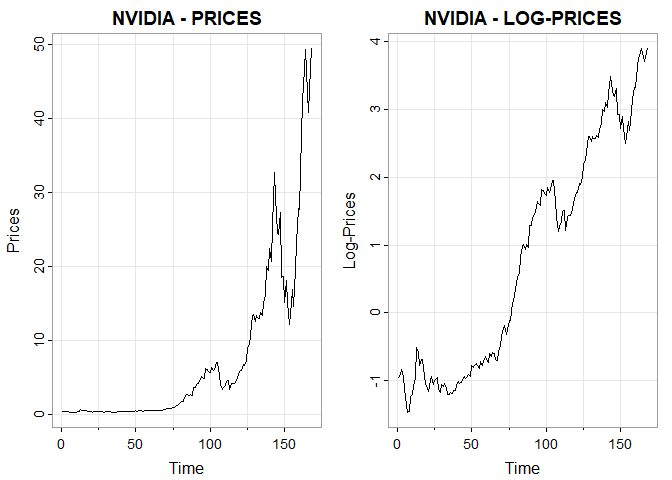<!-- -->

ACF/PACF analysis. The plots suggest the presence of a RW.

``` r
par(mfrow=c(2,2))
acf.P=acf(P,lag.max = 12)
pacf.P=pacf(P,lag.max=12)
acf.p=acf(p,lag.max=12)
pacf.p=pacf(p,lag.max=12)
```

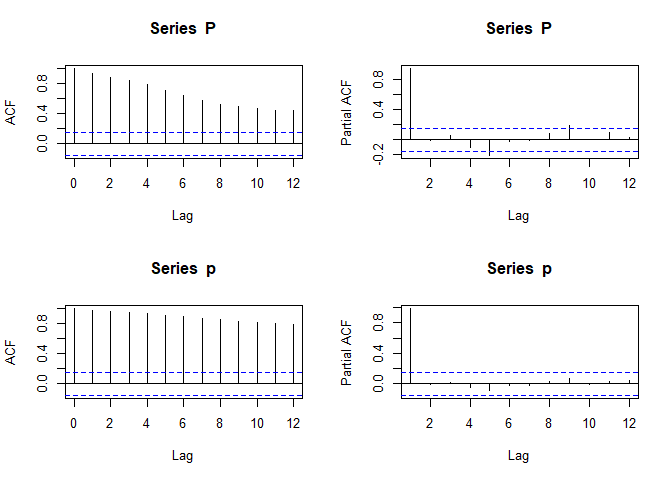<!-- -->

``` r
pacf.P[1]
```

    ## 
    ## Partial autocorrelations of series 'P', by lag
    ## 
    ##     1 
    ## 0.942

Augmented Dickey-Fuller tests for unit roots and Ljung-Box on residuals.
Presence of one unit root and residuals’ absence of correlation
confirmed: RW is confirmed.

``` r
adf1=adfTest(p,lags=12,type="ct")
summary(adf1@test$lm)
```

    ## 
    ## Call:
    ## lm(formula = y.diff ~ y.lag.1 + 1 + tt + y.diff.lag)
    ## 
    ## Residuals:
    ##      Min       1Q   Median       3Q      Max 
    ## -0.37432 -0.05909  0.00166  0.06539  0.29068 
    ## 
    ## Coefficients:
    ##                Estimate Std. Error t value Pr(>|t|)    
    ## (Intercept)  -0.2070765  0.0618411  -3.349 0.001044 ** 
    ## y.lag.1      -0.0872807  0.0251805  -3.466 0.000701 ***
    ## tt            0.0033599  0.0008882   3.783 0.000229 ***
    ## y.diff.lag1   0.0599547  0.0787661   0.761 0.447834    
    ## y.diff.lag2   0.0145171  0.0786594   0.185 0.853844    
    ## y.diff.lag3   0.0989744  0.0787201   1.257 0.210740    
    ## y.diff.lag4   0.1472840  0.0799629   1.842 0.067605 .  
    ## y.diff.lag5  -0.0356818  0.0807190  -0.442 0.659136    
    ## y.diff.lag6   0.0884609  0.0804355   1.100 0.273318    
    ## y.diff.lag7   0.0014492  0.0801969   0.018 0.985608    
    ## y.diff.lag8   0.0617079  0.0789937   0.781 0.436019    
    ## y.diff.lag9   0.0090832  0.0780282   0.116 0.907495    
    ## y.diff.lag10  0.0029121  0.0780369   0.037 0.970285    
    ## y.diff.lag11 -0.0723463  0.0780117  -0.927 0.355327    
    ## y.diff.lag12  0.0346566  0.0787458   0.440 0.660538    
    ## ---
    ## Signif. codes:  0 '***' 0.001 '**' 0.01 '*' 0.05 '.' 0.1 ' ' 1
    ## 
    ## Residual standard error: 0.1182 on 140 degrees of freedom
    ## Multiple R-squared:  0.1396, Adjusted R-squared:  0.0536 
    ## F-statistic: 1.623 on 14 and 140 DF,  p-value: 0.07987

``` r
#Starting point: 12 lags (monthly series). 12th lag isn't significant.
adf1=adfTest(p,lags=11,type="ct")
summary(adf1@test$lm)
```

    ## 
    ## Call:
    ## lm(formula = y.diff ~ y.lag.1 + 1 + tt + y.diff.lag)
    ## 
    ## Residuals:
    ##      Min       1Q   Median       3Q      Max 
    ## -0.37178 -0.05969 -0.00104  0.06487  0.43157 
    ## 
    ## Coefficients:
    ##                Estimate Std. Error t value Pr(>|t|)   
    ## (Intercept)  -0.1475177  0.0626157  -2.356  0.01984 * 
    ## y.lag.1      -0.0672164  0.0257584  -2.609  0.01004 * 
    ## tt            0.0025646  0.0009048   2.835  0.00526 **
    ## y.diff.lag1   0.0644236  0.0820680   0.785  0.43376   
    ## y.diff.lag2   0.0236928  0.0823087   0.288  0.77388   
    ## y.diff.lag3   0.0988347  0.0824082   1.199  0.23240   
    ## y.diff.lag4   0.1884745  0.0830293   2.270  0.02471 * 
    ## y.diff.lag5  -0.0489302  0.0841102  -0.582  0.56166   
    ## y.diff.lag6   0.0534606  0.0837252   0.639  0.52416   
    ## y.diff.lag7  -0.0651086  0.0815181  -0.799  0.42580   
    ## y.diff.lag8   0.0200847  0.0815033   0.246  0.80571   
    ## y.diff.lag9  -0.0041542  0.0815571  -0.051  0.95945   
    ## y.diff.lag10  0.0183014  0.0816076   0.224  0.82288   
    ## y.diff.lag11 -0.0579276  0.0814455  -0.711  0.47810   
    ## ---
    ## Signif. codes:  0 '***' 0.001 '**' 0.01 '*' 0.05 '.' 0.1 ' ' 1
    ## 
    ## Residual standard error: 0.1237 on 142 degrees of freedom
    ## Multiple R-squared:  0.1091, Adjusted R-squared:  0.02751 
    ## F-statistic: 1.337 on 13 and 142 DF,  p-value: 0.1982

``` r
adf1=adfTest(p,lags=10,type="ct")
summary(adf1@test$lm)
```

    ## 
    ## Call:
    ## lm(formula = y.diff ~ y.lag.1 + 1 + tt + y.diff.lag)
    ## 
    ## Residuals:
    ##      Min       1Q   Median       3Q      Max 
    ## -0.37846 -0.06941 -0.00481  0.06877  0.41512 
    ## 
    ## Coefficients:
    ##                Estimate Std. Error t value Pr(>|t|)   
    ## (Intercept)  -0.1383838  0.0605525  -2.285  0.02375 * 
    ## y.lag.1      -0.0645193  0.0251406  -2.566  0.01130 * 
    ## tt            0.0024327  0.0008804   2.763  0.00648 **
    ## y.diff.lag1   0.0690182  0.0818673   0.843  0.40060   
    ## y.diff.lag2   0.0259968  0.0821378   0.317  0.75208   
    ## y.diff.lag3   0.1109803  0.0815422   1.361  0.17563   
    ## y.diff.lag4   0.1935189  0.0824267   2.348  0.02025 * 
    ## y.diff.lag5  -0.0585258  0.0834495  -0.701  0.48423   
    ## y.diff.lag6   0.0451940  0.0812774   0.556  0.57904   
    ## y.diff.lag7  -0.0845685  0.0799118  -1.058  0.29170   
    ## y.diff.lag8   0.0142787  0.0812555   0.176  0.86076   
    ## y.diff.lag9   0.0006002  0.0813206   0.007  0.99412   
    ## y.diff.lag10  0.0176862  0.0811937   0.218  0.82787   
    ## ---
    ## Signif. codes:  0 '***' 0.001 '**' 0.01 '*' 0.05 '.' 0.1 ' ' 1
    ## 
    ## Residual standard error: 0.1236 on 144 degrees of freedom
    ## Multiple R-squared:  0.1023, Adjusted R-squared:  0.02748 
    ## F-statistic: 1.367 on 12 and 144 DF,  p-value: 0.1881

``` r
adf1=adfTest(p,lags=9,type="ct")
summary(adf1@test$lm)
```

    ## 
    ## Call:
    ## lm(formula = y.diff ~ y.lag.1 + 1 + tt + y.diff.lag)
    ## 
    ## Residuals:
    ##      Min       1Q   Median       3Q      Max 
    ## -0.38882 -0.06422 -0.00339  0.07056  0.40804 
    ## 
    ## Coefficients:
    ##               Estimate Std. Error t value Pr(>|t|)  
    ## (Intercept) -0.1222945  0.0586959  -2.084   0.0389 *
    ## y.lag.1     -0.0591155  0.0245826  -2.405   0.0174 *
    ## tt           0.0022225  0.0008591   2.587   0.0107 *
    ## y.diff.lag1  0.0694713  0.0816508   0.851   0.3963  
    ## y.diff.lag2  0.0386895  0.0811982   0.476   0.6344  
    ## y.diff.lag3  0.1081362  0.0808323   1.338   0.1830  
    ## y.diff.lag4  0.1842246  0.0818670   2.250   0.0259 *
    ## y.diff.lag5 -0.0800339  0.0808359  -0.990   0.3238  
    ## y.diff.lag6  0.0341201  0.0796512   0.428   0.6690  
    ## y.diff.lag7 -0.0888799  0.0795759  -1.117   0.2659  
    ## y.diff.lag8  0.0192521  0.0809662   0.238   0.8124  
    ## y.diff.lag9  0.0062669  0.0808229   0.078   0.9383  
    ## ---
    ## Signif. codes:  0 '***' 0.001 '**' 0.01 '*' 0.05 '.' 0.1 ' ' 1
    ## 
    ## Residual standard error: 0.1233 on 146 degrees of freedom
    ## Multiple R-squared:  0.09665,    Adjusted R-squared:  0.02858 
    ## F-statistic:  1.42 on 11 and 146 DF,  p-value: 0.1696

``` r
adf1=adfTest(p,lags=8,type="ct")
summary(adf1@test$lm)
```

    ## 
    ## Call:
    ## lm(formula = y.diff ~ y.lag.1 + 1 + tt + y.diff.lag)
    ## 
    ## Residuals:
    ##      Min       1Q   Median       3Q      Max 
    ## -0.38841 -0.06200 -0.00166  0.07264  0.40571 
    ## 
    ## Coefficients:
    ##               Estimate Std. Error t value Pr(>|t|)  
    ## (Intercept) -0.1132756  0.0568003  -1.994   0.0480 *
    ## y.lag.1     -0.0561449  0.0239898  -2.340   0.0206 *
    ## tt           0.0021047  0.0008369   2.515   0.0130 *
    ## y.diff.lag1  0.0776462  0.0804393   0.965   0.3360  
    ## y.diff.lag2  0.0376371  0.0802209   0.469   0.6396  
    ## y.diff.lag3  0.1028426  0.0800995   1.284   0.2012  
    ## y.diff.lag4  0.1721981  0.0791718   2.175   0.0312 *
    ## y.diff.lag5 -0.0878022  0.0789133  -1.113   0.2677  
    ## y.diff.lag6  0.0313716  0.0790826   0.397   0.6922  
    ## y.diff.lag7 -0.0861752  0.0790914  -1.090   0.2777  
    ## y.diff.lag8  0.0225123  0.0802517   0.281   0.7795  
    ## ---
    ## Signif. codes:  0 '***' 0.001 '**' 0.01 '*' 0.05 '.' 0.1 ' ' 1
    ## 
    ## Residual standard error: 0.1227 on 148 degrees of freedom
    ## Multiple R-squared:  0.0934, Adjusted R-squared:  0.03214 
    ## F-statistic: 1.525 on 10 and 148 DF,  p-value: 0.1358

``` r
adf1=adfTest(p,lags=7,type="ct")
summary(adf1@test$lm)
```

    ## 
    ## Call:
    ## lm(formula = y.diff ~ y.lag.1 + 1 + tt + y.diff.lag)
    ## 
    ## Residuals:
    ##      Min       1Q   Median       3Q      Max 
    ## -0.38242 -0.06184 -0.00425  0.07309  0.39778 
    ## 
    ## Coefficients:
    ##              Estimate Std. Error t value Pr(>|t|)  
    ## (Intercept) -0.088676   0.056115  -1.580   0.1162  
    ## y.lag.1     -0.048635   0.023901  -2.035   0.0436 *
    ## tt           0.001801   0.000833   2.162   0.0322 *
    ## y.diff.lag1  0.076205   0.080703   0.944   0.3466  
    ## y.diff.lag2  0.022505   0.080801   0.279   0.7810  
    ## y.diff.lag3  0.068738   0.079042   0.870   0.3859  
    ## y.diff.lag4  0.154078   0.078750   1.957   0.0523 .
    ## y.diff.lag5 -0.099633   0.079502  -1.253   0.2121  
    ## y.diff.lag6  0.040846   0.079817   0.512   0.6096  
    ## y.diff.lag7 -0.079813   0.079750  -1.001   0.3185  
    ## ---
    ## Signif. codes:  0 '***' 0.001 '**' 0.01 '*' 0.05 '.' 0.1 ' ' 1
    ## 
    ## Residual standard error: 0.124 on 150 degrees of freedom
    ## Multiple R-squared:  0.07524,    Adjusted R-squared:  0.01976 
    ## F-statistic: 1.356 on 9 and 150 DF,  p-value: 0.2131

``` r
adf1=adfTest(p,lags=6,type="ct")
summary(adf1@test$lm)
```

    ## 
    ## Call:
    ## lm(formula = y.diff ~ y.lag.1 + 1 + tt + y.diff.lag)
    ## 
    ## Residuals:
    ##      Min       1Q   Median       3Q      Max 
    ## -0.36298 -0.06894 -0.00462  0.06702  0.41882 
    ## 
    ## Coefficients:
    ##               Estimate Std. Error t value Pr(>|t|)  
    ## (Intercept) -0.0907845  0.0546663  -1.661   0.0988 .
    ## y.lag.1     -0.0504193  0.0234533  -2.150   0.0332 *
    ## tt           0.0018279  0.0008176   2.236   0.0268 *
    ## y.diff.lag1  0.0730425  0.0802526   0.910   0.3642  
    ## y.diff.lag2  0.0269520  0.0785816   0.343   0.7321  
    ## y.diff.lag3  0.0553937  0.0778811   0.711   0.4780  
    ## y.diff.lag4  0.1495715  0.0783807   1.908   0.0582 .
    ## y.diff.lag5 -0.0987688  0.0792163  -1.247   0.2144  
    ## y.diff.lag6  0.0367908  0.0794238   0.463   0.6439  
    ## ---
    ## Signif. codes:  0 '***' 0.001 '**' 0.01 '*' 0.05 '.' 0.1 ' ' 1
    ## 
    ## Residual standard error: 0.1237 on 152 degrees of freedom
    ## Multiple R-squared:  0.06743,    Adjusted R-squared:  0.01834 
    ## F-statistic: 1.374 on 8 and 152 DF,  p-value: 0.2122

``` r
adf1=adfTest(p,lags=5,type="ct")
summary(adf1@test$lm)
```

    ## 
    ## Call:
    ## lm(formula = y.diff ~ y.lag.1 + 1 + tt + y.diff.lag)
    ## 
    ## Residuals:
    ##      Min       1Q   Median       3Q      Max 
    ## -0.36951 -0.06525 -0.00160  0.06758  0.41540 
    ## 
    ## Coefficients:
    ##               Estimate Std. Error t value Pr(>|t|)  
    ## (Intercept) -0.0930936  0.0530631  -1.754   0.0814 .
    ## y.lag.1     -0.0506137  0.0229341  -2.207   0.0288 *
    ## tt           0.0018587  0.0007995   2.325   0.0214 *
    ## y.diff.lag1  0.0756024  0.0778541   0.971   0.3330  
    ## y.diff.lag2  0.0359148  0.0772368   0.465   0.6426  
    ## y.diff.lag3  0.0590668  0.0773147   0.764   0.4460  
    ## y.diff.lag4  0.1484906  0.0779222   1.906   0.0586 .
    ## y.diff.lag5 -0.0979187  0.0786348  -1.245   0.2149  
    ## ---
    ## Signif. codes:  0 '***' 0.001 '**' 0.01 '*' 0.05 '.' 0.1 ' ' 1
    ## 
    ## Residual standard error: 0.1231 on 154 degrees of freedom
    ## Multiple R-squared:  0.07129,    Adjusted R-squared:  0.02907 
    ## F-statistic: 1.689 on 7 and 154 DF,  p-value: 0.1155

``` r
adf1=adfTest(p,lags=4,type="ct")
summary(adf1@test$lm)
```

    ## 
    ## Call:
    ## lm(formula = y.diff ~ y.lag.1 + 1 + tt + y.diff.lag)
    ## 
    ## Residuals:
    ##      Min       1Q   Median       3Q      Max 
    ## -0.37530 -0.06454 -0.00299  0.07393  0.42706 
    ## 
    ## Coefficients:
    ##               Estimate Std. Error t value Pr(>|t|)   
    ## (Intercept) -0.1212082  0.0517619  -2.342  0.02046 * 
    ## y.lag.1     -0.0612764  0.0225305  -2.720  0.00727 **
    ## tt           0.0022361  0.0007853   2.847  0.00500 **
    ## y.diff.lag1  0.0826461  0.0774399   1.067  0.28752   
    ## y.diff.lag2  0.0443278  0.0776152   0.571  0.56874   
    ## y.diff.lag3  0.0535971  0.0778716   0.688  0.49230   
    ## y.diff.lag4  0.1419220  0.0784295   1.810  0.07229 . 
    ## ---
    ## Signif. codes:  0 '***' 0.001 '**' 0.01 '*' 0.05 '.' 0.1 ' ' 1
    ## 
    ## Residual standard error: 0.1241 on 156 degrees of freedom
    ## Multiple R-squared:  0.07416,    Adjusted R-squared:  0.03855 
    ## F-statistic: 2.083 on 6 and 156 DF,  p-value: 0.05822

``` r
#4 significant lags, trend and intercept are significant too.

adf1
```

    ## 
    ## Title:
    ##  Augmented Dickey-Fuller Test
    ## 
    ## Test Results:
    ##   PARAMETER:
    ##     Lag Order: 4
    ##   STATISTIC:
    ##     Dickey-Fuller: -2.7197
    ##   P VALUE:
    ##     0.2759 
    ## 
    ## Description:
    ##  Sun Apr 26 23:50:24 2026 by user: Utente

``` r
#Fail to reject H0: at least one unit root.

dp=diff(p)
adf2=adfTest(dp,lags=12,type="ct")
summary(adf2@test$lm)
```

    ## 
    ## Call:
    ## lm(formula = y.diff ~ y.lag.1 + 1 + tt + y.diff.lag)
    ## 
    ## Residuals:
    ##      Min       1Q   Median       3Q      Max 
    ## -0.39630 -0.05301  0.00673  0.06878  0.30933 
    ## 
    ## Coefficients:
    ##                Estimate Std. Error t value Pr(>|t|)    
    ## (Intercept)  -0.0044870  0.0225102  -0.199 0.842296    
    ## y.lag.1      -0.9416118  0.2670353  -3.526 0.000572 ***
    ## tt            0.0003499  0.0002327   1.504 0.134904    
    ## y.diff.lag1  -0.0168354  0.2530579  -0.067 0.947053    
    ## y.diff.lag2  -0.0274947  0.2387797  -0.115 0.908495    
    ## y.diff.lag3   0.0416537  0.2262804   0.184 0.854219    
    ## y.diff.lag4   0.1523888  0.2148865   0.709 0.479413    
    ## y.diff.lag5   0.0630411  0.2041565   0.309 0.757945    
    ## y.diff.lag6   0.1063772  0.1904771   0.558 0.577417    
    ## y.diff.lag7   0.0573009  0.1775028   0.323 0.747319    
    ## y.diff.lag8   0.0899706  0.1624963   0.554 0.580689    
    ## y.diff.lag9   0.0652072  0.1510576   0.432 0.666649    
    ## y.diff.lag10  0.0418039  0.1339657   0.312 0.755471    
    ## y.diff.lag11 -0.0540435  0.1109211  -0.487 0.626867    
    ## y.diff.lag12 -0.0469107  0.0823529  -0.570 0.569848    
    ## ---
    ## Signif. codes:  0 '***' 0.001 '**' 0.01 '*' 0.05 '.' 0.1 ' ' 1
    ## 
    ## Residual standard error: 0.1233 on 139 degrees of freedom
    ## Multiple R-squared:  0.5094, Adjusted R-squared:   0.46 
    ## F-statistic: 10.31 on 14 and 139 DF,  p-value: 1.282e-15

``` r
adf2=adfTest(dp,lags=11,type="ct")
summary(adf2@test$lm)
```

    ## 
    ## Call:
    ## lm(formula = y.diff ~ y.lag.1 + 1 + tt + y.diff.lag)
    ## 
    ## Residuals:
    ##      Min       1Q   Median       3Q      Max 
    ## -0.39847 -0.05132  0.00577  0.07235  0.30758 
    ## 
    ## Coefficients:
    ##                Estimate Std. Error t value Pr(>|t|)    
    ## (Intercept)  -0.0056723  0.0220966  -0.257 0.797780    
    ## y.lag.1      -0.9995751  0.2512858  -3.978 0.000111 ***
    ## tt            0.0003764  0.0002277   1.653 0.100586    
    ## y.diff.lag1   0.0317647  0.2372488   0.134 0.893682    
    ## y.diff.lag2   0.0160300  0.2245545   0.071 0.943192    
    ## y.diff.lag3   0.0821626  0.2118143   0.388 0.698676    
    ## y.diff.lag4   0.1909689  0.2006957   0.952 0.342961    
    ## y.diff.lag5   0.0983707  0.1876049   0.524 0.600858    
    ## y.diff.lag6   0.1370732  0.1750433   0.783 0.434892    
    ## y.diff.lag7   0.0918402  0.1612628   0.570 0.569919    
    ## y.diff.lag8   0.1251972  0.1493897   0.838 0.403417    
    ## y.diff.lag9   0.1097174  0.1327802   0.826 0.410025    
    ## y.diff.lag10  0.0898858  0.1100329   0.817 0.415364    
    ## y.diff.lag11 -0.0085443  0.0813887  -0.105 0.916540    
    ## ---
    ## Signif. codes:  0 '***' 0.001 '**' 0.01 '*' 0.05 '.' 0.1 ' ' 1
    ## 
    ## Residual standard error: 0.1227 on 141 degrees of freedom
    ## Multiple R-squared:  0.5339, Adjusted R-squared:  0.4909 
    ## F-statistic: 12.42 on 13 and 141 DF,  p-value: < 2.2e-16

``` r
adf2=adfTest(dp,lags=10,type="ct")
```

    ## Warning in adfTest(dp, lags = 10, type = "ct"): p-value smaller than printed
    ## p-value

``` r
summary(adf2@test$lm)
```

    ## 
    ## Call:
    ## lm(formula = y.diff ~ y.lag.1 + 1 + tt + y.diff.lag)
    ## 
    ## Residuals:
    ##      Min       1Q   Median       3Q      Max 
    ## -0.39030 -0.05762  0.00656  0.06973  0.37291 
    ## 
    ## Coefficients:
    ##                Estimate Std. Error t value Pr(>|t|)    
    ## (Intercept)   0.0055644  0.0224300   0.248    0.804    
    ## y.lag.1      -1.0043405  0.2427579  -4.137 5.97e-05 ***
    ## tt            0.0002792  0.0002318   1.205    0.230    
    ## y.diff.lag1   0.0473398  0.2300661   0.206    0.837    
    ## y.diff.lag2   0.0457504  0.2164642   0.211    0.833    
    ## y.diff.lag3   0.1185313  0.2028292   0.584    0.560    
    ## y.diff.lag4   0.2700814  0.1882724   1.435    0.154    
    ## y.diff.lag5   0.1786026  0.1762438   1.013    0.313    
    ## y.diff.lag6   0.1968473  0.1625550   1.211    0.228    
    ## y.diff.lag7   0.1054593  0.1526557   0.691    0.491    
    ## y.diff.lag8   0.1068012  0.1346584   0.793    0.429    
    ## y.diff.lag9   0.0839816  0.1118686   0.751    0.454    
    ## y.diff.lag10  0.0820348  0.0825472   0.994    0.322    
    ## ---
    ## Signif. codes:  0 '***' 0.001 '**' 0.01 '*' 0.05 '.' 0.1 ' ' 1
    ## 
    ## Residual standard error: 0.1262 on 143 degrees of freedom
    ## Multiple R-squared:  0.5104, Adjusted R-squared:  0.4693 
    ## F-statistic: 12.42 on 12 and 143 DF,  p-value: < 2.2e-16

``` r
adf2=adfTest(dp,lags=9,type="ct")
```

    ## Warning in adfTest(dp, lags = 9, type = "ct"): p-value smaller than printed
    ## p-value

``` r
summary(adf2@test$lm)
```

    ## 
    ## Call:
    ## lm(formula = y.diff ~ y.lag.1 + 1 + tt + y.diff.lag)
    ## 
    ## Residuals:
    ##      Min       1Q   Median       3Q      Max 
    ## -0.39059 -0.05943  0.00832  0.07236  0.36078 
    ## 
    ## Coefficients:
    ##               Estimate Std. Error t value Pr(>|t|)    
    ## (Intercept)  0.0067714  0.0220969   0.306    0.760    
    ## y.lag.1     -0.9267205  0.2290218  -4.046 8.43e-05 ***
    ## tt           0.0002479  0.0002288   1.083    0.281    
    ## y.diff.lag1 -0.0268695  0.2157482  -0.125    0.901    
    ## y.diff.lag2 -0.0254946  0.2019052  -0.126    0.900    
    ## y.diff.lag3  0.0544217  0.1861417   0.292    0.770    
    ## y.diff.lag4  0.2140482  0.1732366   1.236    0.219    
    ## y.diff.lag5  0.1173425  0.1603326   0.732    0.465    
    ## y.diff.lag6  0.1380014  0.1506047   0.916    0.361    
    ## y.diff.lag7  0.0296188  0.1342060   0.221    0.826    
    ## y.diff.lag8  0.0262313  0.1110854   0.236    0.814    
    ## y.diff.lag9  0.0060875  0.0822026   0.074    0.941    
    ## ---
    ## Signif. codes:  0 '***' 0.001 '**' 0.01 '*' 0.05 '.' 0.1 ' ' 1
    ## 
    ## Residual standard error: 0.1259 on 145 degrees of freedom
    ## Multiple R-squared:  0.506,  Adjusted R-squared:  0.4685 
    ## F-statistic:  13.5 on 11 and 145 DF,  p-value: < 2.2e-16

``` r
adf2=adfTest(dp,lags=8,type="ct")
```

    ## Warning in adfTest(dp, lags = 8, type = "ct"): p-value smaller than printed
    ## p-value

``` r
summary(adf2@test$lm)
```

    ## 
    ## Call:
    ## lm(formula = y.diff ~ y.lag.1 + 1 + tt + y.diff.lag)
    ## 
    ## Residuals:
    ##      Min       1Q   Median       3Q      Max 
    ## -0.39142 -0.05974  0.00699  0.07252  0.35748 
    ## 
    ## Coefficients:
    ##               Estimate Std. Error t value Pr(>|t|)    
    ## (Intercept)  0.0092165  0.0217176   0.424    0.672    
    ## y.lag.1     -0.9251120  0.2144093  -4.315 2.92e-05 ***
    ## tt           0.0002268  0.0002255   1.006    0.316    
    ## y.diff.lag1 -0.0266201  0.2008516  -0.133    0.895    
    ## y.diff.lag2 -0.0155924  0.1850514  -0.084    0.933    
    ## y.diff.lag3  0.0657913  0.1711626   0.384    0.701    
    ## y.diff.lag4  0.2209169  0.1572989   1.404    0.162    
    ## y.diff.lag5  0.1142559  0.1484009   0.770    0.443    
    ## y.diff.lag6  0.1267200  0.1322260   0.958    0.339    
    ## y.diff.lag7  0.0160024  0.1105190   0.145    0.885    
    ## y.diff.lag8  0.0167766  0.0815480   0.206    0.837    
    ## ---
    ## Signif. codes:  0 '***' 0.001 '**' 0.01 '*' 0.05 '.' 0.1 ' ' 1
    ## 
    ## Residual standard error: 0.1253 on 147 degrees of freedom
    ## Multiple R-squared:  0.5051, Adjusted R-squared:  0.4714 
    ## F-statistic:    15 on 10 and 147 DF,  p-value: < 2.2e-16

``` r
adf2=adfTest(dp,lags=7,type="ct")
```

    ## Warning in adfTest(dp, lags = 7, type = "ct"): p-value smaller than printed
    ## p-value

``` r
summary(adf2@test$lm)
```

    ## 
    ## Call:
    ## lm(formula = y.diff ~ y.lag.1 + 1 + tt + y.diff.lag)
    ## 
    ## Residuals:
    ##      Min       1Q   Median       3Q      Max 
    ## -0.39460 -0.06026  0.00674  0.07419  0.35844 
    ## 
    ## Coefficients:
    ##               Estimate Std. Error t value Pr(>|t|)    
    ## (Intercept)  0.0102800  0.0213134   0.482    0.630    
    ## y.lag.1     -0.9123381  0.1994542  -4.574 9.99e-06 ***
    ## tt           0.0002139  0.0002218   0.965    0.336    
    ## y.diff.lag1 -0.0349301  0.1838763  -0.190    0.850    
    ## y.diff.lag2 -0.0217365  0.1700696  -0.128    0.898    
    ## y.diff.lag3  0.0576215  0.1555711   0.370    0.712    
    ## y.diff.lag4  0.2100096  0.1457100   1.441    0.152    
    ## y.diff.lag5  0.0974218  0.1305017   0.747    0.457    
    ## y.diff.lag6  0.1080480  0.1090426   0.991    0.323    
    ## y.diff.lag7 -0.0011676  0.0809208  -0.014    0.989    
    ## ---
    ## Signif. codes:  0 '***' 0.001 '**' 0.01 '*' 0.05 '.' 0.1 ' ' 1
    ## 
    ## Residual standard error: 0.1245 on 149 degrees of freedom
    ## Multiple R-squared:  0.5085, Adjusted R-squared:  0.4788 
    ## F-statistic: 17.13 on 9 and 149 DF,  p-value: < 2.2e-16

``` r
adf2=adfTest(dp,lags=6,type="ct")
```

    ## Warning in adfTest(dp, lags = 6, type = "ct"): p-value smaller than printed
    ## p-value

``` r
summary(adf2@test$lm)
```

    ## 
    ## Call:
    ## lm(formula = y.diff ~ y.lag.1 + 1 + tt + y.diff.lag)
    ## 
    ## Residuals:
    ##      Min       1Q   Median       3Q      Max 
    ## -0.39233 -0.06383  0.00526  0.07633  0.36003 
    ## 
    ## Coefficients:
    ##               Estimate Std. Error t value Pr(>|t|)    
    ## (Intercept)  0.0172945  0.0211335   0.818    0.414    
    ## y.lag.1     -0.9529706  0.1847997  -5.157 7.77e-07 ***
    ## tt           0.0001657  0.0002211   0.749    0.455    
    ## y.diff.lag1  0.0091201  0.1710906   0.053    0.958    
    ## y.diff.lag2  0.0116772  0.1563671   0.075    0.941    
    ## y.diff.lag3  0.0655300  0.1454103   0.451    0.653    
    ## y.diff.lag4  0.2018560  0.1289313   1.566    0.120    
    ## y.diff.lag5  0.0808789  0.1081858   0.748    0.456    
    ## y.diff.lag6  0.1020909  0.0798119   1.279    0.203    
    ## ---
    ## Signif. codes:  0 '***' 0.001 '**' 0.01 '*' 0.05 '.' 0.1 ' ' 1
    ## 
    ## Residual standard error: 0.1253 on 151 degrees of freedom
    ## Multiple R-squared:  0.5005, Adjusted R-squared:  0.474 
    ## F-statistic: 18.91 on 8 and 151 DF,  p-value: < 2.2e-16

``` r
adf2=adfTest(dp,lags=5,type="ct")
```

    ## Warning in adfTest(dp, lags = 5, type = "ct"): p-value smaller than printed
    ## p-value

``` r
summary(adf2@test$lm)
```

    ## 
    ## Call:
    ## lm(formula = y.diff ~ y.lag.1 + 1 + tt + y.diff.lag)
    ## 
    ## Residuals:
    ##      Min       1Q   Median       3Q      Max 
    ## -0.38115 -0.06595  0.00520  0.07330  0.38527 
    ## 
    ## Coefficients:
    ##               Estimate Std. Error t value Pr(>|t|)    
    ## (Intercept)  0.0180793  0.0208019   0.869    0.386    
    ## y.lag.1     -0.8729723  0.1705888  -5.117 9.17e-07 ***
    ## tt           0.0001327  0.0002186   0.607    0.545    
    ## y.diff.lag1 -0.0737246  0.1558644  -0.473    0.637    
    ## y.diff.lag2 -0.0611414  0.1451622  -0.421    0.674    
    ## y.diff.lag3 -0.0219423  0.1286511  -0.171    0.865    
    ## y.diff.lag4  0.1093744  0.1075476   1.017    0.311    
    ## y.diff.lag5 -0.0135909  0.0796131  -0.171    0.865    
    ## ---
    ## Signif. codes:  0 '***' 0.001 '**' 0.01 '*' 0.05 '.' 0.1 ' ' 1
    ## 
    ## Residual standard error: 0.1252 on 153 degrees of freedom
    ## Multiple R-squared:  0.4963, Adjusted R-squared:  0.4733 
    ## F-statistic: 21.54 on 7 and 153 DF,  p-value: < 2.2e-16

``` r
adf2=adfTest(dp,lags=4,type="ct")
```

    ## Warning in adfTest(dp, lags = 4, type = "ct"): p-value smaller than printed
    ## p-value

``` r
summary(adf2@test$lm)
```

    ## 
    ## Call:
    ## lm(formula = y.diff ~ y.lag.1 + 1 + tt + y.diff.lag)
    ## 
    ## Residuals:
    ##      Min       1Q   Median       3Q      Max 
    ## -0.37906 -0.06628  0.00435  0.07353  0.38490 
    ## 
    ## Coefficients:
    ##               Estimate Std. Error t value Pr(>|t|)    
    ## (Intercept)  0.0152131  0.0204227   0.745    0.457    
    ## y.lag.1     -0.8704939  0.1547060  -5.627 8.37e-08 ***
    ## tt           0.0001576  0.0002150   0.733    0.465    
    ## y.diff.lag1 -0.0670541  0.1439775  -0.466    0.642    
    ## y.diff.lag2 -0.0460151  0.1279043  -0.360    0.720    
    ## y.diff.lag3 -0.0027488  0.1070736  -0.026    0.980    
    ## y.diff.lag4  0.1253514  0.0786096   1.595    0.113    
    ## ---
    ## Signif. codes:  0 '***' 0.001 '**' 0.01 '*' 0.05 '.' 0.1 ' ' 1
    ## 
    ## Residual standard error: 0.1246 on 155 degrees of freedom
    ## Multiple R-squared:  0.4962, Adjusted R-squared:  0.4767 
    ## F-statistic: 25.45 on 6 and 155 DF,  p-value: < 2.2e-16

``` r
adf2=adfTest(dp,lags=3,type="ct")
```

    ## Warning in adfTest(dp, lags = 3, type = "ct"): p-value smaller than printed
    ## p-value

``` r
summary(adf2@test$lm)
```

    ## 
    ## Call:
    ## lm(formula = y.diff ~ y.lag.1 + 1 + tt + y.diff.lag)
    ## 
    ## Residuals:
    ##      Min       1Q   Median       3Q      Max 
    ## -0.41030 -0.06714  0.00655  0.07641  0.39168 
    ## 
    ## Coefficients:
    ##               Estimate Std. Error t value Pr(>|t|)    
    ## (Intercept)  0.0085272  0.0204754   0.416    0.678    
    ## y.lag.1     -0.7600833  0.1446812  -5.254 4.79e-07 ***
    ## tt           0.0001790  0.0002156   0.830    0.408    
    ## y.diff.lag1 -0.1731295  0.1284175  -1.348    0.180    
    ## y.diff.lag2 -0.1457009  0.1077970  -1.352    0.178    
    ## y.diff.lag3 -0.1137735  0.0793116  -1.435    0.153    
    ## ---
    ## Signif. codes:  0 '***' 0.001 '**' 0.01 '*' 0.05 '.' 0.1 ' ' 1
    ## 
    ## Residual standard error: 0.1266 on 157 degrees of freedom
    ## Multiple R-squared:  0.4743, Adjusted R-squared:  0.4576 
    ## F-statistic: 28.34 on 5 and 157 DF,  p-value: < 2.2e-16

``` r
adf2=adfTest(dp,lags=2,type="ct")
```

    ## Warning in adfTest(dp, lags = 2, type = "ct"): p-value smaller than printed
    ## p-value

``` r
summary(adf2@test$lm)
```

    ## 
    ## Call:
    ## lm(formula = y.diff ~ y.lag.1 + 1 + tt + y.diff.lag)
    ## 
    ## Residuals:
    ##      Min       1Q   Median       3Q      Max 
    ## -0.42912 -0.06789  0.00633  0.07907  0.41953 
    ## 
    ## Coefficients:
    ##               Estimate Std. Error t value Pr(>|t|)    
    ## (Intercept)  0.0039606  0.0203625   0.195    0.846    
    ## y.lag.1     -0.8583432  0.1284488  -6.682 3.76e-10 ***
    ## tt           0.0002543  0.0002138   1.189    0.236    
    ## y.diff.lag1 -0.0628707  0.1074759  -0.585    0.559    
    ## y.diff.lag2 -0.0370032  0.0793117  -0.467    0.641    
    ## ---
    ## Signif. codes:  0 '***' 0.001 '**' 0.01 '*' 0.05 '.' 0.1 ' ' 1
    ## 
    ## Residual standard error: 0.1274 on 159 degrees of freedom
    ## Multiple R-squared:  0.4612, Adjusted R-squared:  0.4477 
    ## F-statistic: 34.03 on 4 and 159 DF,  p-value: < 2.2e-16

``` r
adf2=adfTest(dp,lags=1,type="ct")
```

    ## Warning in adfTest(dp, lags = 1, type = "ct"): p-value smaller than printed
    ## p-value

``` r
summary(adf2@test$lm)
```

    ## 
    ## Call:
    ## lm(formula = y.diff ~ y.lag.1 + 1 + tt + y.diff.lag)
    ## 
    ## Residuals:
    ##      Min       1Q   Median       3Q      Max 
    ## -0.43832 -0.06685  0.00524  0.07768  0.42290 
    ## 
    ## Coefficients:
    ##               Estimate Std. Error t value Pr(>|t|)    
    ## (Intercept)  0.0013430  0.0200533   0.067    0.947    
    ## y.lag.1     -0.8957566  0.1068061  -8.387 2.39e-14 ***
    ## tt           0.0002902  0.0002099   1.382    0.169    
    ## y.diff.lag  -0.0271687  0.0787952  -0.345    0.731    
    ## ---
    ## Signif. codes:  0 '***' 0.001 '**' 0.01 '*' 0.05 '.' 0.1 ' ' 1
    ## 
    ## Residual standard error: 0.127 on 161 degrees of freedom
    ## Multiple R-squared:  0.4612, Adjusted R-squared:  0.4512 
    ## F-statistic: 45.94 on 3 and 161 DF,  p-value: < 2.2e-16

``` r
#0 significant lags.

adf2=adfTest(dp,lags=0,type="ct")
```

    ## Warning in adfTest(dp, lags = 0, type = "ct"): p-value smaller than printed
    ## p-value

``` r
summary(adf2@test$lm)
```

    ## 
    ## Call:
    ## lm(formula = y.diff ~ y.lag.1 + 1 + tt)
    ## 
    ## Residuals:
    ##      Min       1Q   Median       3Q      Max 
    ## -0.43940 -0.06734  0.00634  0.07837  0.42422 
    ## 
    ## Coefficients:
    ##               Estimate Std. Error t value Pr(>|t|)    
    ## (Intercept)  0.0030209  0.0197110   0.153    0.878    
    ## y.lag.1     -0.9195923  0.0780390 -11.784   <2e-16 ***
    ## tt           0.0002827  0.0002060   1.372    0.172    
    ## ---
    ## Signif. codes:  0 '***' 0.001 '**' 0.01 '*' 0.05 '.' 0.1 ' ' 1
    ## 
    ## Residual standard error: 0.1264 on 163 degrees of freedom
    ## Multiple R-squared:   0.46,  Adjusted R-squared:  0.4534 
    ## F-statistic: 69.43 on 2 and 163 DF,  p-value: < 2.2e-16

``` r
#Trend is not significant too.

adf2=adfTest(dp,lags=0,type="c")
```

    ## Warning in adfTest(dp, lags = 0, type = "c"): p-value smaller than printed
    ## p-value

``` r
summary(adf2@test$lm)
```

    ## 
    ## Call:
    ## lm(formula = y.diff ~ y.lag.1 + 1)
    ## 
    ## Residuals:
    ##      Min       1Q   Median       3Q      Max 
    ## -0.42273 -0.06489  0.00152  0.08271  0.40258 
    ## 
    ## Coefficients:
    ##             Estimate Std. Error t value Pr(>|t|)    
    ## (Intercept)  0.02628    0.01009   2.605     0.01 *  
    ## y.lag.1     -0.90760    0.07776 -11.672   <2e-16 ***
    ## ---
    ## Signif. codes:  0 '***' 0.001 '**' 0.01 '*' 0.05 '.' 0.1 ' ' 1
    ## 
    ## Residual standard error: 0.1267 on 164 degrees of freedom
    ## Multiple R-squared:  0.4538, Adjusted R-squared:  0.4504 
    ## F-statistic: 136.2 on 1 and 164 DF,  p-value: < 2.2e-16

``` r
adf2
```

    ## 
    ## Title:
    ##  Augmented Dickey-Fuller Test
    ## 
    ## Test Results:
    ##   PARAMETER:
    ##     Lag Order: 0
    ##   STATISTIC:
    ##     Dickey-Fuller: -11.6723
    ##   P VALUE:
    ##     0.01 
    ## 
    ## Description:
    ##  Sun Apr 26 23:50:25 2026 by user: Utente

``` r
#Significant intercept. Test for second unit roots rejected.

par(mfrow=c(1,2))
acf(dp,lag.max=12)
pacf(dp,lag.max=12)
```

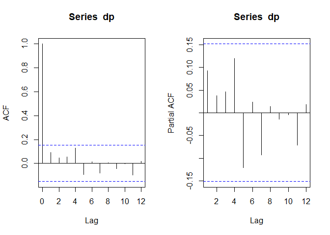<!-- -->

``` r
Box.test(dp,lag=12,type="Ljung-Box")
```

    ## 
    ##  Box-Ljung test
    ## 
    ## data:  dp
    ## X-squared = 9.9459, df = 12, p-value = 0.6207

``` r
#Fail to reject absence of correlation between residuals, for which WN is confirmed. RW confirmed.
```

### Log-returns

Exploratory analysis. BasicStats shows slight skewness to the right,
lower kurtosis and increased variance when compared to the daily prices’
case. Evident volatility clustering and stationarity around 0 (as
expected). QQ plot and test don’t suggest normality, as does the density
plot, especially in the tails.

``` r
r=dp
BS.2=as.matrix(basicStats(r))
BS.2
```

    ##                      r
    ## nobs        167.000000
    ## NAs           0.000000
    ## Minimum      -0.386066
    ## Maximum       0.440347
    ## 1. Quartile  -0.034422
    ## 3. Quartile   0.110942
    ## Mean          0.029087
    ## Median        0.028291
    ## Sum           4.857579
    ## SE Mean       0.009790
    ## LCL Mean      0.009758
    ## UCL Mean      0.048416
    ## Variance      0.016006
    ## Stdev         0.126515
    ## Skewness     -0.185973
    ## Kurtosis      0.854847

``` r
par(mfrow=c(1,3))
tsplot(r,xlab="Time",ylab="Log-returns", main="NVIDIA - LOG-RETURNS")
x=seq(min(r),max(r),length=50)
y=dnorm(x,mean=mean(r),sd=sd(r))
hist(r,breaks=100,freq=F,main="NVIDIA's returns")
lines(x,y,col=2,lwd=2)
qqnorm(r,main="Normal Q-Q Plot",xlab="Theoretical",ylab="Empirical")
qqline(r,col="steelblue", lwd=2)
```

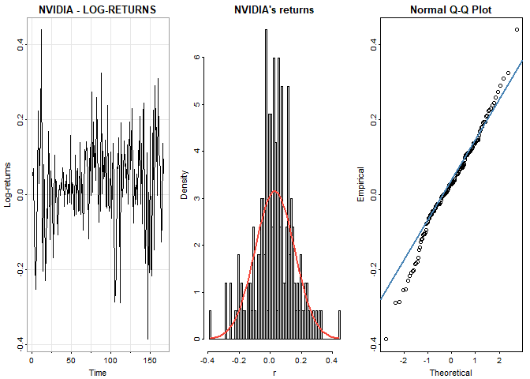<!-- -->

``` r
jarqueberaTest(r)
```

    ## 
    ## Title:
    ##  Jarque-Bera Normality Test
    ## 
    ## Test Results:
    ##   STATISTIC:
    ##     X-squared: 6.6343
    ##   P VALUE:
    ##     Asymptotic p Value: 0.03626

Plots show ACF and PACF of the log-returns, their squared values and
their absolute values, and suggest slight serial dependence at higher
moments.

``` r
par(mfrow=c(2,3))
r2=r^2
r.abs=abs(r)
acf(r,lag.max=12)
acf(r2,lag.max = 12)
acf(r.abs,lag.max=12)
pacf(r,lag.max=12)
pacf(r2,lag.max=12)
pacf(r.abs,lag.max=12)
```

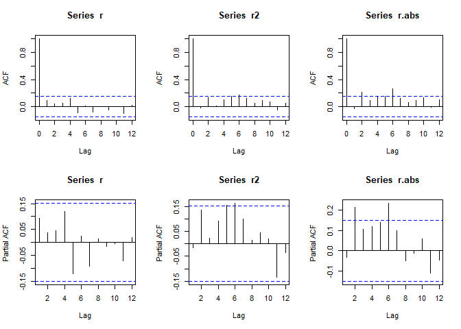<!-- -->

ACF plots already show a WN, an ARMA model is estimated anyway. The best
AIC is brought by MA(1) without intercept, which has a coefficient with
dubious significance. By sacrificing 0.01 AIC value, coefficient’s
p-value improves (by choosing an AR(1) without intercept). This model
will be compared with the null model.

``` r
ar1.int=arma(r,order=c(1,0))
ar1=arma(r,order=c(1,0),include.intercept = F)
```

    ## Warning in optim(coef, err, gr = NULL, hessian = TRUE, ...): l'ottimizzazione ad una dimensione di Nelder-Mead non è affidabile:
    ## utilizzare "Brent" o direttamente optimize()

``` r
ma1.int=arma(r,order=c(0,1))
ma1=arma(r,order=c(0,1),include.intercept = F)
```

    ## Warning in optim(coef, err, gr = NULL, hessian = TRUE, ...): l'ottimizzazione ad una dimensione di Nelder-Mead non è affidabile:
    ## utilizzare "Brent" o direttamente optimize()

``` r
arma11.int=arma(r,order=c(1,1))
arma11=arma(r,order=c(1,1),include.intercept = F)
par(mfrow=c(2,3))
acf(na.omit(ar1.int$residuals), lag.max=12)
acf(na.omit(ar1$residuals), lag.max=12)
acf(na.omit(ma1.int$residuals), lag.max=12)
acf(na.omit(ma1$residuals), lag.max=12)
acf(na.omit(arma11.int$residuals), lag.max=12)
acf(na.omit(arma11$residuals), lag.max=12)
```

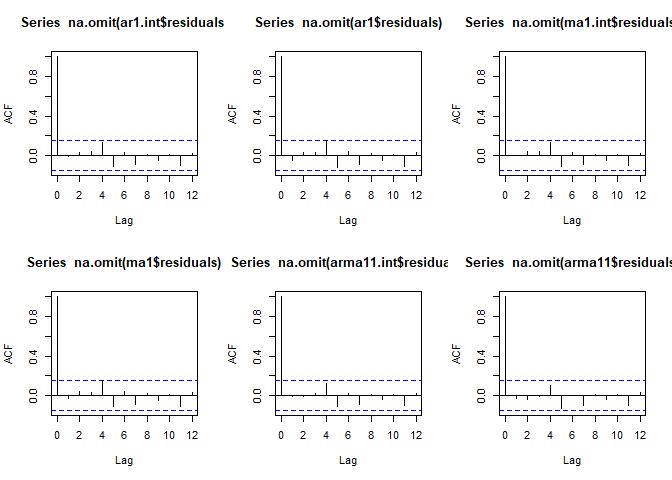<!-- -->

``` r
summary(ar1.int)
```

    ## 
    ## Call:
    ## arma(x = r, order = c(1, 0))
    ## 
    ## Model:
    ## ARMA(1,0)
    ## 
    ## Residuals:
    ##       Min        1Q    Median        3Q       Max 
    ## -0.422728 -0.064879  0.001529  0.082721  0.402586 
    ## 
    ## Coefficient(s):
    ##            Estimate  Std. Error  t value Pr(>|t|)   
    ## ar1        0.092447    0.077056    1.200   0.2302   
    ## intercept  0.026271    0.009999    2.627   0.0086 **
    ## ---
    ## Signif. codes:  0 '***' 0.001 '**' 0.01 '*' 0.05 '.' 0.1 ' ' 1
    ## 
    ## Fit:
    ## sigma^2 estimated as 0.01596,  Conditional Sum-of-Squares = 2.63,  AIC = -213.04

``` r
summary(ar1)
```

    ## 
    ## Call:
    ## arma(x = r, order = c(1, 0), include.intercept = F)
    ## 
    ## Model:
    ## ARMA(1,0)
    ## 
    ## Residuals:
    ##      Min       1Q   Median       3Q      Max 
    ## -0.40152 -0.04305  0.02555  0.10809  0.42326 
    ## 
    ## Coefficient(s):
    ##      Estimate  Std. Error  t value Pr(>|t|)  
    ## ar1   0.13746     0.07666    1.793   0.0729 .
    ## ---
    ## Signif. codes:  0 '***' 0.001 '**' 0.01 '*' 0.05 '.' 0.1 ' ' 1
    ## 
    ## Fit:
    ## sigma^2 estimated as 0.016,  Conditional Sum-of-Squares = 2.74,  AIC = -214.69

``` r
summary(ma1.int)
```

    ## 
    ## Call:
    ## arma(x = r, order = c(0, 1))
    ## 
    ## Model:
    ## ARMA(0,1)
    ## 
    ## Residuals:
    ##       Min        1Q    Median        3Q       Max 
    ## -0.422317 -0.064832  0.002545  0.081434  0.403893 
    ## 
    ## Coefficient(s):
    ##            Estimate  Std. Error  t value Pr(>|t|)   
    ## ma1         0.08566     0.07425    1.154  0.24865   
    ## intercept   0.02899     0.01058    2.740  0.00615 **
    ## ---
    ## Signif. codes:  0 '***' 0.001 '**' 0.01 '*' 0.05 '.' 0.1 ' ' 1
    ## 
    ## Fit:
    ## sigma^2 estimated as 0.01597,  Conditional Sum-of-Squares = 2.64,  AIC = -212.92

``` r
summary(ma1)
```

    ## 
    ## Call:
    ## arma(x = r, order = c(0, 1), include.intercept = F)
    ## 
    ## Model:
    ## ARMA(0,1)
    ## 
    ## Residuals:
    ##      Min       1Q   Median       3Q      Max 
    ## -0.39917 -0.03974  0.02616  0.10870  0.42733 
    ## 
    ## Coefficient(s):
    ##      Estimate  Std. Error  t value Pr(>|t|)  
    ## ma1   0.11856     0.07178    1.652   0.0986 .
    ## ---
    ## Signif. codes:  0 '***' 0.001 '**' 0.01 '*' 0.05 '.' 0.1 ' ' 1
    ## 
    ## Fit:
    ## sigma^2 estimated as 0.01599,  Conditional Sum-of-Squares = 2.75,  AIC = -214.7

``` r
summary(arma11.int)
```

    ## 
    ## Call:
    ## arma(x = r, order = c(1, 1))
    ## 
    ## Model:
    ## ARMA(1,1)
    ## 
    ## Residuals:
    ##       Min        1Q    Median        3Q       Max 
    ## -0.417318 -0.066062  0.001267  0.082714  0.397131 
    ## 
    ## Coefficient(s):
    ##            Estimate  Std. Error  t value Pr(>|t|)
    ## ar1         0.55714     0.36971    1.507    0.132
    ## ma1        -0.46411     0.38279   -1.212    0.225
    ## intercept   0.01293     0.01168    1.107    0.268
    ## 
    ## Fit:
    ## sigma^2 estimated as 0.01591,  Conditional Sum-of-Squares = 2.63,  AIC = -211.55

``` r
summary(arma11)
```

    ## 
    ## Call:
    ## arma(x = r, order = c(1, 1), include.intercept = F)
    ## 
    ## Model:
    ## ARMA(1,1)
    ## 
    ## Residuals:
    ##      Min       1Q   Median       3Q      Max 
    ## -0.39558 -0.05019  0.02133  0.09713  0.41010 
    ## 
    ## Coefficient(s):
    ##      Estimate  Std. Error  t value Pr(>|t|)    
    ## ar1    0.7616      0.2242    3.398 0.000679 ***
    ## ma1   -0.6363      0.2586   -2.460 0.013875 *  
    ## ---
    ## Signif. codes:  0 '***' 0.001 '**' 0.01 '*' 0.05 '.' 0.1 ' ' 1
    ## 
    ## Fit:
    ## sigma^2 estimated as 0.01605,  Conditional Sum-of-Squares = 2.71,  AIC = -212.16

``` r
mod.arma=ar1
mod.mean=arma(r,order=c(0,0,0),include.intercept = T)
```

    ## Warning in optim(coef, err, gr = NULL, hessian = TRUE, ...): l'ottimizzazione ad una dimensione di Nelder-Mead non è affidabile:
    ## utilizzare "Brent" o direttamente optimize()

``` r
summary(mod.mean)
```

    ## 
    ## Call:
    ## arma(x = r, order = c(0, 0, 0), include.intercept = T)
    ## 
    ## Model:
    ## ARMA(0,0)
    ## 
    ## Residuals:
    ##       Min        1Q    Median        3Q       Max 
    ## -0.415143 -0.063499 -0.000786  0.081864  0.411270 
    ## 
    ## Coefficient(s):
    ##            Estimate  Std. Error  t value Pr(>|t|)   
    ## intercept  0.029077    0.009761    2.979  0.00289 **
    ## ---
    ## Signif. codes:  0 '***' 0.001 '**' 0.01 '*' 0.05 '.' 0.1 ' ' 1
    ## 
    ## Fit:
    ## sigma^2 estimated as 0.01601,  Conditional Sum-of-Squares = 2.66,  AIC = -214.58

``` r
par(mfrow=c(1,2))
acf(mod.mean$residuals,lag.max=12)
pacf(mod.mean$residuals,lag.max=12)
```

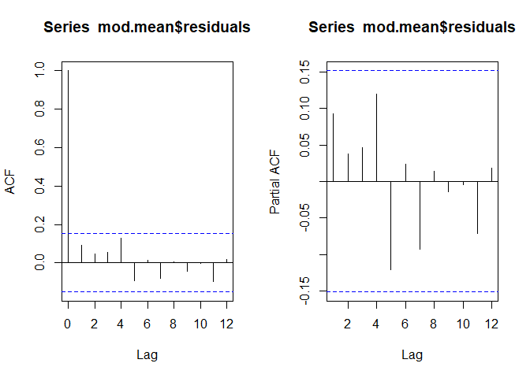<!-- -->

Static and dynamic forecast.

``` r
test.size=12
train.size=length(r)-12
test=tail(r,test.size)
train=head(r,train.size)
for (i in 1:test.size){
  if (i==1){
    new.train=train
    p.mean=p.ar=c(rep(NA,12))
    mod.mean=Arima(train,order=c(0,0,0),include.mean = T)
    mod.arma=Arima(train,order=c(1,0,0),include.mean = F)
  }
  else{
    new.train=c(new.train, test[i-1])
  }
  mod.mean.stat=Arima(new.train,model=mod.mean)
  mod.arma.stat=Arima(new.train,model=mod.arma)
  p.mean[i]=forecast(mod.mean.stat,h=1)$mean
  p.ar[i]=forecast(mod.arma.stat,h=1)$mean
}

test.size=12
train.size=length(r)-12
test=tail(r,test.size)
train=head(r,train.size)
for (i in 1:test.size){
  if (i==1){
    new.train=train
    p.ar.2=c(rep(NA,12))
    mod.arma=Arima(train,order=c(1,0,0),include.mean = F)
  }
  else{
    new.train=as.vector(new.train)
    new.train=c(new.train, p.ar.2[i-1])
  }
  mod.arma.din=Arima(new.train,model=mod.arma)
  p.ar.2[i]=forecast(mod.arma.din,h=1)$mean
}
```

As expected (by model metrics and usual characteristics of returns time
series) the model doesn’t perform well in forecasting, errors look
similar to the ones of the intercept model. Diebold-Mariano confirms
homogeneity of errors between models.

``` r
par(mfrow=c(1,1)) 
ts.plot(ts(test),ts(p.mean),ts(p.ar),ts(p.ar.2),col=1:4,main="Forecasts comparison") 
legend("topleft",legend=c("Actual returns","Forecasts mean model","Forecasts AR(1) (static)","Forecasts AR(1) (dynamic)"),col=1:4,lty = 1,  cex=0.70) 
```

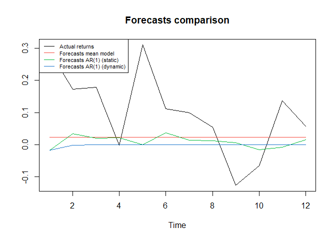<!-- -->

``` r
err.mean=test-p.mean 
err.ar=test-p.ar 
err.ar.2=test-p.ar.2
MSE.mean=mean(err.mean^2) 
MSE.ar=mean(err.ar^2) 
MSE.ar.2=mean(err.ar.2^2) 
MSE.mean 
```

    ## [1] 0.02159955

``` r
MSE.ar 
```

    ## [1] 0.02443741

``` r
MSE.ar.2 
```

    ## [1] 0.02675935

``` r
p1=dm_test(err.ar,err.mean,alternative = "greater",h=1)$p.value
p2=dm_test(err.ar,err.ar.2,alternative = "less",h=1)$p.value
p3=dm_test(err.ar.2,err.mean,alternative = "greater",h=1)$p.value
p.adjust(c(p1,p2,p3),"holm")
```

    ##         DM         DM         DM 
    ## 0.13522135 0.07472062 0.06963925

### Volatility

Returns’ series doesn’t appear homoscedastic: peaks and effects on
variance are visible in the following plots.

``` r
par(mfrow=c(3,1))
tsplot(r,main="NVIDIA's monthly returns")
tsplot(abs(r),main="Absolute returns")
tsplot(r^2, main="Squared returns")#Proxy of variance, since mean(r)~0
```

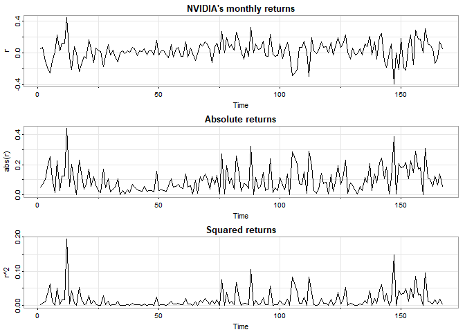<!-- -->

``` r
var5=roll_var(r,width=5,center=T)
var10=roll_var(r,width=10,center=T)
par(mfrow=c(2,1))
tsplot(var5,main="Rolling variance with 5 obs window")
tsplot(var10,main="Rolling variance with 10 obs window")
```

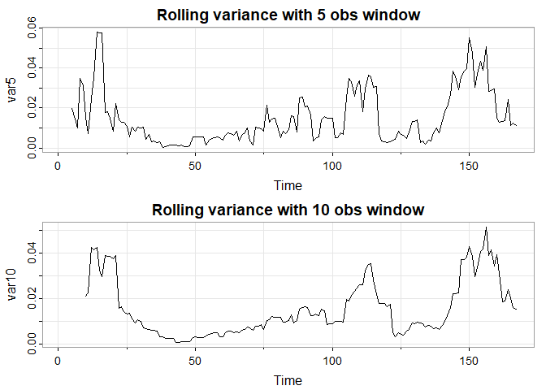<!-- -->

No ARCH effects according to the LM test. Autocorrelation between
squared returns. Exploratory estimation of a GARCH model anyway.

``` r
ArchTest(r,lags=1)
```

    ## 
    ##  ARCH LM-test; Null hypothesis: no ARCH effects
    ## 
    ## data:  r
    ## Chi-squared = 0.048447, df = 1, p-value = 0.8258

``` r
ArchTest(r,lags=5)
```

    ## 
    ##  ARCH LM-test; Null hypothesis: no ARCH effects
    ## 
    ## data:  r
    ## Chi-squared = 8.8248, df = 5, p-value = 0.1163

``` r
ArchTest(r,lags=10)
```

    ## 
    ##  ARCH LM-test; Null hypothesis: no ARCH effects
    ## 
    ## data:  r
    ## Chi-squared = 15.14, df = 10, p-value = 0.127

``` r
Box.test(as.numeric(r^2),lag=5,type ="Ljung-Box")
```

    ## 
    ##  Box-Ljung test
    ## 
    ## data:  as.numeric(r^2)
    ## X-squared = 9.2545, df = 5, p-value = 0.09933

``` r
Box.test(as.numeric(r^2),lag=10,type="Ljung-Box")
```

    ## 
    ##  Box-Ljung test
    ## 
    ## data:  as.numeric(r^2)
    ## X-squared = 19.753, df = 10, p-value = 0.03167

Fitting a GARCH(1,1) as starting model, with both normal and t-Student
distribution of innovations.

Normal model:

Baseline variance’s coefficient is non-significant. Absence of ARCH
effects among residuals. Stable coefficients. Satisfying goodness of
fit.

Std model:

Similar results.

The models look statisfying; no more models to be fitted.

``` r
r1=r[1:155]
r2=r[156:167]
spec1=ugarchspec(variance.model=list(model="sGARCH",garchOrder=c(1,1)),mean.model = list(armaOrder=c(0,0),include.mean=T),distribution.model = "norm")
spec2=ugarchspec(variance.model=list(model="sGARCH",garchOrder=c(1,1)),mean.model = list(armaOrder=c(0,0),include.mean=T),distribution.model = "std")
garch11.norm=ugarchfit(spec1,r1)
garch11.sstd=ugarchfit(spec2,r1)
show(garch11.norm)
```

    ## 
    ## *---------------------------------*
    ## *          GARCH Model Fit        *
    ## *---------------------------------*
    ## 
    ## Conditional Variance Dynamics    
    ## -----------------------------------
    ## GARCH Model  : sGARCH(1,1)
    ## Mean Model   : ARFIMA(0,0,0)
    ## Distribution : norm 
    ## 
    ## Optimal Parameters
    ## ------------------------------------
    ##         Estimate  Std. Error  t value Pr(>|t|)
    ## mu      0.025243    0.008844   2.8543 0.004313
    ## omega   0.000500    0.000443   1.1283 0.259174
    ## alpha1  0.151403    0.059548   2.5425 0.011005
    ## beta1   0.833655    0.048613  17.1488 0.000000
    ## 
    ## Robust Standard Errors:
    ##         Estimate  Std. Error  t value Pr(>|t|)
    ## mu      0.025243    0.010031   2.5165 0.011853
    ## omega   0.000500    0.000384   1.3026 0.192710
    ## alpha1  0.151403    0.057860   2.6167 0.008878
    ## beta1   0.833655    0.032079  25.9873 0.000000
    ## 
    ## LogLikelihood : 109.9917 
    ## 
    ## Information Criteria
    ## ------------------------------------
    ##                     
    ## Akaike       -1.3676
    ## Bayes        -1.2891
    ## Shibata      -1.3689
    ## Hannan-Quinn -1.3357
    ## 
    ## Weighted Ljung-Box Test on Standardized Residuals
    ## ------------------------------------
    ##                         statistic p-value
    ## Lag[1]                     0.6373  0.4247
    ## Lag[2*(p+q)+(p+q)-1][2]    0.7863  0.5730
    ## Lag[4*(p+q)+(p+q)-1][5]    1.4971  0.7406
    ## d.o.f=0
    ## H0 : No serial correlation
    ## 
    ## Weighted Ljung-Box Test on Standardized Squared Residuals
    ## ------------------------------------
    ##                         statistic p-value
    ## Lag[1]                     0.5308  0.4663
    ## Lag[2*(p+q)+(p+q)-1][5]    1.5524  0.7270
    ## Lag[4*(p+q)+(p+q)-1][9]    3.2065  0.7244
    ## d.o.f=2
    ## 
    ## Weighted ARCH LM Tests
    ## ------------------------------------
    ##             Statistic Shape Scale P-Value
    ## ARCH Lag[3]     1.466 0.500 2.000  0.2260
    ## ARCH Lag[5]     1.727 1.440 1.667  0.5348
    ## ARCH Lag[7]     3.291 2.315 1.543  0.4604
    ## 
    ## Nyblom stability test
    ## ------------------------------------
    ## Joint Statistic:  0.7709
    ## Individual Statistics:             
    ## mu     0.3104
    ## omega  0.3090
    ## alpha1 0.1546
    ## beta1  0.2465
    ## 
    ## Asymptotic Critical Values (10% 5% 1%)
    ## Joint Statistic:          1.07 1.24 1.6
    ## Individual Statistic:     0.35 0.47 0.75
    ## 
    ## Sign Bias Test
    ## ------------------------------------
    ##                    t-value   prob sig
    ## Sign Bias           1.4599 0.1464    
    ## Negative Sign Bias  1.1329 0.2590    
    ## Positive Sign Bias  0.3704 0.7116    
    ## Joint Effect        3.8595 0.2770    
    ## 
    ## 
    ## Adjusted Pearson Goodness-of-Fit Test:
    ## ------------------------------------
    ##   group statistic p-value(g-1)
    ## 1    20     16.74       0.6073
    ## 2    30     36.42       0.1617
    ## 3    40     34.16       0.6900
    ## 4    50     53.71       0.2987
    ## 
    ## 
    ## Elapsed time : 0.05995297

``` r
show(garch11.sstd)
```

    ## 
    ## *---------------------------------*
    ## *          GARCH Model Fit        *
    ## *---------------------------------*
    ## 
    ## Conditional Variance Dynamics    
    ## -----------------------------------
    ## GARCH Model  : sGARCH(1,1)
    ## Mean Model   : ARFIMA(0,0,0)
    ## Distribution : std 
    ## 
    ## Optimal Parameters
    ## ------------------------------------
    ##         Estimate  Std. Error  t value Pr(>|t|)
    ## mu      0.025970    0.008353   3.1090 0.001877
    ## omega   0.000662    0.000592   1.1184 0.263391
    ## alpha1  0.161236    0.075378   2.1390 0.032433
    ## beta1   0.815549    0.061055  13.3577 0.000000
    ## shape   6.788406    3.715314   1.8271 0.067678
    ## 
    ## Robust Standard Errors:
    ##         Estimate  Std. Error  t value Pr(>|t|)
    ## mu      0.025970    0.009136   2.8426 0.004475
    ## omega   0.000662    0.000499   1.3282 0.184127
    ## alpha1  0.161236    0.072699   2.2179 0.026564
    ## beta1   0.815549    0.034673  23.5214 0.000000
    ## shape   6.788406    2.978417   2.2792 0.022655
    ## 
    ## LogLikelihood : 112.2192 
    ## 
    ## Information Criteria
    ## ------------------------------------
    ##                     
    ## Akaike       -1.3835
    ## Bayes        -1.2853
    ## Shibata      -1.3855
    ## Hannan-Quinn -1.3436
    ## 
    ## Weighted Ljung-Box Test on Standardized Residuals
    ## ------------------------------------
    ##                         statistic p-value
    ## Lag[1]                     0.6763  0.4109
    ## Lag[2*(p+q)+(p+q)-1][2]    0.8176  0.5614
    ## Lag[4*(p+q)+(p+q)-1][5]    1.5661  0.7236
    ## d.o.f=0
    ## H0 : No serial correlation
    ## 
    ## Weighted Ljung-Box Test on Standardized Squared Residuals
    ## ------------------------------------
    ##                         statistic p-value
    ## Lag[1]                     0.5628  0.4531
    ## Lag[2*(p+q)+(p+q)-1][5]    1.5770  0.7210
    ## Lag[4*(p+q)+(p+q)-1][9]    3.1962  0.7262
    ## d.o.f=2
    ## 
    ## Weighted ARCH LM Tests
    ## ------------------------------------
    ##             Statistic Shape Scale P-Value
    ## ARCH Lag[3]     1.430 0.500 2.000  0.2317
    ## ARCH Lag[5]     1.718 1.440 1.667  0.5369
    ## ARCH Lag[7]     3.238 2.315 1.543  0.4697
    ## 
    ## Nyblom stability test
    ## ------------------------------------
    ## Joint Statistic:  0.9787
    ## Individual Statistics:             
    ## mu     0.4648
    ## omega  0.3781
    ## alpha1 0.2294
    ## beta1  0.3106
    ## shape  0.2665
    ## 
    ## Asymptotic Critical Values (10% 5% 1%)
    ## Joint Statistic:          1.28 1.47 1.88
    ## Individual Statistic:     0.35 0.47 0.75
    ## 
    ## Sign Bias Test
    ## ------------------------------------
    ##                    t-value   prob sig
    ## Sign Bias           1.1289 0.2607    
    ## Negative Sign Bias  0.9588 0.3392    
    ## Positive Sign Bias  0.4935 0.6224    
    ## Joint Effect        2.9576 0.3982    
    ## 
    ## 
    ## Adjusted Pearson Goodness-of-Fit Test:
    ## ------------------------------------
    ##   group statistic p-value(g-1)
    ## 1    20     17.00       0.5899
    ## 2    30     15.52       0.9806
    ## 3    40     39.32       0.4554
    ## 4    50     32.42       0.9674
    ## 
    ## 
    ## Elapsed time : 0.08993602

Standardized residuals’ analysis. Similar results, std fits the data
better than normal distribution.

``` r
resst.garch11.norm=residuals(garch11.norm,standardize=T)
resst.garch11.sstd=residuals(garch11.sstd,standardize=T)
par(mfrow=c(2,1))
plot(resst.garch11.norm,main="Standardized residuals' analysis - Normal model")
plot(resst.garch11.sstd,main="Standardized residuals' analysis - Sstd model")
```

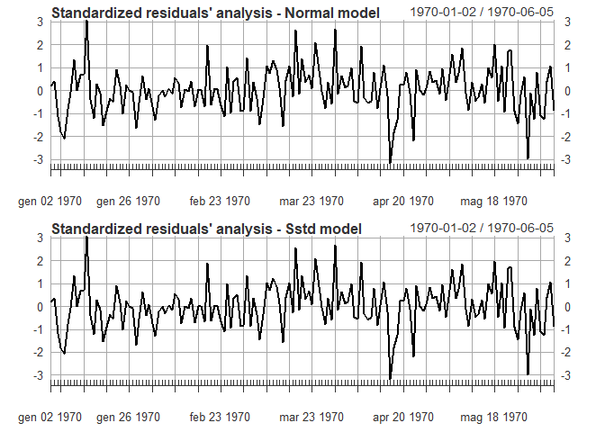<!-- -->

``` r
par(mfrow=c(2,1))
plot(garch11.norm,which=8)
plot(garch11.norm,which=9)
```

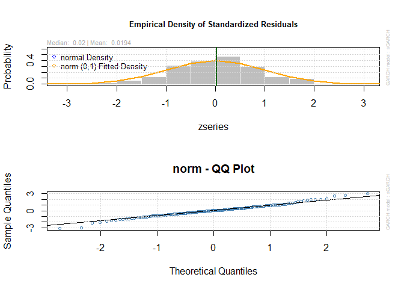<!-- -->

``` r
par(mfrow=c(2,1))
plot(garch11.sstd,which=8)
plot(garch11.sstd,which=9)
```

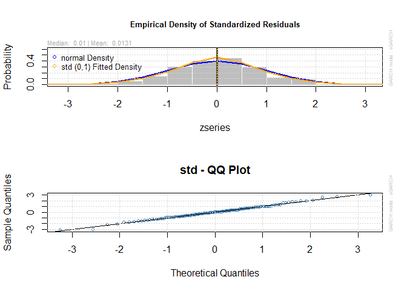<!-- -->

``` r
par(mfrow=c(2,2))
plot(garch11.norm,which=10)
plot(garch11.norm,which=11)
plot(garch11.sstd,which=10)
plot(garch11.sstd,which=11)
```

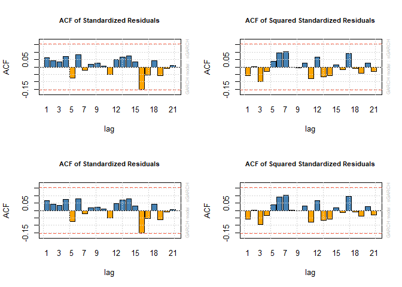<!-- -->

Similar fitted values for sigma. Volatility clustering is correctly
recognized.

``` r
sigma1=sigma(garch11.norm)
sigma2=sigma(garch11.sstd)
par(mfrow=c(2,1))
plot(sigma1,main="GARCH(1,1) norm")
plot(sigma2,main="GARCH(1,1) std")
```

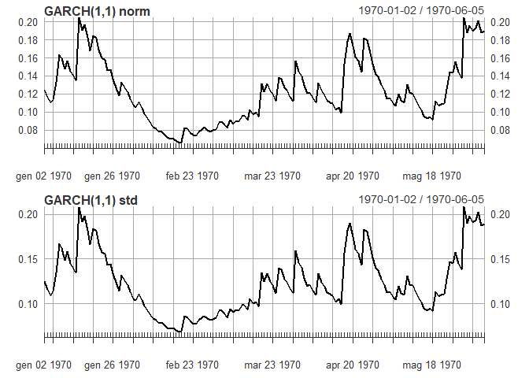<!-- -->

Information Criteria. No clear results.

``` r
AIC=c(infocriteria(garch11.norm)[1],infocriteria(garch11.sstd)[1])
BIC=c(infocriteria(garch11.norm)[2],infocriteria(garch11.sstd)[2])
SHI=c(infocriteria(garch11.norm)[3],infocriteria(garch11.sstd)[3])
HQC=c(infocriteria(garch11.norm)[4],infocriteria(garch11.sstd)[4])

par(mfrow=c(2,2))
plot(AIC)
plot(BIC)
plot(SHI)
plot(HQC)
```

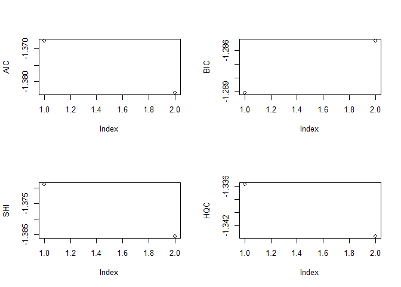<!-- -->

Log-likelihood evaluation. Better results for std model.

``` r
loglik=c(garch11.norm@fit$LLH,garch11.sstd@fit$LLH)
par(mfrow=c(1,1))
plot(loglik)
```

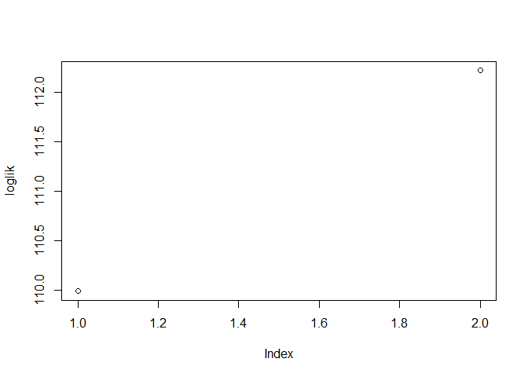<!-- -->

Static and dynamic forecasts. Results look completely different across
different forecast approaches. The errors evaluation will clarify which
model better represents the data.

``` r
for1=ugarchroll(spec1,data=r1,forecast.length = length(r2),refit.every = 5)
for2=ugarchroll(spec2,data=r1,forecast.length = length(r2),refit.every = 5)
forec=cbind("GARCH(1,1) norm"=as.data.frame(for1)$Sigma,"GARCH(1,1) std"=as.data.frame(for2)$Sigma)
plot(ts(forec),main="Static Forecasts")
```

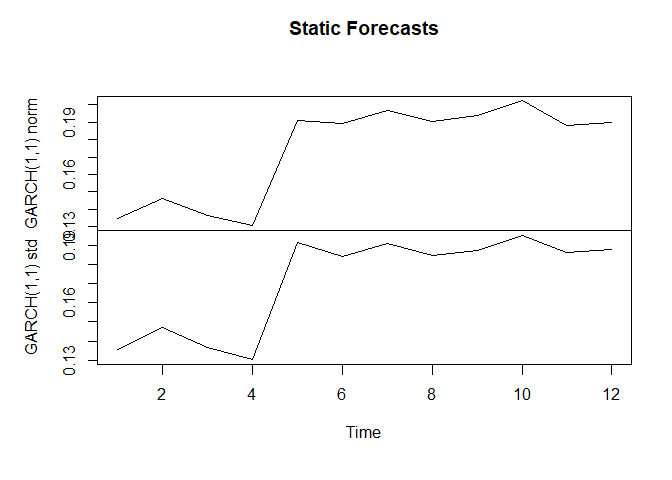<!-- -->

``` r
for3=ugarchforecast(garch11.norm,data=r1,n.ahead = length(r2))
for4=ugarchforecast(garch11.sstd,data=r1,n.ahead = length(r2))
forec2=cbind("GARCH(1,1) norm"=for3@forecast$sigmaFor,"GARCH(1,1) std"=for4@forecast$sigmaFor)
plot(ts(forec2),main="Dynamic Forecasts")
```

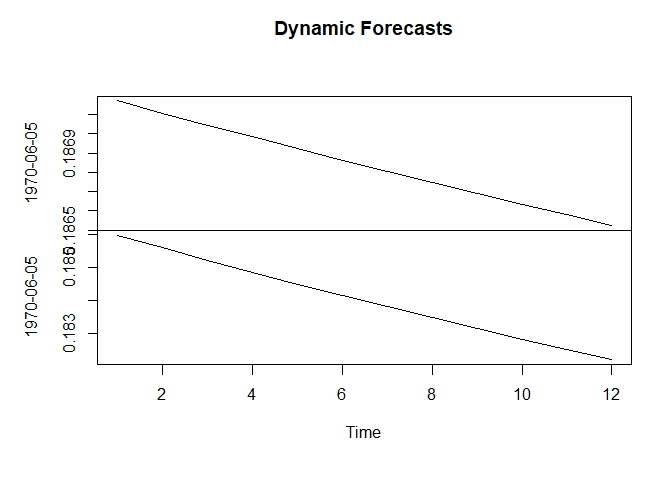<!-- -->

Visualization.

``` r
par(mfrow=c(2,1))
plot(for1,which=1)
plot(for2,which=1)
```

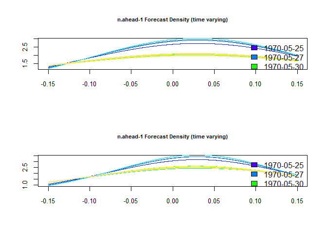<!-- -->

``` r
par(mfrow=c(2,1))
plot(for1,which=2)
plot(for2,which=2)
```

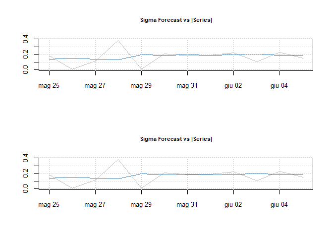<!-- -->

``` r
par(mfrow=c(2,1))
plot(for1,which=3)
plot(for2,which=3)
```

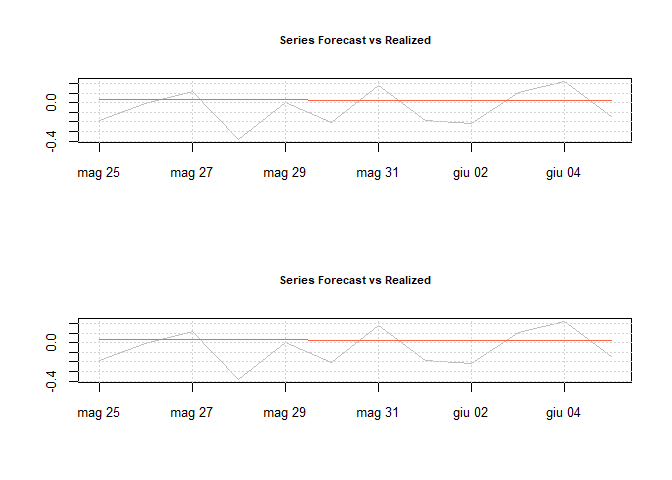<!-- -->

``` r
plot(for1,which=5)
```

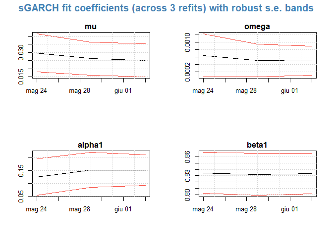<!-- -->

``` r
plot(for2,which=5)
plot(for3,which=1)
```

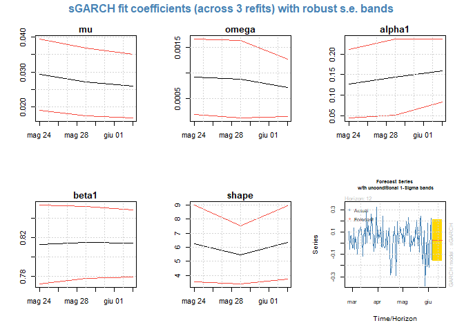<!-- -->

``` r
plot(for4,which=1)
plot(for3,which=3)
plot(for4,which=3)
```

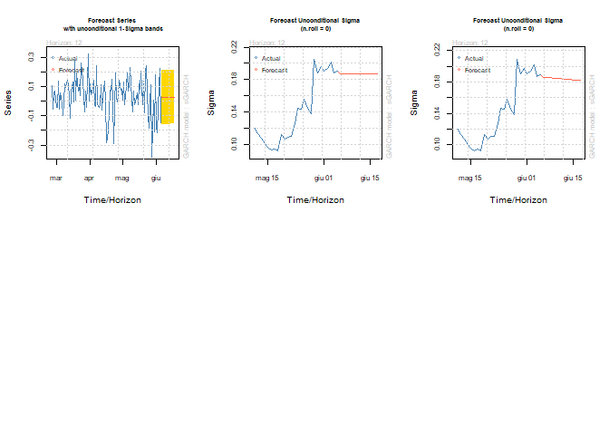<!-- -->

Forecast errors analysis. GARCH std shows better results.

``` r
err1=as.data.frame(for1)$Sigma^2-r2^2
err2=as.data.frame(for2)$Sigma^2-r2^2
ERR=cbind("GARCH(1,1) norm"=err1,"GARCH(1,1) std"=err2)
plot(ts(ERR),main="Forcecast's errors")
```

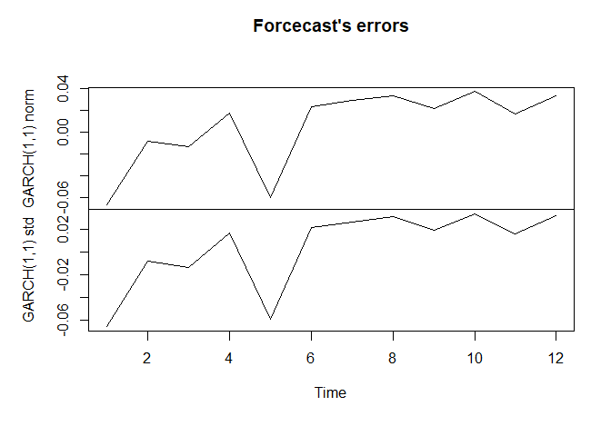<!-- -->

``` r
err.ind=matrix(nrow=3,ncol=2)
colnames(err.ind)=c("GARCH norm","GARCH std")
row.names(err.ind)=c("MSE","RMSE","MAE")
err.ind[,1]=c(mean(err1^2),sqrt(mean(err1^2)),mean(abs(err1)))
err.ind[,2]=c(mean(err2^2),sqrt(mean(err2^2)),mean(abs(err2)))
err.ind
```

    ##      GARCH norm   GARCH std
    ## MSE  0.00117741 0.001110014
    ## RMSE 0.03431340 0.033316873
    ## MAE  0.02983127 0.028642078

``` r
err3=for3@forecast$sigmaFor^2-r2^2
err4=for4@forecast$sigmaFor^2-r2^2
ERR2=cbind("GARCH(1,1) norm"=err3,"GARCH(1,1) std"=err4)
plot(ts(ERR2),main="Forcecast's errors")
```

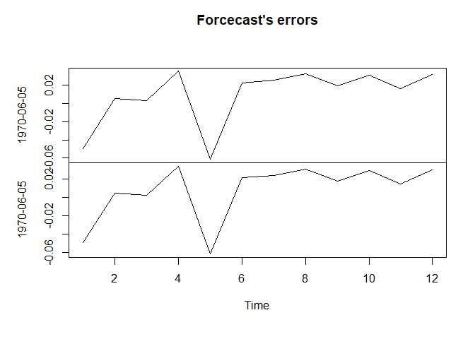<!-- -->

``` r
err.ind2=matrix(nrow=3,ncol=2)
colnames(err.ind2)=c("GARCH norm","GARCH std")
row.names(err.ind2)=c("MSE","RMSE","MAE")
err.ind2[,1]=c(mean(err3^2),sqrt(mean(err3^2)),mean(abs(err3)))
err.ind2[,2]=c(mean(err4^2),sqrt(mean(err4^2)),mean(abs(err4)))
err.ind2
```

    ##       GARCH norm    GARCH std
    ## MSE  0.001009919 0.0009801382
    ## RMSE 0.031779227 0.0313071590
    ## MAE  0.027491019 0.0266732139

Diebold-Mariano. GARCH std produces significantly better predictions
than GARCH norm.

``` r
i=j=1
DM=matrix(nrow=2,ncol=2)
for (l in 1:4){
  if (i==j) {
    DM[l]=NA
    i=i+1
  }
  else {
    DM[l]=dm_test(ERR[,i],ERR[,j],alternative = "greater",power = 1,varestimator = "NeweyWest")$p.value
    if (i==2){
      i=1
      j=j+1
    }
    else{
      i=i+1
    }
  }
}
DM
```

    ##           [,1]        [,2]
    ## [1,]        NA 0.007990643
    ## [2,] 0.9920094          NA

``` r
i=j=1
DM=matrix(nrow=2,ncol=2)
for (l in 1:4){
  if (i==j) {
    DM[l]=NA
    i=i+1
  }
  else {
    DM[l]=dm_test(ERR2[,i],ERR2[,j],alternative = "greater",power = 1,varestimator = "NeweyWest")$p.value
    if (i==2){
      i=1
      j=j+1
    }
    else{
      i=i+1
    }
  }
}
DM
```

    ##           [,1]        [,2]
    ## [1,]        NA 0.003659632
    ## [2,] 0.9963404          NA

## Amplifon - daily

### Prices, log-prices

Refinitiv data from the 2nd of January 2018 to the 28th of February
2025.

``` r
Amplifon <- read_excel("Amplifon.xlsx", skip = 29)
```

Prices and log-prices. Exploration of the series characteristics.
Leptokurtosis, slight negative skewness (log-prices) and volatility
clustering as expected.

``` r
P=xts(Amplifon[,2],order.by=Amplifon$`Exchange Date`,frequency = "daily")
p=log(P)
r=na.omit(diff(p))
basicStats(cbind(P,p))
```

    ##                    Close     Close.1
    ## nobs         1820.000000 1820.000000
    ## NAs             0.000000    0.000000
    ## Minimum        12.860000    2.554122
    ## Maximum        47.450000    3.859677
    ## 1. Quartile    21.847500    3.084086
    ## 3. Quartile    32.912500    3.493853
    ## Mean           27.698060    3.276724
    ## Median         27.700000    3.321432
    ## Sum         50410.470000 5963.637869
    ## SE Mean         0.186450    0.007193
    ## LCL Mean       27.332381    3.262616
    ## UCL Mean       28.063739    3.290832
    ## Variance       63.269877    0.094170
    ## Stdev           7.954236    0.306872
    ## Skewness        0.125194   -0.473873
    ## Kurtosis       -0.563355   -0.520813

``` r
par(mfrow=c(3,1))
plot(P,xlab="Time",ylab="Prices",main="NVIDIA - PRICES")
plot(p,xlab="Time",ylab="Log-Prices",main="NVIDIA - LOG-PRICES")
```

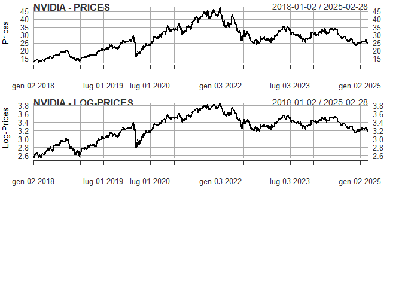<!-- -->

ACF/PACF analysis. The plots evidently suggest the presence of a RW
stochastic process for both Prices and Log-prices series. ACF show
values close to 1 consistently at least until 21 lags; PACF show values
close to 1 at the first lag and non-significant values for the remaining
ones.

``` r
par(mfrow=c(2,2))
acf.P=acf(P,lag.max = 21)
pacf.P=pacf(P,lag.max=21)
acf.p=acf(p,lag.max=21)
pacf.p=pacf(p,lag.max=21)
```

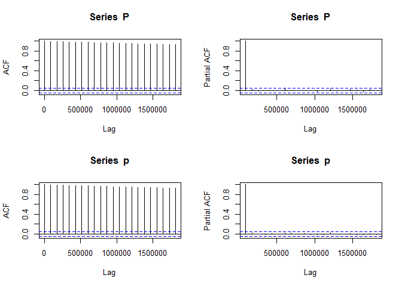<!-- -->

``` r
acf.P$acf[21]
```

    ## [1] 0.9314632

``` r
pacf.P$acf[1]
```

    ## [1] 0.9962358

``` r
acf.p$acf[21]
```

    ## [1] 0.9306433

``` r
pacf.p$acf[1]
```

    ## [1] 0.9960283

Augmented Dickey-Fuller tests for unit roots and Ljung-Box on residuals.
Presence of one unit root and residuals’ absence of correlation
confirmed: RW is confirmed.

``` r
adf1=adfTest(p,lags=21,type="ct")
summary(adf1@test$lm)
```

    ## 
    ## Call:
    ## lm(formula = y.diff ~ y.lag.1 + 1 + tt + y.diff.lag)
    ## 
    ## Residuals:
    ##       Min        1Q    Median        3Q       Max 
    ## -0.216129 -0.011584  0.000516  0.011854  0.103390 
    ## 
    ## Coefficients:
    ##                Estimate Std. Error t value Pr(>|t|)  
    ## (Intercept)   1.197e-02  6.522e-03   1.836   0.0665 .
    ## y.lag.1      -3.508e-03  2.188e-03  -1.603   0.1090  
    ## tt           -1.529e-07  1.277e-06  -0.120   0.9047  
    ## y.diff.lag1  -3.630e-02  2.375e-02  -1.528   0.1267  
    ## y.diff.lag2   1.670e-02  2.376e-02   0.703   0.4824  
    ## y.diff.lag3   1.199e-02  2.376e-02   0.505   0.6139  
    ## y.diff.lag4  -1.456e-02  2.377e-02  -0.613   0.5402  
    ## y.diff.lag5   5.664e-03  2.377e-02   0.238   0.8117  
    ## y.diff.lag6  -3.103e-02  2.376e-02  -1.306   0.1918  
    ## y.diff.lag7  -1.114e-02  2.377e-02  -0.469   0.6393  
    ## y.diff.lag8  -6.236e-03  2.378e-02  -0.262   0.7931  
    ## y.diff.lag9  -8.983e-03  2.377e-02  -0.378   0.7056  
    ## y.diff.lag10  1.447e-02  2.378e-02   0.609   0.5429  
    ## y.diff.lag11  1.100e-02  2.378e-02   0.463   0.6437  
    ## y.diff.lag12  2.025e-02  2.378e-02   0.852   0.3946  
    ## y.diff.lag13 -9.340e-03  2.378e-02  -0.393   0.6946  
    ## y.diff.lag14  9.067e-03  2.378e-02   0.381   0.7031  
    ## y.diff.lag15 -9.509e-03  2.378e-02  -0.400   0.6893  
    ## y.diff.lag16 -2.274e-02  2.376e-02  -0.957   0.3386  
    ## y.diff.lag17  1.397e-02  2.377e-02   0.588   0.5567  
    ## y.diff.lag18  1.992e-02  2.377e-02   0.838   0.4020  
    ## y.diff.lag19 -1.977e-02  2.377e-02  -0.831   0.4058  
    ## y.diff.lag20  6.601e-03  2.377e-02   0.278   0.7812  
    ## y.diff.lag21 -1.072e-02  2.375e-02  -0.451   0.6517  
    ## ---
    ## Signif. codes:  0 '***' 0.001 '**' 0.01 '*' 0.05 '.' 0.1 ' ' 1
    ## 
    ## Residual standard error: 0.0216 on 1774 degrees of freedom
    ## Multiple R-squared:  0.008707,   Adjusted R-squared:  -0.004145 
    ## F-statistic: 0.6775 on 23 and 1774 DF,  p-value: 0.8716

``` r
#No significant lag.

adf1=adfTest(p,lags=0,type="ct")
summary(adf1@test$lm)
```

    ## 
    ## Call:
    ## lm(formula = y.diff ~ y.lag.1 + 1 + tt)
    ## 
    ## Residuals:
    ##       Min        1Q    Median        3Q       Max 
    ## -0.217662 -0.011193  0.000523  0.011978  0.103477 
    ## 
    ## Coefficients:
    ##               Estimate Std. Error t value Pr(>|t|)  
    ## (Intercept)  1.318e-02  6.273e-03   2.102   0.0357 *
    ## y.lag.1     -3.912e-03  2.104e-03  -1.859   0.0631 .
    ## tt          -1.913e-08  1.229e-06  -0.016   0.9876  
    ## ---
    ## Signif. codes:  0 '***' 0.001 '**' 0.01 '*' 0.05 '.' 0.1 ' ' 1
    ## 
    ## Residual standard error: 0.02145 on 1816 degrees of freedom
    ## Multiple R-squared:  0.00316,    Adjusted R-squared:  0.002062 
    ## F-statistic: 2.878 on 2 and 1816 DF,  p-value: 0.05648

``` r
#Trend is not significant either.

adf1=adfTest(p,lags=0,type="c")
summary(adf1@test$lm)
```

    ## 
    ## Call:
    ## lm(formula = y.diff ~ y.lag.1 + 1)
    ## 
    ## Residuals:
    ##       Min        1Q    Median        3Q       Max 
    ## -0.217661 -0.011192  0.000528  0.011984  0.103474 
    ## 
    ## Coefficients:
    ##              Estimate Std. Error t value Pr(>|t|)  
    ## (Intercept)  0.013234   0.005392   2.454   0.0142 *
    ## y.lag.1     -0.003932   0.001638  -2.400   0.0165 *
    ## ---
    ## Signif. codes:  0 '***' 0.001 '**' 0.01 '*' 0.05 '.' 0.1 ' ' 1
    ## 
    ## Residual standard error: 0.02144 on 1817 degrees of freedom
    ## Multiple R-squared:  0.00316,    Adjusted R-squared:  0.002611 
    ## F-statistic:  5.76 on 1 and 1817 DF,  p-value: 0.0165

``` r
#Intercept is significant.

adf1
```

    ## 
    ## Title:
    ##  Augmented Dickey-Fuller Test
    ## 
    ## Test Results:
    ##   PARAMETER:
    ##     Lag Order: 0
    ##   STATISTIC:
    ##     Dickey-Fuller: -2.3999
    ##   P VALUE:
    ##     0.1636 
    ## 
    ## Description:
    ##  Sun Apr 26 23:50:28 2026 by user: Utente

``` r
#Fail to reject H0: log-prices do have at least one unit root. Repeating the procedure on differenced series to verify the presence of other unit roots.

dp=na.omit(diff(p))
adf2=adfTest(dp,lags=21,type="ct")
```

    ## Warning in adfTest(dp, lags = 21, type = "ct"): p-value smaller than printed
    ## p-value

``` r
summary(adf2@test$lm)
```

    ## 
    ## Call:
    ## lm(formula = y.diff ~ y.lag.1 + 1 + tt + y.diff.lag)
    ## 
    ## Residuals:
    ##       Min        1Q    Median        3Q       Max 
    ## -0.215614 -0.011630  0.000578  0.012103  0.104883 
    ## 
    ## Coefficients:
    ##                Estimate Std. Error t value Pr(>|t|)    
    ## (Intercept)   1.727e-03  1.053e-03   1.639    0.101    
    ## y.lag.1      -1.118e+00  1.180e-01  -9.472   <2e-16 ***
    ## tt           -1.505e-06  9.942e-07  -1.514    0.130    
    ## y.diff.lag1   7.910e-02  1.151e-01   0.687    0.492    
    ## y.diff.lag2   9.366e-02  1.123e-01   0.834    0.404    
    ## y.diff.lag3   1.029e-01  1.093e-01   0.942    0.346    
    ## y.diff.lag4   8.691e-02  1.064e-01   0.817    0.414    
    ## y.diff.lag5   9.094e-02  1.032e-01   0.881    0.379    
    ## y.diff.lag6   5.734e-02  9.994e-02   0.574    0.566    
    ## y.diff.lag7   4.400e-02  9.667e-02   0.455    0.649    
    ## y.diff.lag8   3.615e-02  9.336e-02   0.387    0.699    
    ## y.diff.lag9   2.544e-02  8.988e-02   0.283    0.777    
    ## y.diff.lag10  3.889e-02  8.635e-02   0.450    0.652    
    ## y.diff.lag11  4.826e-02  8.255e-02   0.585    0.559    
    ## y.diff.lag12  6.697e-02  7.848e-02   0.853    0.394    
    ## y.diff.lag13  5.551e-02  7.407e-02   0.749    0.454    
    ## y.diff.lag14  6.258e-02  6.947e-02   0.901    0.368    
    ## y.diff.lag15  5.129e-02  6.461e-02   0.794    0.427    
    ## y.diff.lag16  2.616e-02  5.950e-02   0.440    0.660    
    ## y.diff.lag17  3.872e-02  5.427e-02   0.713    0.476    
    ## y.diff.lag18  5.641e-02  4.843e-02   1.165    0.244    
    ## y.diff.lag19  3.517e-02  4.200e-02   0.837    0.403    
    ## y.diff.lag20  4.085e-02  3.423e-02   1.193    0.233    
    ## y.diff.lag21  2.750e-02  2.374e-02   1.158    0.247    
    ## ---
    ## Signif. codes:  0 '***' 0.001 '**' 0.01 '*' 0.05 '.' 0.1 ' ' 1
    ## 
    ## Residual standard error: 0.02161 on 1773 degrees of freedom
    ## Multiple R-squared:  0.5222, Adjusted R-squared:  0.516 
    ## F-statistic: 84.24 on 23 and 1773 DF,  p-value: < 2.2e-16

``` r
#No significant lag.

adf2=adfTest(dp,lags=0,type="ct")
```

    ## Warning in adfTest(dp, lags = 0, type = "ct"): p-value smaller than printed
    ## p-value

``` r
summary(adf1@test$lm)
```

    ## 
    ## Call:
    ## lm(formula = y.diff ~ y.lag.1 + 1)
    ## 
    ## Residuals:
    ##       Min        1Q    Median        3Q       Max 
    ## -0.217661 -0.011192  0.000528  0.011984  0.103474 
    ## 
    ## Coefficients:
    ##              Estimate Std. Error t value Pr(>|t|)  
    ## (Intercept)  0.013234   0.005392   2.454   0.0142 *
    ## y.lag.1     -0.003932   0.001638  -2.400   0.0165 *
    ## ---
    ## Signif. codes:  0 '***' 0.001 '**' 0.01 '*' 0.05 '.' 0.1 ' ' 1
    ## 
    ## Residual standard error: 0.02144 on 1817 degrees of freedom
    ## Multiple R-squared:  0.00316,    Adjusted R-squared:  0.002611 
    ## F-statistic:  5.76 on 1 and 1817 DF,  p-value: 0.0165

``` r
#Trend is not significant either.

adf2=adfTest(dp,lags=0,type="c")
```

    ## Warning in adfTest(dp, lags = 0, type = "c"): p-value smaller than printed
    ## p-value

``` r
summary(adf1@test$lm)
```

    ## 
    ## Call:
    ## lm(formula = y.diff ~ y.lag.1 + 1)
    ## 
    ## Residuals:
    ##       Min        1Q    Median        3Q       Max 
    ## -0.217661 -0.011192  0.000528  0.011984  0.103474 
    ## 
    ## Coefficients:
    ##              Estimate Std. Error t value Pr(>|t|)  
    ## (Intercept)  0.013234   0.005392   2.454   0.0142 *
    ## y.lag.1     -0.003932   0.001638  -2.400   0.0165 *
    ## ---
    ## Signif. codes:  0 '***' 0.001 '**' 0.01 '*' 0.05 '.' 0.1 ' ' 1
    ## 
    ## Residual standard error: 0.02144 on 1817 degrees of freedom
    ## Multiple R-squared:  0.00316,    Adjusted R-squared:  0.002611 
    ## F-statistic:  5.76 on 1 and 1817 DF,  p-value: 0.0165

``` r
#Intercept is significant.

adf2
```

    ## 
    ## Title:
    ##  Augmented Dickey-Fuller Test
    ## 
    ## Test Results:
    ##   PARAMETER:
    ##     Lag Order: 0
    ##   STATISTIC:
    ##     Dickey-Fuller: -44.2389
    ##   P VALUE:
    ##     0.01 
    ## 
    ## Description:
    ##  Sun Apr 26 23:50:28 2026 by user: Utente

``` r
#Reject H0: the presence of one single unit root is confirmed.

par(mfrow=c(1,2))
acf(dp,lag.max=21)
pacf(dp,lag.max=21)
```

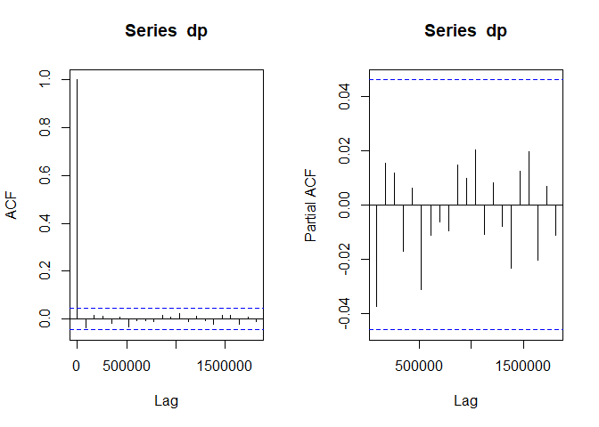<!-- -->

``` r
Box.test(dp,lag=21,type="Ljung-Box")
```

    ## 
    ##  Box-Ljung test
    ## 
    ## data:  dp
    ## X-squared = 11.23, df = 21, p-value = 0.9581

``` r
#ACF and PACF plots are compatible with WN; Ljung-Box fails to reject absence of correlation. RW confirmed.
```

### Log-returns

Exploratory analysis. BasicStats shows slight negative skewness and high
kurtosis, evident volatility clustering and stationarity around 0 (as
expected). QQ plot doesn’t suggest normality, as does the density plot
and Jarque-Bera test, especially in the tails.

``` r
r=dp
BS.2=as.matrix(basicStats(r))
BS.2
```

    ##                   Close
    ## nobs        1819.000000
    ## NAs            0.000000
    ## Minimum       -0.216257
    ## Maximum        0.105728
    ## 1. Quartile   -0.010985
    ## 3. Quartile    0.012416
    ## Mean           0.000349
    ## Median         0.001097
    ## Sum            0.635397
    ## SE Mean        0.000503
    ## LCL Mean      -0.000638
    ## UCL Mean       0.001337
    ## Variance       0.000461
    ## Stdev          0.021472
    ## Skewness      -0.612325
    ## Kurtosis       7.140490

``` r
par(mfrow=c(1,3))
plot(r,xlab="Time",ylab="Log-returns", main="NVIDIA - LOG-RETURNS")
x=seq(min(r),max(r),length=50)
y=dnorm(x,mean=mean(r),sd=sd(r))
hist(r,breaks=100,freq=F,main="NVIDIA's returns")
lines(x,y,col=2,lwd=2)
qqnorm(r,main="Normal Q-Q Plot",xlab="Theoretical",ylab="Empirical")
qqline(r,col="steelblue", lwd=2)
```

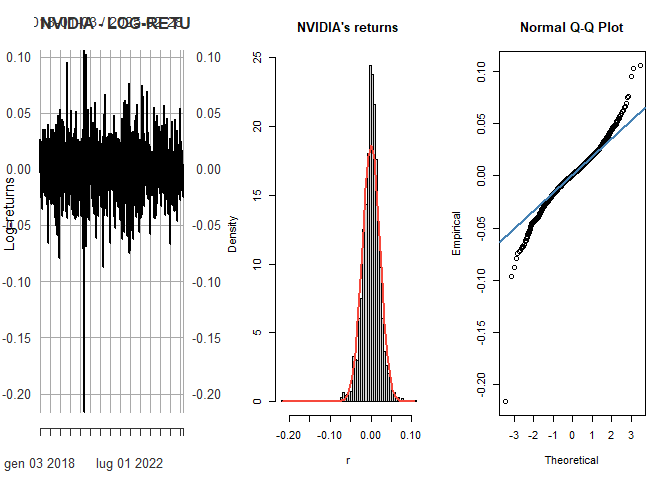<!-- -->

``` r
jarqueberaTest(r)
```

    ## 
    ## Title:
    ##  Jarque-Bera Normality Test
    ## 
    ## Test Results:
    ##   STATISTIC:
    ##     X-squared: 3990.3035
    ##   P VALUE:
    ##     Asymptotic p Value: < 2.2e-16

Plots show ACF and PACF of the log-returns, their squared values and
their absolute values, and suggest the presence of some form of
non-linear serial dependence. No clear stochastic processes are
evidently suggested by the plots of the original log-returns, therefore
some ARMA processes are estimated and then evaluated.

``` r
par(mfrow=c(2,3))
r2=r^2
r.abs=abs(r)
acf(r,lag.max=12)
acf(r2,lag.max = 12)
acf(r.abs,lag.max=12)
pacf(r,lag.max=12)
pacf(r2,lag.max=12)
pacf(r.abs,lag.max=12)
```

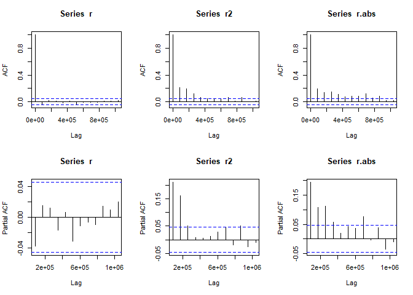<!-- -->

ACF plots already show a WN, an ARMA model is estimated anyway. The best
AIC is brought by AR(1) without intercept. In none of the proposed
models is shown a significant coefficient, suggesting the right model
could be the null one (WN).

``` r
ar.int=arma(r,order=c(1,0))
ar=arma(r,order=c(1,0),include.intercept = F)
```

    ## Warning in optim(coef, err, gr = NULL, hessian = TRUE, ...): l'ottimizzazione ad una dimensione di Nelder-Mead non è affidabile:
    ## utilizzare "Brent" o direttamente optimize()

``` r
ma.int=arma(r,order=c(0,1))
ma=arma(r,order=c(0,1),include.intercept = F)
```

    ## Warning in optim(coef, err, gr = NULL, hessian = TRUE, ...): l'ottimizzazione ad una dimensione di Nelder-Mead non è affidabile:
    ## utilizzare "Brent" o direttamente optimize()

``` r
arma.int=arma(r,order=c(1,1))
arma=arma(r,order=c(1,1),include.intercept = F)
par(mfrow=c(2,3))
acf(na.omit(ar.int$residuals), lag.max=21)
acf(na.omit(ar$residuals), lag.max=21)
acf(na.omit(ma.int$residuals), lag.max=21)
acf(na.omit(ma$residuals), lag.max=21)
acf(na.omit(arma.int$residuals), lag.max=21)
acf(na.omit(arma$residuals), lag.max=21)
```

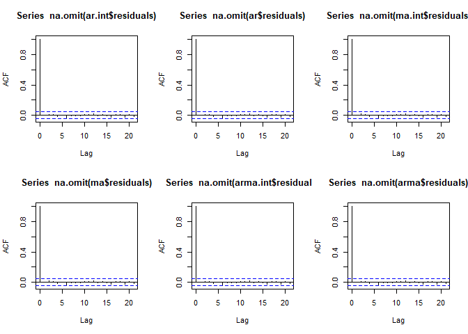<!-- -->

``` r
summary(ar.int)
```

    ## 
    ## Call:
    ## arma(x = r, order = c(1, 0))
    ## 
    ## Model:
    ## ARMA(1,0)
    ## 
    ## Residuals:
    ##        Min         1Q     Median         3Q        Max 
    ## -0.2175312 -0.0114884  0.0007505  0.0119145  0.1039964 
    ## 
    ## Coefficient(s):
    ##             Estimate  Std. Error  t value Pr(>|t|)
    ## ar1       -0.0374593   0.0234305   -1.599    0.110
    ## intercept  0.0003608   0.0005032    0.717    0.473
    ## 
    ## Fit:
    ## sigma^2 estimated as 0.0004606,  Conditional Sum-of-Squares = 0.84,  AIC = -8809.06

``` r
summary(ar)
```

    ## 
    ## Call:
    ## arma(x = r, order = c(1, 0), include.intercept = F)
    ## 
    ## Model:
    ## ARMA(1,0)
    ## 
    ## Residuals:
    ##       Min        1Q    Median        3Q       Max 
    ## -0.217157 -0.011136  0.001102  0.012273  0.104330 
    ## 
    ## Coefficient(s):
    ##      Estimate  Std. Error  t value Pr(>|t|)
    ## ar1  -0.03689     0.02343   -1.575    0.115
    ## 
    ## Fit:
    ## sigma^2 estimated as 0.0004606,  Conditional Sum-of-Squares = 0.84,  AIC = -8811.06

``` r
summary(ma.int)
```

    ## 
    ## Call:
    ## arma(x = r, order = c(0, 1))
    ## 
    ## Model:
    ## ARMA(0,1)
    ## 
    ## Residuals:
    ##        Min         1Q     Median         3Q        Max 
    ## -0.2175952 -0.0114922  0.0007542  0.0119048  0.1039741 
    ## 
    ## Coefficient(s):
    ##             Estimate  Std. Error  t value Pr(>|t|)
    ## ma1       -0.0363471   0.0230269   -1.578    0.114
    ## intercept  0.0003458   0.0004848    0.713    0.476
    ## 
    ## Fit:
    ## sigma^2 estimated as 0.0004607,  Conditional Sum-of-Squares = 0.84,  AIC = -8808.99

``` r
summary(ma)
```

    ## 
    ## Call:
    ## arma(x = r, order = c(0, 1), include.intercept = F)
    ## 
    ## Model:
    ## ARMA(0,1)
    ## 
    ## Residuals:
    ##       Min        1Q    Median        3Q       Max 
    ## -0.217227 -0.011135  0.001114  0.012269  0.104316 
    ## 
    ## Coefficient(s):
    ##      Estimate  Std. Error  t value Pr(>|t|)
    ## ma1  -0.03601     0.02302   -1.564    0.118
    ## 
    ## Fit:
    ## sigma^2 estimated as 0.0004607,  Conditional Sum-of-Squares = 0.84,  AIC = -8811

``` r
summary(arma.int)
```

    ## 
    ## Call:
    ## arma(x = r, order = c(1, 1))
    ## 
    ## Model:
    ## ARMA(1,1)
    ## 
    ## Residuals:
    ##        Min         1Q     Median         3Q        Max 
    ## -0.2171896 -0.0114789  0.0006411  0.0119378  0.1037974 
    ## 
    ## Coefficient(s):
    ##             Estimate  Std. Error  t value Pr(>|t|)
    ## ar1       -0.2062301   0.3965970   -0.520    0.603
    ## ma1        0.1680818   0.3981114    0.422    0.673
    ## intercept  0.0004213   0.0006053    0.696    0.486
    ## 
    ## Fit:
    ## sigma^2 estimated as 0.0004606,  Conditional Sum-of-Squares = 0.84,  AIC = -8807.21

``` r
summary(arma)
```

    ## 
    ## Call:
    ## arma(x = r, order = c(1, 1), include.intercept = F)
    ## 
    ## Model:
    ## ARMA(1,1)
    ## 
    ## Residuals:
    ##       Min        1Q    Median        3Q       Max 
    ## -0.216831 -0.011115  0.001006  0.012298  0.104158 
    ## 
    ## Coefficient(s):
    ##      Estimate  Std. Error  t value Pr(>|t|)
    ## ar1   -0.2037      0.3982   -0.511    0.609
    ## ma1    0.1656      0.3995    0.415    0.678
    ## 
    ## Fit:
    ## sigma^2 estimated as 0.0004606,  Conditional Sum-of-Squares = 0.84,  AIC = -8809.21

``` r
mod.arma=ar
mod.mean=arma(r,order=c(0,0))
```

    ## Warning in optim(coef, err, gr = NULL, hessian = TRUE, ...): l'ottimizzazione ad una dimensione di Nelder-Mead non è affidabile:
    ## utilizzare "Brent" o direttamente optimize()

``` r
summary(mod.mean)
```

    ## 
    ## Call:
    ## arma(x = r, order = c(0, 0))
    ## 
    ## Model:
    ## ARMA(0,0)
    ## 
    ## Residuals:
    ##        Min         1Q     Median         3Q        Max 
    ## -0.2166050 -0.0113331  0.0007495  0.0120683  0.1053802 
    ## 
    ## Coefficient(s):
    ##            Estimate  Std. Error  t value Pr(>|t|)
    ## intercept 0.0003479   0.0005033    0.691    0.489
    ## 
    ## Fit:
    ## sigma^2 estimated as 0.000461,  Conditional Sum-of-Squares = 0.84,  AIC = -8809.49

``` r
par(mfrow=c(1,2))
acf(mod.mean$residuals,lag.max=21)
pacf(mod.mean$residuals,lag.max=21)
```

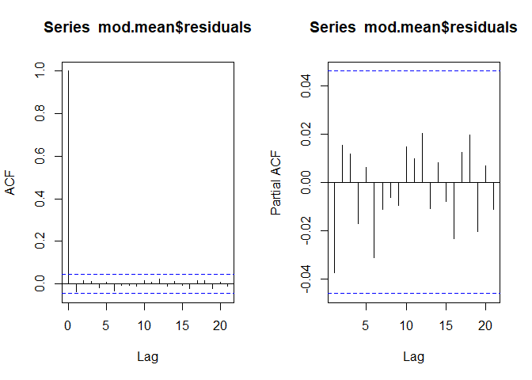<!-- -->

Static forecasts.

``` r
test.size=250
train.size=length(r)-250
test=tail(r,test.size)
train=head(r,train.size)
for (i in 1:test.size){
  if (i==1){
    new.train=train
    p.mean=p.ar=c(rep(NA,250))
    mod.mean=Arima(train,order=c(0,0,0),include.mean = T)
    mod.arma=Arima(train,order=c(1,0,0),include.mean = F)
  }
  else{
    new.train=c(new.train, test[i-1])
  }
  mod.mean.stat=Arima(new.train,model=mod.mean)
  mod.arma.stat=Arima(new.train,model=mod.arma)
  p.mean[i]=forecast(mod.mean.stat,h=1)$mean
  p.ar[i]=forecast(mod.arma.stat,h=1)$mean
}

test.size=250
train.size=length(r)-250
test=tail(r,test.size)
train=head(r,train.size)
for (i in 1:test.size){
  if (i==1){
    new.train=train
    p.ar.2=c(rep(NA,250))
    mod.arma=Arima(train,order=c(1,0,0),include.mean = F)
  }
  else{
    new.train=as.vector(new.train)
    new.train=c(new.train, p.ar.2[i-1])
  }
  mod.arma.din=Arima(new.train,model=mod.arma)
  p.ar.2[i]=forecast(mod.arma.din,h=1)$mean
}
```

As expected (by model metrics and usual characteristics of returns time
series) the model doesn’t perform well in forecasting, errors look
similar to the ones of the intercept model. Diebold-Mariano confirms
homogeneity of errors between models.

``` r
par(mfrow=c(1,1)) 
ts.plot(ts(test),ts(p.mean),ts(p.ar),ts(p.ar.2),col=1:3,main="Forecasts comparison") 
legend("topleft",legend=c("Actual returns","Forecasts mean model","Forecasts AR(1) (static)","Forecasts AR(1) (dynamic)"),col=1:4,lty = 1,  cex=0.70) 
```

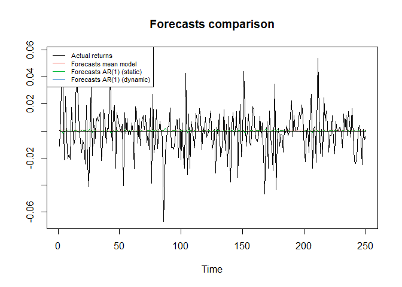<!-- -->

``` r
err.mean=test-p.mean 
err.ar=test-p.ar 
err.ar.2=test-p.ar.2
MSE.mean=mean(err.mean^2) 
MSE.ar=mean(err.ar^2) 
MSE.ar.2=mean(err.ar.2^2) 
MSE.mean 
```

    ## [1] 0.0002948701

``` r
MSE.ar 
```

    ## [1] 0.000291955

``` r
MSE.ar.2 
```

    ## [1] 0.0002935245

``` r
p1=dm_test(err.ar,err.mean,alternative = "less",h=1)$p.value
p2=dm_test(err.ar,err.ar.2,alternative = "less",h=1)$p.value
p3=dm_test(err.ar.2,err.mean,alternative = "less",h=1)$p.value
p.adjust(c(p1,p2,p3),"holm")
```

    ##        DM        DM        DM 
    ## 0.1569240 0.2330669 0.2330669

### Volatility

Returns’ series doesn’t appear homoscedastic: peaks and effects on
variance are visible in the following plots.

``` r
par(mfrow=c(3,1))
plot(r,main="Amplifon's daily returns")
plot(abs(r),main="Absolute returns")
plot(r^2, main="Squared returns")#Proxy of variance, since mean(r)~0
```

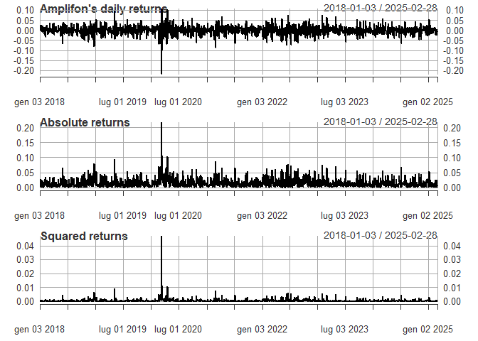<!-- -->

``` r
var62=roll_var(r,width=62,center=T)
var126=roll_var(r,width=126,center=T)
par(mfrow=c(2,1))
plot(var62,main="Rolling variance with 62 obs window")
plot(var126,main="Rolling variance with 126 obs window")
```

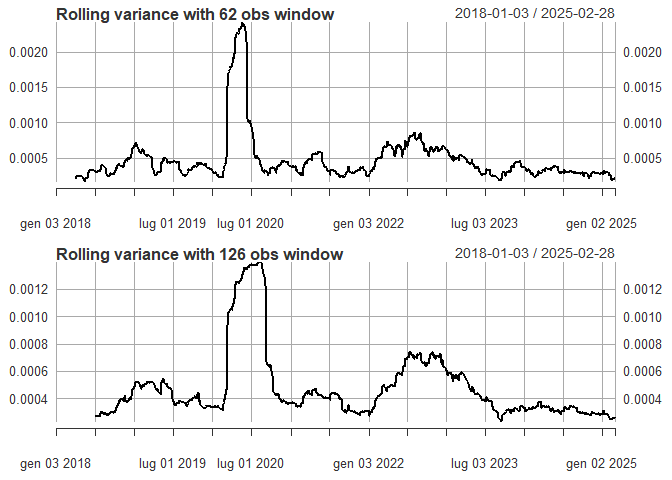<!-- -->

H0 is rejected for both LM and Ljung-Box. ARCH effects are confirmed.

``` r
ArchTest(r,lags=1)
```

    ## 
    ##  ARCH LM-test; Null hypothesis: no ARCH effects
    ## 
    ## data:  r
    ## Chi-squared = 80.283, df = 1, p-value < 2.2e-16

``` r
ArchTest(r,lags=5)
```

    ## 
    ##  ARCH LM-test; Null hypothesis: no ARCH effects
    ## 
    ## data:  r
    ## Chi-squared = 129.68, df = 5, p-value < 2.2e-16

``` r
ArchTest(r,lags=10)
```

    ## 
    ##  ARCH LM-test; Null hypothesis: no ARCH effects
    ## 
    ## data:  r
    ## Chi-squared = 139.31, df = 10, p-value < 2.2e-16

``` r
Box.test(as.numeric(r^2),lag=5,type ="Ljung-Box")
```

    ## 
    ##  Box-Ljung test
    ## 
    ## data:  as.numeric(r^2)
    ## X-squared = 189.3, df = 5, p-value < 2.2e-16

``` r
Box.test(as.numeric(r^2),lag=10,type="Ljung-Box")
```

    ## 
    ##  Box-Ljung test
    ## 
    ## data:  as.numeric(r^2)
    ## X-squared = 213.83, df = 10, p-value < 2.2e-16

Fitting a GARCH(1,1) as starting model, with both normal and skewed
t-Student distribution of innovations.

Normal model:

Optimal coefficients entirely significant and variance’s intercept and
shock’s effect non significant for robust estimates of the normal model.
Absence of ARCH effects among residuals. Stability over time for the
model’s coefficients. Low goodness of fit for normal distribution on
innovations.

Sstd model:

Similar results, average returns are no longer significant and goodness
of fit improves with sstd.

``` r
r1=r[1:1567,]
r2=r[1568:1819,]
spec1=ugarchspec(variance.model=list(model="sGARCH",garchOrder=c(1,1)),mean.model = list(armaOrder=c(0,0),include.mean=T),distribution.model = "norm")
spec2=ugarchspec(variance.model=list(model="sGARCH",garchOrder=c(1,1)),mean.model = list(armaOrder=c(0,0),include.mean=F),distribution.model = "sstd")
#include.mean=F because of non-significance of mu
garch11.norm=ugarchfit(spec1,r1)
garch11.sstd=ugarchfit(spec2,r1)
show(garch11.norm)
```

    ## 
    ## *---------------------------------*
    ## *          GARCH Model Fit        *
    ## *---------------------------------*
    ## 
    ## Conditional Variance Dynamics    
    ## -----------------------------------
    ## GARCH Model  : sGARCH(1,1)
    ## Mean Model   : ARFIMA(0,0,0)
    ## Distribution : norm 
    ## 
    ## Optimal Parameters
    ## ------------------------------------
    ##         Estimate  Std. Error  t value Pr(>|t|)
    ## mu      0.001040    0.000502   2.0714 0.038323
    ## omega   0.000046    0.000018   2.5741 0.010051
    ## alpha1  0.104958    0.028212   3.7203 0.000199
    ## beta1   0.798460    0.061269  13.0320 0.000000
    ## 
    ## Robust Standard Errors:
    ##         Estimate  Std. Error  t value Pr(>|t|)
    ## mu      0.001040    0.000482   2.1578 0.030944
    ## omega   0.000046    0.000033   1.4138 0.157429
    ## alpha1  0.104958    0.058877   1.7827 0.074639
    ## beta1   0.798460    0.117751   6.7809 0.000000
    ## 
    ## LogLikelihood : 3836.21 
    ## 
    ## Information Criteria
    ## ------------------------------------
    ##                     
    ## Akaike       -4.8911
    ## Bayes        -4.8775
    ## Shibata      -4.8912
    ## Hannan-Quinn -4.8861
    ## 
    ## Weighted Ljung-Box Test on Standardized Residuals
    ## ------------------------------------
    ##                         statistic p-value
    ## Lag[1]                    0.02006  0.8874
    ## Lag[2*(p+q)+(p+q)-1][2]   0.04486  0.9603
    ## Lag[4*(p+q)+(p+q)-1][5]   0.11393  0.9976
    ## d.o.f=0
    ## H0 : No serial correlation
    ## 
    ## Weighted Ljung-Box Test on Standardized Squared Residuals
    ## ------------------------------------
    ##                         statistic p-value
    ## Lag[1]                    0.05147  0.8205
    ## Lag[2*(p+q)+(p+q)-1][5]   1.87973  0.6471
    ## Lag[4*(p+q)+(p+q)-1][9]   3.32902  0.7036
    ## d.o.f=2
    ## 
    ## Weighted ARCH LM Tests
    ## ------------------------------------
    ##             Statistic Shape Scale P-Value
    ## ARCH Lag[3]     1.876 0.500 2.000  0.1708
    ## ARCH Lag[5]     3.692 1.440 1.667  0.2039
    ## ARCH Lag[7]     4.057 2.315 1.543  0.3384
    ## 
    ## Nyblom stability test
    ## ------------------------------------
    ## Joint Statistic:  0.6115
    ## Individual Statistics:             
    ## mu     0.2333
    ## omega  0.1203
    ## alpha1 0.1005
    ## beta1  0.1338
    ## 
    ## Asymptotic Critical Values (10% 5% 1%)
    ## Joint Statistic:          1.07 1.24 1.6
    ## Individual Statistic:     0.35 0.47 0.75
    ## 
    ## Sign Bias Test
    ## ------------------------------------
    ##                    t-value   prob sig
    ## Sign Bias            1.110 0.2671    
    ## Negative Sign Bias   1.166 0.2438    
    ## Positive Sign Bias   1.289 0.1976    
    ## Joint Effect         3.069 0.3811    
    ## 
    ## 
    ## Adjusted Pearson Goodness-of-Fit Test:
    ## ------------------------------------
    ##   group statistic p-value(g-1)
    ## 1    20     66.73    3.184e-07
    ## 2    30     81.93    6.028e-07
    ## 3    40     94.85    1.489e-06
    ## 4    50    108.27    2.308e-06
    ## 
    ## 
    ## Elapsed time : 0.179754

``` r
show(garch11.sstd)
```

    ## 
    ## *---------------------------------*
    ## *          GARCH Model Fit        *
    ## *---------------------------------*
    ## 
    ## Conditional Variance Dynamics    
    ## -----------------------------------
    ## GARCH Model  : sGARCH(1,1)
    ## Mean Model   : ARFIMA(0,0,0)
    ## Distribution : sstd 
    ## 
    ## Optimal Parameters
    ## ------------------------------------
    ##         Estimate  Std. Error  t value Pr(>|t|)
    ## omega   0.000043    0.000022   1.9758 0.048174
    ## alpha1  0.107617    0.036358   2.9599 0.003077
    ## beta1   0.806672    0.074049  10.8938 0.000000
    ## skew    0.911202    0.028638  31.8184 0.000000
    ## shape   5.522737    0.774420   7.1315 0.000000
    ## 
    ## Robust Standard Errors:
    ##         Estimate  Std. Error  t value Pr(>|t|)
    ## omega   0.000043    0.000038   1.1340 0.256795
    ## alpha1  0.107617    0.059553   1.8071 0.070752
    ## beta1   0.806672    0.132043   6.1091 0.000000
    ## skew    0.911202    0.027523  33.1065 0.000000
    ## shape   5.522737    0.706859   7.8131 0.000000
    ## 
    ## LogLikelihood : 3886.117 
    ## 
    ## Information Criteria
    ## ------------------------------------
    ##                     
    ## Akaike       -4.9536
    ## Bayes        -4.9365
    ## Shibata      -4.9536
    ## Hannan-Quinn -4.9472
    ## 
    ## Weighted Ljung-Box Test on Standardized Residuals
    ## ------------------------------------
    ##                         statistic p-value
    ## Lag[1]                    0.02341  0.8784
    ## Lag[2*(p+q)+(p+q)-1][2]   0.04189  0.9627
    ## Lag[4*(p+q)+(p+q)-1][5]   0.09724  0.9982
    ## d.o.f=0
    ## H0 : No serial correlation
    ## 
    ## Weighted Ljung-Box Test on Standardized Squared Residuals
    ## ------------------------------------
    ##                         statistic p-value
    ## Lag[1]                    0.08906  0.7654
    ## Lag[2*(p+q)+(p+q)-1][5]   1.63454  0.7068
    ## Lag[4*(p+q)+(p+q)-1][9]   3.04453  0.7516
    ## d.o.f=2
    ## 
    ## Weighted ARCH LM Tests
    ## ------------------------------------
    ##             Statistic Shape Scale P-Value
    ## ARCH Lag[3]     1.313 0.500 2.000  0.2518
    ## ARCH Lag[5]     3.246 1.440 1.667  0.2561
    ## ARCH Lag[7]     3.637 2.315 1.543  0.4020
    ## 
    ## Nyblom stability test
    ## ------------------------------------
    ## Joint Statistic:  0.9484
    ## Individual Statistics:             
    ## omega  0.1315
    ## alpha1 0.1201
    ## beta1  0.1642
    ## skew   0.4971
    ## shape  0.1272
    ## 
    ## Asymptotic Critical Values (10% 5% 1%)
    ## Joint Statistic:          1.28 1.47 1.88
    ## Individual Statistic:     0.35 0.47 0.75
    ## 
    ## Sign Bias Test
    ## ------------------------------------
    ##                    t-value   prob sig
    ## Sign Bias           0.3857 0.6997    
    ## Negative Sign Bias  0.8429 0.3994    
    ## Positive Sign Bias  1.0166 0.3095    
    ## Joint Effect        2.4285 0.4884    
    ## 
    ## 
    ## Adjusted Pearson Goodness-of-Fit Test:
    ## ------------------------------------
    ##   group statistic p-value(g-1)
    ## 1    20     18.79       0.4701
    ## 2    30     28.71       0.4805
    ## 3    40     44.10       0.2646
    ## 4    50     52.69       0.3334
    ## 
    ## 
    ## Elapsed time : 0.272608

Standardized residuals’ analysis. Similar results, sstd fits the data
better than normal distribution.

``` r
resst.garch11.norm=residuals(garch11.norm,standardize=T)
resst.garch11.sstd=residuals(garch11.sstd,standardize=T)
par(mfrow=c(2,1))
plot(resst.garch11.norm,main="Standardized residuals' analysis - Normal model")
plot(resst.garch11.sstd,main="Standardized residuals' analysis - Sstd model")
```

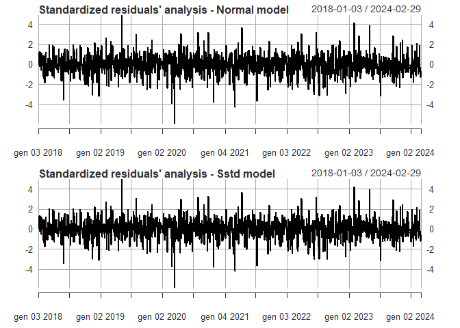<!-- -->

``` r
par(mfrow=c(2,1))
plot(garch11.norm,which=8)
plot(garch11.norm,which=9)
```

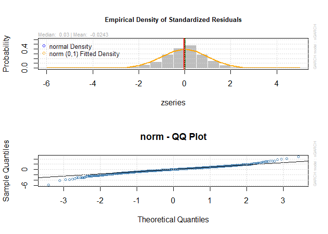<!-- -->

``` r
par(mfrow=c(2,1))
plot(garch11.sstd,which=8)
plot(garch11.sstd,which=9)
```

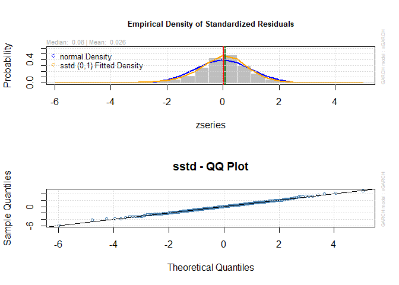<!-- -->

``` r
par(mfrow=c(2,2))
plot(garch11.norm,which=10)
plot(garch11.norm,which=11)
plot(garch11.sstd,which=10)
plot(garch11.sstd,which=11)
```

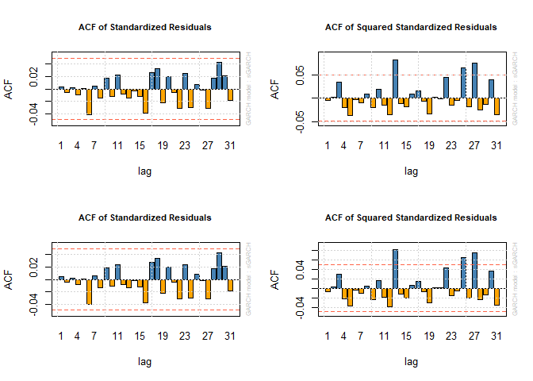<!-- -->

Fitting the GJR-GARCH and E-GARCH models to capture returns’
asymmetrical response to shocks.

GJR-GARCH:

Non significant alpha coefficient, but kept anyway to correctly estimate
the model. Baseline coefficient of volatility is not significant either
with robust standard errors. No residual ARCH effects. Stable
coefficients. Sstd doesn’t fit well in this case.

E-GARCH:

Significant coefficients. No residual ARCH effects. Stable coefficients.
SStd still doesn’t fit optimally.

``` r
spec3=ugarchspec(variance.model=list(model="gjrGARCH",garchOrder=c(1,1)),mean.model = list(armaOrder=c(0,0),include.mean=F),distribution.model = "sstd")
spec4=ugarchspec(variance.model=list(model="eGARCH",garchOrder=c(1,2)),mean.model = list(armaOrder=c(0,0),include.mean=F),distribution.model = "sstd")
#mu is not significant
gjrgarch11.sstd=ugarchfit(spec3,r1)
egarch12.sstd=ugarchfit(spec4,r1)
show(gjrgarch11.sstd)
```

    ## 
    ## *---------------------------------*
    ## *          GARCH Model Fit        *
    ## *---------------------------------*
    ## 
    ## Conditional Variance Dynamics    
    ## -----------------------------------
    ## GARCH Model  : gjrGARCH(1,1)
    ## Mean Model   : ARFIMA(0,0,0)
    ## Distribution : sstd 
    ## 
    ## Optimal Parameters
    ## ------------------------------------
    ##         Estimate  Std. Error  t value Pr(>|t|)
    ## omega   0.000018    0.000009  2.05899 0.039495
    ## alpha1  0.012722    0.020739  0.61345 0.539582
    ## beta1   0.904991    0.039950 22.65291 0.000000
    ## gamma1  0.089401    0.026470  3.37748 0.000732
    ## skew    0.906197    0.028784 31.48217 0.000000
    ## shape   6.059254    0.935740  6.47536 0.000000
    ## 
    ## Robust Standard Errors:
    ##         Estimate  Std. Error  t value Pr(>|t|)
    ## omega   0.000018    0.000016  1.14608 0.251764
    ## alpha1  0.012722    0.033887  0.37543 0.707340
    ## beta1   0.904991    0.076119 11.88922 0.000000
    ## gamma1  0.089401    0.035702  2.50410 0.012276
    ## skew    0.906197    0.027796 32.60157 0.000000
    ## shape   6.059254    0.881002  6.87768 0.000000
    ## 
    ## LogLikelihood : 3892.584 
    ## 
    ## Information Criteria
    ## ------------------------------------
    ##                     
    ## Akaike       -4.9605
    ## Bayes        -4.9400
    ## Shibata      -4.9606
    ## Hannan-Quinn -4.9529
    ## 
    ## Weighted Ljung-Box Test on Standardized Residuals
    ## ------------------------------------
    ##                         statistic p-value
    ## Lag[1]                   0.006271  0.9369
    ## Lag[2*(p+q)+(p+q)-1][2]  0.011018  0.9887
    ## Lag[4*(p+q)+(p+q)-1][5]  0.057765  0.9994
    ## d.o.f=0
    ## H0 : No serial correlation
    ## 
    ## Weighted Ljung-Box Test on Standardized Squared Residuals
    ## ------------------------------------
    ##                         statistic p-value
    ## Lag[1]                   0.003439  0.9532
    ## Lag[2*(p+q)+(p+q)-1][5]  2.534014  0.4987
    ## Lag[4*(p+q)+(p+q)-1][9]  4.209317  0.5538
    ## d.o.f=2
    ## 
    ## Weighted ARCH LM Tests
    ## ------------------------------------
    ##             Statistic Shape Scale P-Value
    ## ARCH Lag[3]     2.240 0.500 2.000  0.1344
    ## ARCH Lag[5]     3.919 1.440 1.667  0.1814
    ## ARCH Lag[7]     4.329 2.315 1.543  0.3017
    ## 
    ## Nyblom stability test
    ## ------------------------------------
    ## Joint Statistic:  1.1604
    ## Individual Statistics:              
    ## omega  0.05675
    ## alpha1 0.07667
    ## beta1  0.08923
    ## gamma1 0.04680
    ## skew   0.56595
    ## shape  0.08291
    ## 
    ## Asymptotic Critical Values (10% 5% 1%)
    ## Joint Statistic:          1.49 1.68 2.12
    ## Individual Statistic:     0.35 0.47 0.75
    ## 
    ## Sign Bias Test
    ## ------------------------------------
    ##                    t-value   prob sig
    ## Sign Bias           0.1721 0.8634    
    ## Negative Sign Bias  0.6308 0.5283    
    ## Positive Sign Bias  0.2810 0.7788    
    ## Joint Effect        0.6590 0.8828    
    ## 
    ## 
    ## Adjusted Pearson Goodness-of-Fit Test:
    ## ------------------------------------
    ##   group statistic p-value(g-1)
    ## 1    20     28.88     0.067937
    ## 2    30     46.13     0.022792
    ## 3    40     65.14     0.005409
    ## 4    50     74.70     0.010448
    ## 
    ## 
    ## Elapsed time : 0.787426

``` r
show(egarch12.sstd)
```

    ## 
    ## *---------------------------------*
    ## *          GARCH Model Fit        *
    ## *---------------------------------*
    ## 
    ## Conditional Variance Dynamics    
    ## -----------------------------------
    ## GARCH Model  : eGARCH(1,2)
    ## Mean Model   : ARFIMA(0,0,0)
    ## Distribution : sstd 
    ## 
    ## Optimal Parameters
    ## ------------------------------------
    ##         Estimate  Std. Error  t value Pr(>|t|)
    ## omega   -0.29490    0.060487  -4.8755 0.000001
    ## alpha1  -0.11605    0.022295  -5.2050 0.000000
    ## beta1    0.53002    0.002248 235.8185 0.000000
    ## beta2    0.43144    0.002970 145.2711 0.000000
    ## gamma1   0.12128    0.038222   3.1729 0.001509
    ## skew     0.90529    0.028688  31.5564 0.000000
    ## shape    6.22431    0.986892   6.3070 0.000000
    ## 
    ## Robust Standard Errors:
    ##         Estimate  Std. Error  t value Pr(>|t|)
    ## omega   -0.29490    0.044920  -6.5650 0.000000
    ## alpha1  -0.11605    0.024593  -4.7188 0.000002
    ## beta1    0.53002    0.002731 194.1094 0.000000
    ## beta2    0.43144    0.003121 138.2422 0.000000
    ## gamma1   0.12128    0.051683   2.3465 0.018949
    ## skew     0.90529    0.027522  32.8930 0.000000
    ## shape    6.22431    0.913355   6.8148 0.000000
    ## 
    ## LogLikelihood : 3893.099 
    ## 
    ## Information Criteria
    ## ------------------------------------
    ##                     
    ## Akaike       -4.9599
    ## Bayes        -4.9360
    ## Shibata      -4.9600
    ## Hannan-Quinn -4.9510
    ## 
    ## Weighted Ljung-Box Test on Standardized Residuals
    ## ------------------------------------
    ##                         statistic p-value
    ## Lag[1]                    0.03915  0.8431
    ## Lag[2*(p+q)+(p+q)-1][2]   0.04259  0.9621
    ## Lag[4*(p+q)+(p+q)-1][5]   0.15884  0.9953
    ## d.o.f=0
    ## H0 : No serial correlation
    ## 
    ## Weighted Ljung-Box Test on Standardized Squared Residuals
    ## ------------------------------------
    ##                          statistic p-value
    ## Lag[1]                    0.005062  0.9433
    ## Lag[2*(p+q)+(p+q)-1][8]   7.338268  0.1295
    ## Lag[4*(p+q)+(p+q)-1][14] 11.179340  0.1282
    ## d.o.f=3
    ## 
    ## Weighted ARCH LM Tests
    ## ------------------------------------
    ##             Statistic Shape Scale P-Value
    ## ARCH Lag[4]   0.05282 0.500 2.000  0.8182
    ## ARCH Lag[6]   0.78539 1.461 1.711  0.8099
    ## ARCH Lag[8]   0.85337 2.368 1.583  0.9447
    ## 
    ## Nyblom stability test
    ## ------------------------------------
    ## Joint Statistic:  1.4441
    ## Individual Statistics:              
    ## omega  0.15045
    ## alpha1 0.18316
    ## beta1  0.15553
    ## beta2  0.15648
    ## gamma1 0.06331
    ## skew   0.47502
    ## shape  0.05149
    ## 
    ## Asymptotic Critical Values (10% 5% 1%)
    ## Joint Statistic:          1.69 1.9 2.35
    ## Individual Statistic:     0.35 0.47 0.75
    ## 
    ## Sign Bias Test
    ## ------------------------------------
    ##                    t-value   prob sig
    ## Sign Bias           0.5414 0.5883    
    ## Negative Sign Bias  0.4613 0.6447    
    ## Positive Sign Bias  0.2044 0.8381    
    ## Joint Effect        0.6153 0.8929    
    ## 
    ## 
    ## Adjusted Pearson Goodness-of-Fit Test:
    ## ------------------------------------
    ##   group statistic p-value(g-1)
    ## 1    20     21.70     0.299207
    ## 2    30     53.29     0.003904
    ## 3    40     52.78     0.069318
    ## 4    50     73.49     0.013327
    ## 
    ## 
    ## Elapsed time : 0.50525

Standardized residuals’ analysis. Similar results.

``` r
resst.gjrgarch11.sstd=residuals(gjrgarch11.sstd,standardize=T)
resst.egarch12.sstd=residuals(egarch12.sstd,standardize=T)
par(mfrow=c(2,1))
plot(resst.gjrgarch11.sstd,main="Standardized residuals' analysis - Normal model")
plot(resst.egarch12.sstd,main="Standardized residuals' analysis - Sstd model")
```

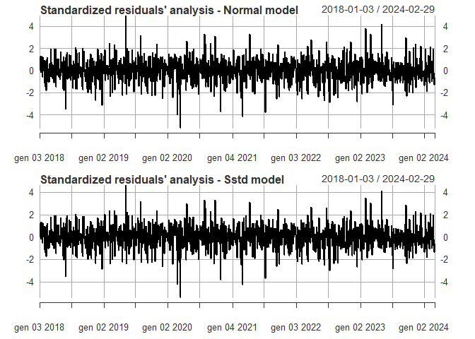<!-- -->

``` r
par(mfrow=c(2,1))
plot(gjrgarch11.sstd,which=8)
plot(gjrgarch11.sstd,which=9)
```

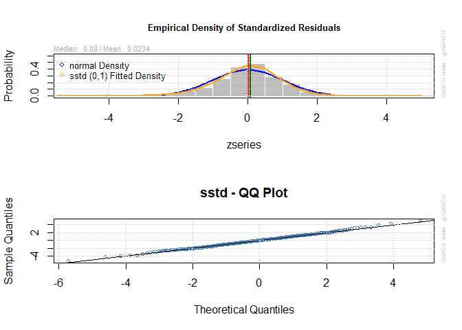<!-- -->

``` r
par(mfrow=c(2,1))
plot(egarch12.sstd,which=8)
plot(egarch12.sstd,which=9)
```

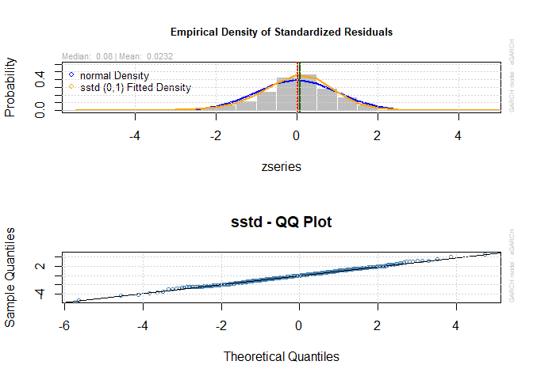<!-- -->

``` r
par(mfrow=c(2,2))
plot(gjrgarch11.sstd,which=10)
plot(gjrgarch11.sstd,which=11)
plot(egarch12.sstd,which=10)
plot(egarch12.sstd,which=11)
```

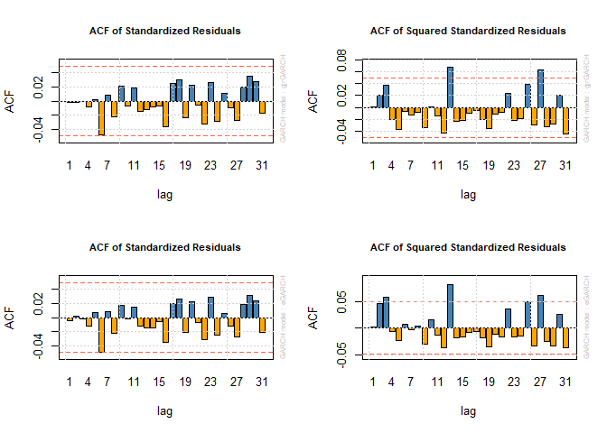<!-- -->

Similar fitted values for sigma, the bigger differences between plots
sit in the “sharpness” of peaks. Volatility clustering is correctly
recognized.

``` r
sigma1=sigma(garch11.norm)
sigma2=sigma(garch11.sstd)
sigma3=sigma(egarch12.sstd)
sigma4=sigma(gjrgarch11.sstd)
par(mfrow=c(2,2))
plot(sigma1,main="GARCH(1,1) norm")
plot(sigma2,main="GARCH(1,1) sstd")
plot(sigma3,main="EGARCH(1,2) sstd")
plot(sigma4,main="GJR-GARCH(1,1) sstd")
```

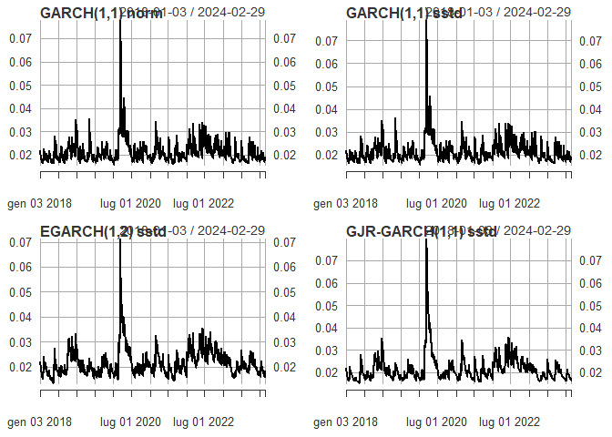<!-- -->

Information Criteria. The first model shows the poorest results in
information criteria, whereas the fourth one shows the best ones.

``` r
AIC=c(infocriteria(garch11.norm)[1],infocriteria(garch11.sstd)[1],infocriteria(egarch12.sstd)[1],infocriteria(gjrgarch11.sstd)[1])
BIC=c(infocriteria(garch11.norm)[2],infocriteria(garch11.sstd)[2],infocriteria(egarch12.sstd)[2],infocriteria(gjrgarch11.sstd)[2])
SHI=c(infocriteria(garch11.norm)[3],infocriteria(garch11.sstd)[3],infocriteria(egarch12.sstd)[3],infocriteria(gjrgarch11.sstd)[3])
HQC=c(infocriteria(garch11.norm)[4],infocriteria(garch11.sstd)[4],infocriteria(egarch12.sstd)[4],infocriteria(gjrgarch11.sstd)[4])

par(mfrow=c(2,2))
plot(AIC)
plot(BIC)
plot(SHI)
plot(HQC)
```

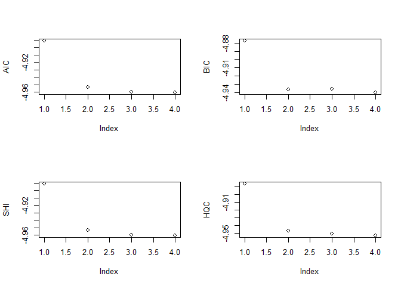<!-- -->

Log-likelihood evaluation. Results compatible with previous analysis.

``` r
loglik=c(garch11.norm@fit$LLH,garch11.sstd@fit$LLH,egarch12.sstd@fit$LLH,gjrgarch11.sstd@fit$LLH)
par(mfrow=c(1,1))
plot(loglik)
```

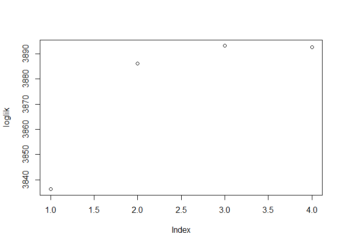<!-- -->

Static and dynamic forecasts.

``` r
for1=ugarchroll(spec1,data=r1,forecast.length = length(r2),refit.every = 5)
for2=ugarchroll(spec2,data=r1,forecast.length = length(r2),refit.every = 5)
for3=ugarchroll(spec3,data=r1,forecast.length = length(r2),refit.every = 5)
for4=ugarchroll(spec4,data=r1,forecast.length = length(r2),refit.every = 5)
forec=cbind("GARCH(1,1) norm"=as.data.frame(for1)$Sigma,"GARCH(1,1) sstd"=as.data.frame(for2)$Sigma,"E-GARCH(1,2) sstd"=as.data.frame(for3)$Sigma,"GJR-GARCH(1,1) sstd"=as.data.frame(for4)$Sigma)
plot(ts(forec),main="Static Forecasts")
```

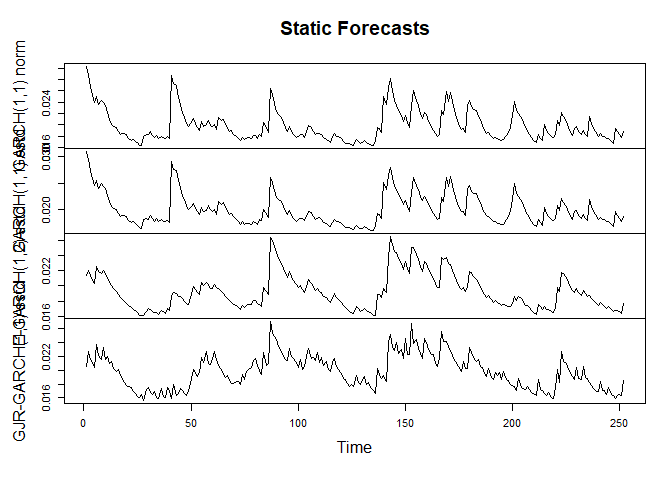<!-- -->

``` r
for5=ugarchforecast(garch11.norm,data=r1,n.ahead = length(r2))
for6=ugarchforecast(garch11.sstd,data=r1,n.ahead = length(r2))
for7=ugarchforecast(egarch12.sstd,data=r1,n.ahead = length(r2))
for8=ugarchforecast(gjrgarch11.sstd,data=r1,n.ahead = length(r2))
forec2=cbind("GARCH(1,1) norm"=sigma(for5),"GARCH(1,1) sstd"=sigma(for6),"E-GARCH(1,2) sstd"=sigma(for7),"GJR-GARCH(1,1) sstd"=sigma(for8))
plot(ts(forec2),main="Dynamic Forecasts")
```

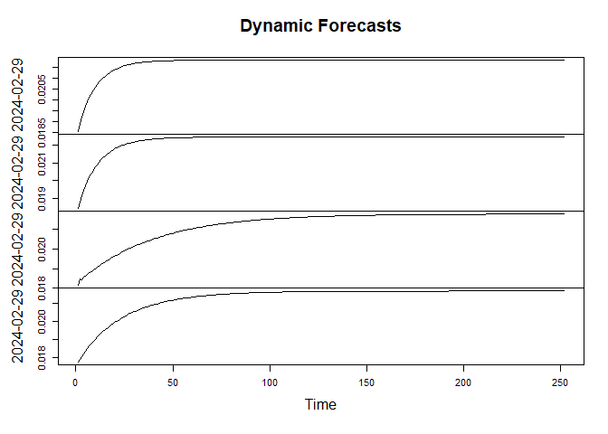<!-- -->

Visualization.

``` r
par(mfrow=c(2,2))
plot(for1,which=1)
plot(for2,which=1)
plot(for3,which=1)
plot(for4,which=1)
```

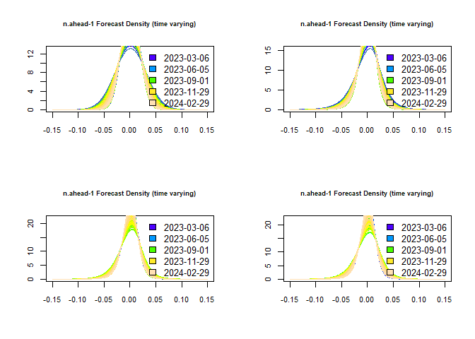<!-- -->

``` r
par(mfrow=c(2,2))
plot(for1,which=2)
plot(for2,which=2)
plot(for3,which=2)
plot(for4,which=2)
```

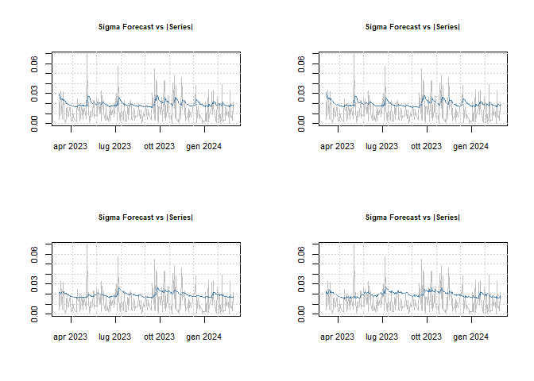<!-- -->

``` r
par(mfrow=c(2,2))
plot(for1,which=3)
plot(for2,which=3)
plot(for3,which=3)
plot(for4,which=3)
```

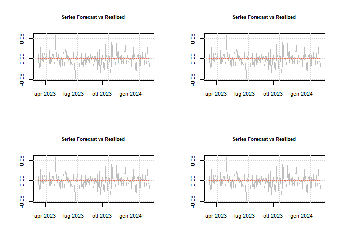<!-- -->

``` r
par(mfrow=c(2,2))
plot(for1,which=4)
plot(for2,which=4)
plot(for3,which=4)
plot(for4,which=4)
```

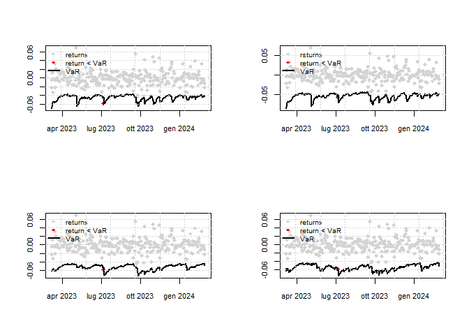<!-- -->

``` r
plot(for1,which=5)
```

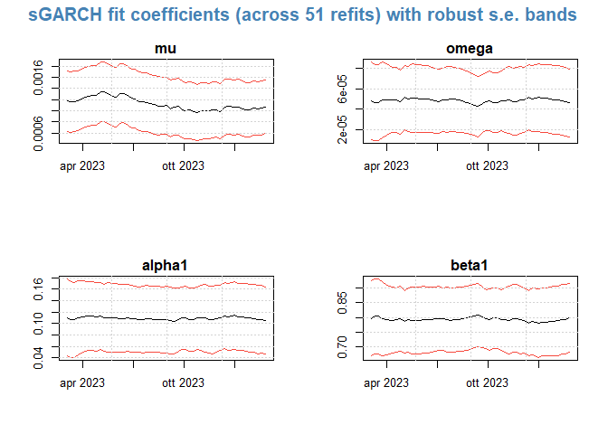<!-- -->

``` r
plot(for2,which=5)
plot(for3,which=5)
```

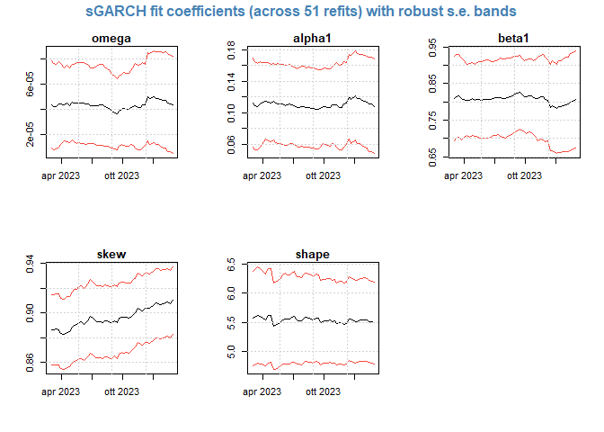<!-- -->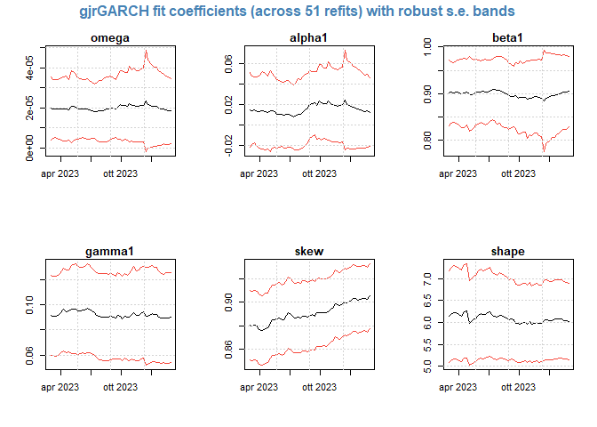<!-- -->

``` r
plot(for4,which=5)
plot(for5,which=1)
```

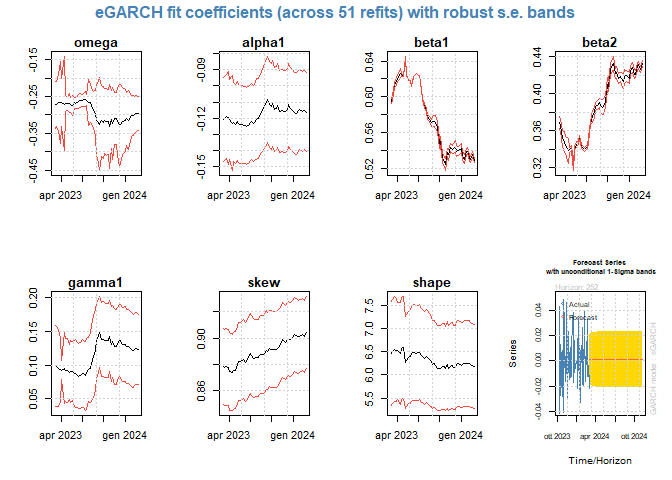<!-- -->

``` r
plot(for6,which=1)
plot(for7,which=1)
plot(for8,which=1)
plot(for5,which=3)
plot(for6,which=3)
plot(for7,which=3)
plot(for8,which=3)
```

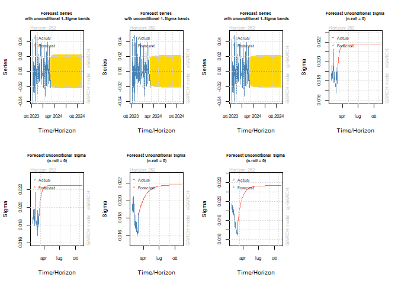<!-- -->

Forecast errors analysis. EGARCH shows the best results for static
forecasts; in dynamic forecasts GJRGARCH shows lower errors too.

``` r
err1=as.data.frame(for1)$Sigma^2-r2^2
err2=as.data.frame(for2)$Sigma^2-r2^2
err3=as.data.frame(for3)$Sigma^2-r2^2
err4=as.data.frame(for4)$Sigma^2-r2^2
ERR=cbind("GARCH(1,1) norm"=err1,"GARCH(1,1) sstd"=err2,"E-GARCH(1,2) sstd"=err3,"GJR-GARCH(1,1) sstd"=err4)
plot(ts(ERR),main="Forcecast's errors")
```

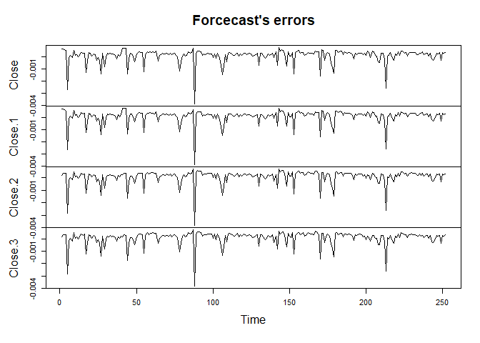<!-- -->

``` r
err.ind=matrix(nrow=3,ncol=4)
colnames(err.ind)=c("GARCH norm","GARCH sstd", "E-GARCH sstd", "GJR-GARCH sstd")
row.names(err.ind)=c("MSE","RMSE","MAE")
err.ind[,1]=c(mean(err1^2),sqrt(mean(err1^2)),mean(abs(err1)))
err.ind[,2]=c(mean(err2^2),sqrt(mean(err2^2)),mean(abs(err2)))
err.ind[,3]=c(mean(err3^2),sqrt(mean(err3^2)),mean(abs(err3)))
err.ind[,4]=c(mean(err4^2),sqrt(mean(err4^2)),mean(abs(err4)))
err.ind
```

    ##       GARCH norm   GARCH sstd E-GARCH sstd GJR-GARCH sstd
    ## MSE  2.91883e-07 2.947422e-07 2.877764e-07   2.947303e-07
    ## RMSE 5.40262e-04 5.429016e-04 5.364480e-04   5.428907e-04
    ## MAE  3.69018e-04 3.729636e-04 3.579805e-04   3.725427e-04

``` r
err5=for5@forecast$sigmaFor^2-r2^2
err6=for6@forecast$sigmaFor^2-r2^2
err7=for7@forecast$sigmaFor^2-r2^2
err8=for8@forecast$sigmaFor^2-r2^2
ERR2=cbind("GARCH(1,1) norm"=err5,"GARCH(1,1) sstd"=err6,"E-GARCH(1,2) sstd"=err7,"GJR-GARCH(1,1) sstd"=err8)
plot(ts(ERR2),main="Forcecast's errors")
```

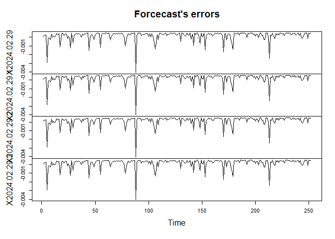<!-- -->

``` r
err.ind2=matrix(nrow=3,ncol=4)
colnames(err.ind2)=c("GARCH norm","GARCH sstd", "E-GARCH sstd", "GJR-GARCH sstd")
row.names(err.ind2)=c("MSE","RMSE","MAE")
err.ind2[,1]=c(mean(err5^2),sqrt(mean(err5^2)),mean(abs(err5)))
err.ind2[,2]=c(mean(err6^2),sqrt(mean(err6^2)),mean(abs(err6)))
err.ind2[,3]=c(mean(err7^2),sqrt(mean(err7^2)),mean(abs(err7)))
err.ind2[,4]=c(mean(err8^2),sqrt(mean(err8^2)),mean(abs(err8)))
err.ind2
```

    ##        GARCH norm   GARCH sstd E-GARCH sstd GJR-GARCH sstd
    ## MSE  3.210266e-07 3.317581e-07 3.175742e-07   3.177416e-07
    ## RMSE 5.665921e-04 5.759845e-04 5.635373e-04   5.636857e-04
    ## MAE  4.175370e-04 4.350190e-04 4.080552e-04   4.088445e-04

Diebold-Mariano. EGARCH shows significantly lower error rates (in
comparison with alternatives) in static forecasts. EGARCH and GJRGARCH
show significantly more accurate forecasts when compared to the
alternatives.

``` r
i=j=1
DM=matrix(nrow=4,ncol=4)
for (l in 1:16){
  if (i==j) {
    DM[l]=NA
    i=i+1
  }
  else {
    DM[l]=dm_test(ERR[,i],ERR[,j],alternative = "greater",power = 1,varestimator = "NeweyWest")$p.value
    if (i==4){
      i=1
      j=j+1
    }
    else{
      i=i+1
    }
  }
}
DM
```

    ##              [,1]      [,2]         [,3]      [,4]
    ## [1,]           NA 0.9999345 0.0588417211 0.6499991
    ## [2,] 6.553028e-05        NA 0.0240283125 0.4826993
    ## [3,] 9.411583e-01 0.9759717           NA 0.9996971
    ## [4,] 3.500009e-01 0.5173007 0.0003029021        NA

``` r
i=j=1
DM=matrix(nrow=4,ncol=4)
for (l in 1:16){
  if (i==j) {
    DM[l]=NA
    i=i+1
  }
  else {
    DM[l]=dm_test(ERR2[,i],ERR2[,j],alternative = "greater",power = 1,varestimator = "NeweyWest")$p.value
    if (i==4){
      i=1
      j=j+1
    }
    else{
      i=i+1
    }
  }
}
DM
```

    ##              [,1] [,2]         [,3]         [,4]
    ## [1,]           NA    1 2.708811e-06 1.798819e-08
    ## [2,] 6.452010e-27   NA 3.595964e-19 9.041723e-23
    ## [3,] 9.999973e-01    1           NA 8.514416e-01
    ## [4,] 1.000000e+00    1 1.485584e-01           NA
